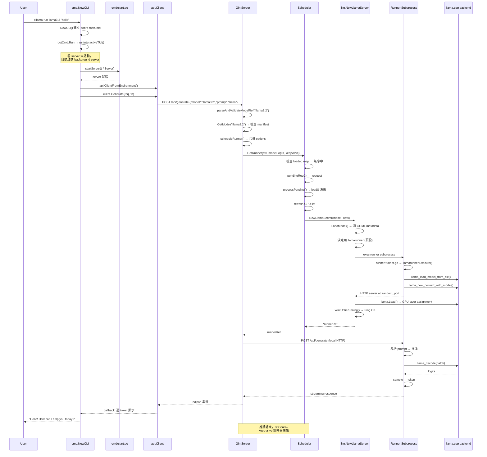

# Ollama · 程式碼追蹤

## 追蹤的場景

**場景**: 使用者輸入 `ollama run llama3.2 "hello"`，假設模型已下載、server 尚未啟動。

**模型**: llama3.2（3B，GGUF 格式，約 2GB）

## 完整路徑



**圖意說明**：這張圖是 Ollama 最完整的請求路徑，從使用者輸入到推論結果輸出。
關鍵轉折點有四個：自動 server 啟動（若未執行）、Scheduler 的載入決策（檢查 cache / 決定載入）、
runner 子行程啟動（選擇引擎）、以及串流回覆。每個轉折點都可能產生延遲或失敗。

## 逐步追蹤

### Step 1: 進入點 — CLI 產生與 server 開機

**入口**: [`main.go:12`](https://github.com/ollama/ollama/blob/f63eea3/main.go#L12)
```go
cobra.CheckErr(cmd.NewCLI().ExecuteContext(context.Background()))
```

`cmd.NewCLI()` [`cmd/cmd.go:2241`](https://github.com/ollama/ollama/blob/f63eea3/cmd/cmd.go#L2241)
建立 cobra root command，Run handler 呼叫 `runInteractiveTUI()`。

若 server 尚未執行，`runInteractiveTUI()` 內部會透過
[`cmd/start.go`](https://github.com/ollama/ollama/blob/f63eea3/cmd/start.go) 啟動
background server。Server 的入口是
[`server/routes.go:1770`](https://github.com/ollama/ollama/blob/f63eea3/server/routes.go#L1770)
的 `Serve(ln net.Listener)`。

**值得注意的設計**：`runInteractiveTUI()` 使用 Bubbletea
建立了一個 TUI（terminal UI）介面，不是簡單的 `fmt.Scan` 迴圈。
這讓 Ollama 的 `run` 指令有類似 ChatGPT 的對話體驗。

### Step 2: API client 發送請求

Client 建立方式：`api.ClientFromEnvironment()`
[`api/client.go`](https://github.com/ollama/ollama/blob/f63eea3/api/client.go#L34-L41)，
從 `OLLAMA_HOST` 環境變數（預設 `127.0.0.1:11434`）建立 HTTP client。

Generate request 的核心方法是 `client.Generate()`，接受 `api.GenerateRequest` 結構與 callback。
Streaming 是透過讀取 HTTP response body 的 ndjson 行來實現的：
每行是一個 `api.GenerateResponse` 的 JSON，以 `"done": true` 標記結束。
[`api/client.go:249-280`](https://github.com/ollama/ollama/blob/f63eea3/api/client.go#L249-L280)

### Step 3: Server 端請求處理

Gin router 將 `POST /api/generate` 路由到 `s.GenerateHandler`
[`server/routes.go:195`](https://github.com/ollama/ollama/blob/f63eea3/server/routes.go#L195)。

處理流程：
1. 解析 JSON body → `api.GenerateRequest`
2. `parseAndValidateModelRef(req.Model)` → 解析 `模型來源（local / cloud / remote）`
3. `getExistingName()` → 確認模型存在於本地 cache
4. `GetModel(name)` → 讀取模型 manifest，載入 config
5. `s.scheduleRunner()` → 排程 runner，這是整個請求的瓶頸點

### Step 4: 排程器 — GetRunner

`s.scheduleRunner()` [`server/routes.go:147`](https://github.com/ollama/ollama/blob/f63eea3/server/routes.go#L147)
合併 model 的預設 options 與請求中的 options，然後呼叫 `s.sched.GetRunner()`。

`GetRunner()` [`server/sched.go:108`](https://github.com/ollama/ollama/blob/f63eea3/server/sched.go#L108)：
1. 計算 `schedulerModelKey`（用 ModelPath 或 digest）
2. 檢查 `loaded map` — 若命中且不需重載，走快取路徑（refCount++，回傳 runner）
3. 否則將 request 放入 `pendingReqCh`
4. 等待 `successCh` 或 `errCh`

**注意**：這是一個**同步等待**（blocking call）。如果模型未載入，請求會阻塞直到載入完成。

### Step 5: 背後的事件驅動排程

`processPending()` [`server/sched.go:170`](https://github.com/ollama/ollama/blob/f63eea3/server/sched.go#L170)
是排程器的主事件迴圈，在 Scheduler 初始化時啟動的獨立 goroutine 中執行。

決策樹：
1. ctx 已取消 → 跳過
2. runner 已在 loaded map 中 → 檢查 `needsReload()` → 跳過或用已載入的
3. 無 runner → 檢查 `loadedCount >= maxRunners` → 需要驅逐一個才載入新的
4. `load()` → 嘗試載入模型

`needsReload()` [`server/sched.go:671`](https://github.com/ollama/ollama/blob/f63eea3/server/sched.go#L671)：
- runner 類型不符（imagegen vs mlxrunner）
- adapter/projector 路徑改變
- 選項改變（NumGPU, NumCtx, NumBatch）
- `llama.Ping()` 失敗（後端無回應）

### Step 6: 載入流程 — NewLlamaServer

`load()` [`server/sched.go:411`](https://github.com/ollama/ollama/blob/f63eea3/server/sched.go#L411)：
1. `llm.LoadModel()` → 讀取 GGUF/GGML 元資料，解析檔案頭（model architecture, tensors, metadata）
2. `llm.NewLlamaServer()` [`llm/server.go:148`](https://github.com/ollama/ollama/blob/f63eea3/llm/server.go#L148) → 決定引擎
3. 建立 `llamaServer` 結構，啟動 `exec.Cmd` 子行程
4. 子行程是 runner binary，透過 `--ollama-engine` 或預設無標誌決定引擎
5. `llama.Load()` → 三階段分配：`LoadOperationFit`（估算）→ `LoadOperationAlloc`（分配）→
   `LoadOperationCommit`（載入權重）
6. `WaitUntilRunning()` → 輪詢 runner 的 HTTP 端點直到回應

### Step 7: Runner 子行程

Runner 入口：[`runner/runner.go:10`](https://github.com/ollama/ollama/blob/f63eea3/runner/runner.go#L10)：
```go
func Execute(args []string) error {
    if args[0] == "--ollama-engine" {
        return ollamarunner.Execute(args[1:])
    }
    // ...
    return llamarunner.Execute(args)
}
```

對於 llama3.2（傳統架構），使用 `llamarunner.Execute()`。
llamarunner 透過 CGo link 到 `llama.cpp`，呼叫：
- `llama.LoadModelFromFile()` — 載入 GGUF 到記憶體
- `llama.NewContext()` — 建立推論 context
- `processBatch()` — 批次推論迴圈

### Step 8: 推論與串流回覆

server 端透過 HTTP POST 請求發送到 runner 的本地 port：
[`server/routes.go:309-324`](https://github.com/ollama/ollama/blob/f63eea3/server/routes.go#L309-L324)

runner 內部處理：
1. 解析 prompt，tokenize
2. `prefill`：一次處理整個 prompt 的 tokens
3. `decode` 迴圈：逐 token 產生
4. 對每個 token，透過 HTTP streaming 回傳給主 server
5. 主 server 再串流給 API client

串流格式是 `application/x-ndjson`，每個 token 一行 JSON：
```json
{"model":"llama3.2","response":"Hello","done":false}
...
{"model":"llama3.2","response":"today?","done":true,"total_duration":1234567890}
```

## 關鍵序列化/IO 次數

這條路徑經過的序列化/反序列化點：
1. CLI → API Client：struct → JSON（client.go 組裝請求）
2. API Client → Server：HTTP request body 序列化
3. Server → Runner：HTTP request body 序列化（第二次 JSON）
4. Runner → llama.cpp：batch tokens 序列化（CGo call）
5. Runner → Server：response JSON 流（ndjson）
6. Server → Client：response JSON 流（ndjson）
7. Client → CLI：callback 回傳 `GenerateResponse` struct

**總共 5 次序列化/反序列化**，其中 2 次（3→5, 5→6）在 localhost loopback 網路發生。
這是子行程隔離的成本。

## 想學更多時，在哪裡下中斷點

- 想看請求進入 server：`server/routes.go:195` GenerateHandler 開頭
- 想看排程決策：`server/sched.go:108` GetRunner 開頭
- 想看模型載入：`server/sched.go:411` load 函數
- 想看 runner 啟動：`llm/server.go:148` NewLlamaServer
- 想看推論步驟：`runner/ollamarunner/runner.go` 或 `runner/llamarunner/runner.go` 的 forward/decode 迴圈
- 想看 GPU 分配：`discover/gpu.go` 的 GPUDevices 函數
