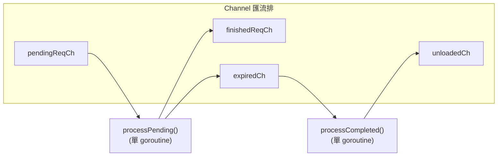

# Ollama · 值得偷學的設計

## Pattern 1: 子行程隔離（Subprocess Runner Pattern）

**是什麼**：
將高風險的推論引擎（C/C++ 程式碼，容易段錯誤）以獨立子行程執行，
主行程（Go server）透過 HTTP + JSON 與之通訊。

**為什麼有效**：
C/C++ 推論引擎的崩潰隔離是最棘手的問題之一。
CGo 內的 segfault 會直接帶走整個行程，導致所有進行中的請求中斷。
子行程隔離讓：

1. 引擎崩潰僅影響該模型的進行中請求，不影響其他模型
2. 主 server 可以自動重啟 runner，實現 transparent recovery
3. 可在不重啟主 server 的情況下切換引擎（如從 llamarunner 升級到 ollamarunner）

**程式碼位置**：
- 子行程啟動：[`llm/server.go:358`](https://github.com/ollama/ollama/blob/f63eea3/llm/server.go#L358)
- 引擎分派：[`runner/runner.go:10`](https://github.com/ollama/ollama/blob/f63eea3/runner/runner.go#L10)
- 崩潰檢測：[`llm/server.go:67-84`](https://github.com/ollama/ollama/blob/f63eea3/llm/server.go#L67-L84)（`LlamaServer` interface 的 `Ping()` 方法）

**替代方案**：
- **CGo 同行程**（傳統 llama.cpp binding）：無通訊成本，但 segfault 即全局 crash。
  典型實作如 `llama.go` 的 `llama.Model` struct。
  Ollama 在 llamarunner 中使用這種方式，但限制在子行程內。
- **微核心架構**（如 vLLM）：Python 行程內呼叫 CUDA kernel，使用 `torch.cuda.Stream` 隔離。
  崩潰仍然是全局的，但 Python 的錯誤處理比 C++ 段錯誤更安全。
- **gRPC / IPC**（如 TGI）：與 HTTP 相比，gRPC 有更低的序列化成本，但依賴 protobuf 生態。

**何時可以借用**：
- 當你的系統中有一個「不穩定但高效能」的元件（C/C++ library、CUDA kernel、舊系統整合）
- 當你希望「頂多重啟一個元件」而不是「整個服務掛掉」

**注意事項**：
- 子行程啟動延遲：Ollama 的冷啟動約 500ms-2s。若使用者每天只換一次模型影響不大，
  但對需要快速切換模型的場景（如 A/B testing），這是顯著開銷。
- HTTP over localhost 的序列化成本：每次推論步驟都要 JSON marshal/unmarshal。
  Ollama 透過 streaming 批次回傳來攤平成本。
- Zombie process 管理：必須正確處理 `cmd.Wait()` 避免 orphan child。

## Pattern 2: 事件驅動的排程器（Channel-Based Scheduler）

**是什麼**：
使用 Go channel 作為排程器的事件匯流排，實現無鎖的模型生命週期管理。

**程式碼位置**：
- Scheduler 結構：[`server/sched.go:38`](https://github.com/ollama/ollama/blob/f63eea3/server/sched.go#L38-L59)
- 事件迴圈處理：[`server/sched.go:170`](https://github.com/ollama/ollama/blob/f63eea3/server/sched.go#L170)
  `processPending()` 與 `processCompleted()`

**替代方案**：
- **Mutex-based state machine**：典型做法是用 `sync.Mutex` 保護模型狀態 map，
  每個請求取得鎖後檢查狀態。問題是鎖競爭和 deadlock 風險。
- **Actor model**：每個模型是一個 actor，透過 mailbox 通訊。更彈性但複雜度更高，
  且在 Go 中沒有內建 actor 支援。
- **Database-backed scheduler**：適合多機場景（如 Ray），
  對 Ollama 的單機場景過重。

**何時可以借用**：
- Go 專案中需要管理一批「有限資源」（模型、連線、worker pool）的生命週期
- 資源的建立/銷毀成本高（模型載入需要秒級時間）
- 需要精確控制「誰在用什麼資源，用多久」

**注意事項**：
- 單 goroutine 事件迴圈是 Throughput 瓶頸。Ollama 因為載入決策每秒只發生幾次，
  所以這是合理的。若決策頻率高（如每秒數百次），需要 redesign。
- Channel 的緩衝大小（`OLLAMA_MAX_QUEUE = 512`）是硬限制。超過直接回傳 error，
  但沒有背壓（backpressure）通知上層。
- 排程器本身無法平行執行──`activeLoading` 確保全域一次最多載入一個模型。

## Pattern 3: 引擎遷移的雙軌策略（Dual-Engine Migration）

**是什麼**：
在大型重構（從 llama.cpp CGo 到純 Go 引擎）期間，
同時維護兩套引擎，以模型架構為單位逐步遷移。

**程式碼位置**：
- 引擎選擇邏輯：[`llm/server.go:148`](https://github.com/ollama/ollama/blob/f63eea3/llm/server.go#L148)
- 強制使用新引擎的模型列表：[`fs/ggml/ggml.go`](https://github.com/ollama/ollama/blob/f63eea3/fs/ggml/ggml.go)（`OllamaEngineRequired()`）
- 引擎分派：[`runner/runner.go:10`](https://github.com/ollama/ollama/blob/f63eea3/runner/runner.go#L10)

**替代方案**：
- **大爆炸式（Big Bang）**：改完所有程式碼一次上線。風險極高，通常不適合開源專案。
- **特徵標誌（Feature Flag）**：用 `OLLAMA_NEW_ENGINE` 環境變數做全域切換。
  Ollama 已經有這個，但同時也按模型架構細分，更精細。
- **分階段 CGo 重構**：逐步把 llama.cpp 的元件用 Go 重寫，保持 CGo 介面不變。
  難點在於 C++ 的 RAII 和 template 在 Go 中難以對應。

**何時可以借用**：
- 你正在把一個 C/C++ 核心替換成更安全的語言實作
- 不能停機，必須保持向前相容
- 新實作還不支援所有功能

**注意事項**：
- 行為一致性：ollamarunner 和 llamarunner 的 sampling、cache 行為可能不同。
  Ollama 透過 `ggml/ggml.go` 中的 `OllamaEngineRequired()` 列表精確控制哪些模型用新引擎，
  但 [UNVERIFIED] 是否有人系統性比對輸出差異？
- 測試覆蓋：兩套引擎需要兩組測試。Ollama 的測試集中在 `server/sched_test.go`（排程邏輯）
  和 `server/routes_test.go`（API 邏輯），但 runner-level 的 testing 較少。
- 雙倍 binary 體積：Ollama 的 binary 同時包含 llama.cpp 和 ollamarunner 兩套推論引擎。

## Pattern 4: 三階段 GPU 記憶體分配（Iterative GPU Layout）

**是什麼**：
在載入模型時，Ollama 不是一次分配所有 GPU 記憶體，
而是分三階段（Fit → Alloc → Commit）迭代決定每層放在哪個 GPU。

**程式碼位置**：
[`llm/server.go:781-960`](https://github.com/ollama/ollama/blob/f63eea3/llm/server.go#L781-L960)（`Load()` 與 `createLayout()`）

**三階段**：
1. **Fit**（`LoadOperationFit`）：遍歷所有 GPU，計算每層放在哪個 GPU 的適合度，
   但**不分配記憶體**。實際上是 dry-run。
2. **Alloc**（`LoadOperationAlloc`）：根據 Fit 的結果分配 GPU 記憶體，
   但**不載入權重**。此時就能知道會不會 OOM。
3. **Commit**（`LoadOperationCommit`）：在知道不會 OOM 後，
   實際從 GGUF 檔案載入權重到 GPU。

**替代方案**：
- **一次分配**：先計算總需要 VRAM，一次 `cudaMalloc` 全部。簡單但無法應付
  跨 GPU 的分層分配。
- **OOM 時降級**：先載入，如果 OOM 就退到 CPU fallback。
  使用者體驗差（載入 30 秒後才說不行）。
- **vLLM 的 page-based 管理**：vLLM 使用 PagedAttention 動態管理 KV cache 的 GPU 記憶體，
  但權重仍然是預先分配的。

**何時可以借用**：
- 當你的應用需要在不確定的多 GPU 環境中載入大型模型
- 當分配的失敗成本高（使用者等待了幾分鐘）
- 當資源分配涉及複雜的約束（層到 GPU 的匹配）

**注意事項**：
- 三階段的複雜度來自於`模型層大小 ≠ 均勻分布`——不同層（embedding, attention, FFN）
  對 VRAM 需求不同。GGUF 檔案的每層 tensor 大小可以在載入前讀取。
- 迭代分配在 GPU 數量少時無感，但在 4+ GPU 時分配時間可能顯著。

## Pattern 5: OpenAI API 相容性中介層（Middleware Translation）

**是什麼**：
Ollama 不直接暴露 OpenAI API，而是透過 Gin middleware 將 OpenAI 格式的請求
轉換為 Ollama 內部的 API 格式。

**程式碼位置**：
- Middleware 註冊：[`server/routes.go:1722-1735`](https://github.com/ollama/ollama/blob/f63eea3/server/routes.go#L1722-L1735)
- Middleware 實作：[`middleware/`](https://github.com/ollama/ollama/blob/f63eea3/middleware/#L1)
- OpenAI 類型定義：[`openai/`](https://github.com/ollama/ollama/blob/f63eea3/openai/#L1)

**為什麼有效**：
將相容層設計為 middleware 而非 server 內的條件分支，有幾個好處：

1. **路由層級乾淨** — `POST /v1/chat/completions` 和 `POST /api/chat` 最終走同一個
   `ChatHandler`，但 middleware 在路由層完成轉換
2. **可組合** — middleware 可以疊加：
   `cloudPassthroughMiddleware → ChatMiddleware → ChatHandler`
3. **單一責任** — middleware 只負責資料格式轉換，不觸碰業務邏輯
4. **支援多協定** — 除了 OpenAI，還有 Anthropic Messages、OpenAI Responses 等格式

**何時可以借用**：
- 你的專案有自己的一套 API，但希望相容另一個生態的 API
- 相容性端點和原生端點共享大部分邏輯
- 需要支援多種外部 API 格式

**注意事項**：
- 相容性是**有損的**：OpenAI API 的某些欄位（如 `logit_bias`、`user`、`seed` 的嚴格語義）
  在 Ollama 中可能沒有一對一的對應
- Middleware 路徑增加 debug 難度：一個 `POST /v1/chat/completions` 經過 3 層 middleware
  後才到 handler，追蹤問題需要理解每層的轉換

## Pattern 6: `ml/` Backend 註冊機制（Plugin Architecture）

**是什麼**：
Ollama 的新引擎（ollamarunner）使用 `ml.Backend` 介面和 `RegisterBackend` 註冊機制，
讓推論後端可以在不修改核心引擎程式碼的情況下被加入。

**程式碼位置**：
- Backend 介面：[`ml/backend.go:16-32`](https://github.com/ollama/ollama/blob/f63eea3/ml/backend.go#L16-L32)
- 註冊機制：[`ml/backend.go:76-80`](https://github.com/ollama/ollama/blob/f63eea3/ml/backend.go#L76-L80)
- 目前唯一實作 GGML：[`ml/backend/ggml/`](https://github.com/ollama/ollama/blob/f63eea3/ml/backend/ggml/#L1)

**替代方案**：
- **虛擬函式表**（C++ vtbl）：llama.cpp 的做法，效能好但需編譯時期確定
- **Interface + 型別 switch**：Go 中常見，但新增一個 backend 需要改 switch 分支
- **GRPC plugin**：更重的方案，適合跨語言或跨行程的 plugin（如 TensorFlow Serving）

**何時可以借用**：
- 你的系統需要支援多種底層實作，且未來可能增加新的
- 新實作和核心系統的生命週期相同（不需獨立部署）

**注意事項**：
- 目前只有 `ggml` 一個 backend。`RegisterBackend` 提供了擴充點，
  但 [UNVERIFIED] 未來是否會增加其他 backend（如 DirectML、CoreML、TensorRT）？
- 介面的粒度（Tensor 層級 40+ 種方法）很重，實作一個新的 backend 需要投入大量工作。

## ML 工程品味的觀察

- **對 abstraction 的態度適中**：Ollama 不極端——新引擎（ollamarunner）有 `ml/` 抽象層，
  但舊引擎（llamarunner）直接穿透到 llama.cpp C API。沒有為抽象而抽象。
- **Go 與 C++ 的邊界管理**：Go 的 goroutine + channel 非常適合做狀態管理（排程器），
  C++ 則專注於張量運算。兩者透過最簡單的介面（HTTP + JSON）通訊。
  這是 pragmatic 的設計，而非追求「技術一致性」。
- **環境變數勝於 config file**：所有配置透過 `OLLAMA_*` 環境變數設定，沒有 YAML/TOML config file。
  對 CLI tool 來說這是合理的選擇——但對 production 部署來說，環境變數的可追蹤性比 config file 差。
- **積極擁抱新模型**：ollamarunner 的強制引擎清單持續更新，支援最新的 Gemma 4、Llama 4、Qwen 3 等。
  這種「最新模型優先」的策略讓使用者在 Ollama 上總是能先跑最新模型。
