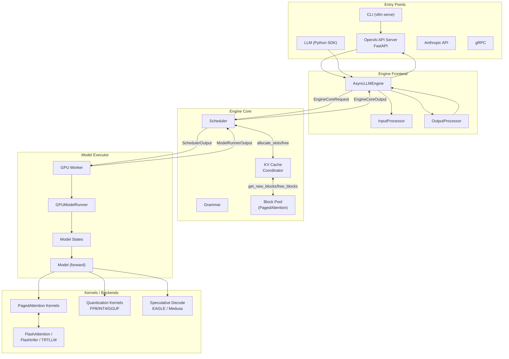
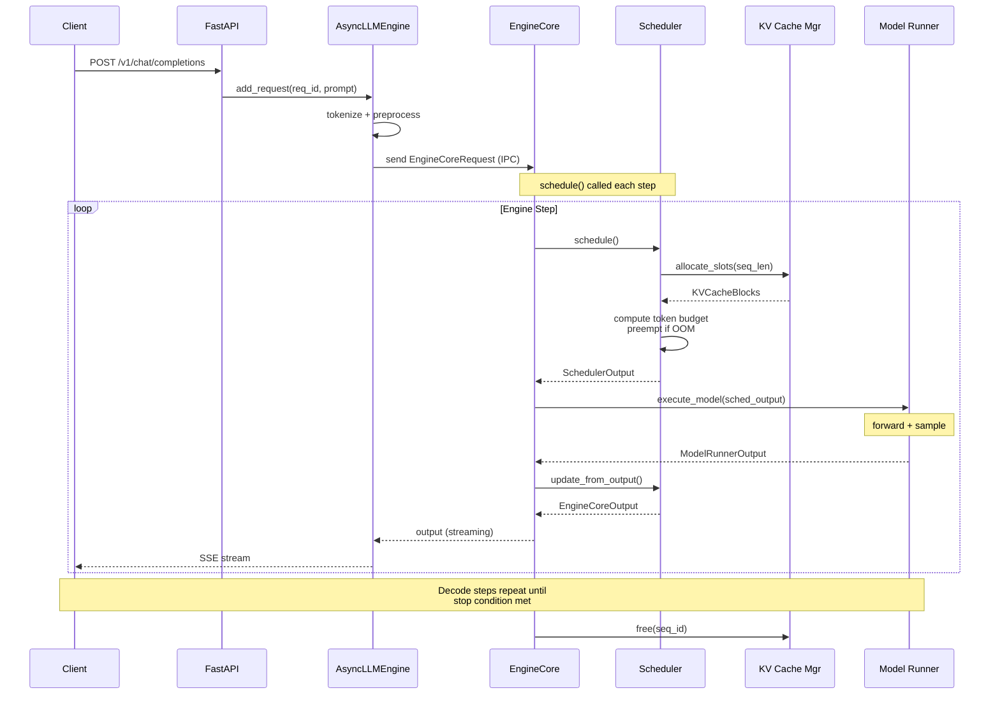
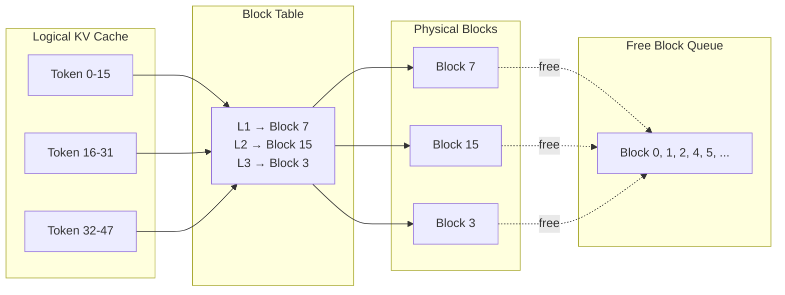
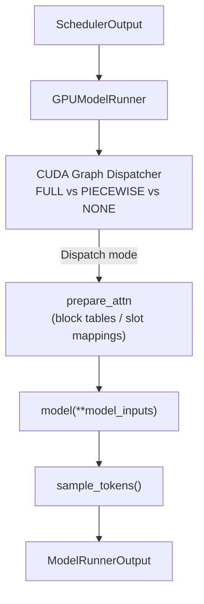

# vLLM · 架構

## 系統高層圖



**圖意說明**: vLLM 的架構可以分為四層。頂層是 Entry Points（CLI、Python SDK、OpenAI 相容 API Server），透過 FastAPI 接受 HTTP 請求。中間層是 Engine Frontend（AsyncLLMEngine），負責 input 預處理與 output 後處理，並透過 EngineCoreRequest/EngineCoreOutput 序列化協定與 Engine Core 通訊。Engine Core 包含 Scheduler（continuous batching 核心）與 KV Cache 管理系統（PagedAttention 的記憶體管理），Shared-nothing 設計讓多個 frontend 可以掛在同一個 engine core 上。底層是 Model Executor（GPU Worker → Model Runner → Model），執行實際的模型 forward 並呼叫各種 attention kernel backend。

---

## 核心流程：一個請求的生命週期



**圖意說明**: 從請求抵達到完成輸出，依序經過：（1）Client 發送 HTTP request → FastAPI 路由 → AsyncLLMEngine 加進佇列；（2）EngineCore 的 `step()` 方法呼叫 Scheduler 決定排程哪些 request 的哪些 token（continuous batching 核心決策）；（3）Scheduler 向 KV Cache Manager 分配 block（PagedAttention 的核心——只分配當前 token 需要的 block，不是整條序列）；（4）GPUModelRunner 執行 forward + sample；（5）output 送回 scheduler 更新狀態，再經由 AsyncLLMEngine 以 SSE stream 方式逐步回傳給 client。

---

## V1 引擎架構（2025 重構）

vLLM 在 2025 年完成了 V1 引擎重構。舊版引擎是單進程設計，V1 改為 frontend / engine core 分離架構：

| 元件 | 位置 | 職責 |
|------|------|------|
| **Engine Core** | `vllm/v1/engine/core.py` | 核心排程循環：`schedule()` → `execute_model()` → `update_from_output()` |
| **Engine Frontend** | `vllm/v1/engine/llm_engine.py` | Input tokenization、output detokenization、處理 aborts |
| **Scheduler** | `vllm/v1/core/sched/scheduler.py` | Continuous batching、preemption、token budget 計算 |
| **KV Cache Manager** | `vllm/v1/core/kv_cache_manager.py` | Block 分配 / 釋放 / prefix caching |
| **Block Pool** | `vllm/v1/core/block_pool.py` | PagedAttention 的實體 block 管理（free list + hash map） |

### 為什麼要分離 frontend 與 engine core？

- **多 frontend 共享一個 engine core** — 支援多個 API server 同時連到同一個 engine（例如 OpenAI API + gRPC + Python SDK）
- **序列化協定明確** — EngineCoreRequest / EngineCoreOutput 透過 msgpack 序列化，frontend 跟 engine core 之間可以走不同的 transport（IPC、RPC、共享記憶體）
- **非同步 pipeline** — EngineCore 支援 `step_with_batch_queue()`，讓 batch 的 execute 跟 scheduler 可以重疊進行

---

## Scheduler — Continuous Batching 設計

Scheduler 是整個系統最關鍵的元件（`vllm/v1/core/sched/scheduler.py:329-922`）。它不區分獨立的「prefill 階段」或「decode 階段」，而是用統一的 `num_computed_tokens` 模型：

> 每個 request 有 `num_computed_tokens` 和 `num_tokens_with_spec`。Scheduler 嘗試讓 `num_computed_tokens` 追上 `num_tokens_with_spec`。

| 場景 | num_new_tokens | 效果 |
|------|---------------|------|
| 新請求（尚未計算任何 token） | 整條 prompt（或 chunked） | prefill |
| 單步 decode | 1（加上 spec tokens） | decode |
| 長 prompt + `long_prefill_token_threshold` | 截斷到 threshold | chunked prefill |
| Prefix cache 命中 | prompt 減去命中 token | 較短的 prefill |

**排程步驟**（同一次 `schedule()` 呼叫內）：

1. **排程 RUNNING requests**（`scheduler.py:364-499`）— 遍歷 `self.running`，計算每個 request 的 `num_new_tokens`，受 `token_budget` 限制
2. **搶佔**（`scheduler.py:456-487`）— 若 KV cache 記憶體不足，觸發 preemption，重置 `num_computed_tokens=0` 並放回 waiting queue
3. **排程 WAITING requests**（`scheduler.py:544-823`）— 若還有 token budget，將新請求加入 batch

### Token budget 設計

Token budget 是控制 prefill/decode balance 的關鍵。`max_num_scheduled_tokens` 決定每次排程最多可以排程多少 token。當 budget 用完但仍有请求在 running 時，新的 request 會等到下一個 step 才被排程。這確保 decode request 不會被長 prefill blocking。

**Chunked prefill**（`enable_chunked_prefill=True`，預設）：允許一條長 prompt 分多次排程，中間穿插 decode request。Trade-off：降低 TTFT 變異但增加 per-token overhead。

**Long prefill token threshold**：當設定此值時，單次 prefill 不會超過 threshold token。這是為了保障 decode latency，但代價是長 prompt 的 TTFT 增加。

---

## PagedAttention — KV Cache 管理

PagedAttention 的核心是**將 KV cache 切成固定大小的 block（預設 16 tokens/block），透過 block table 進行間接定址**。這不像傳統實作那樣為整個序列預留連續記憶體，而是按需分配：



### Block 管理架構（三層委派）

```
Scheduler → KVCacheManager (kv_cache_manager.py:110)
          → KVCacheCoordinator (kv_cache_coordinator.py)
          → SingleTypeKVCacheManager(s)
          → BlockPool (block_pool.py)
```

**BlockPool**（`block_pool.py:149-182`）是最底層的管理器：

- `num_gpu_blocks`：所有可用的 GPU block 總數（由 KV cache 大小決定）
- `FreeKVCacheBlockQueue`：雙向鏈結串列實現的 free list，支援 O(1) remove / popleft / append（`kv_cache_utils.py:164-372`）
- `BlockHashToBlockMap`：hash → block 對應表（prefix caching 用）
- `null_block`：block_id=0 保留為空指標

**KVCacheManager.allocate_slots()**（`kv_cache_manager.py:236-427`）是分配邏輯的核心：

1. Admission gate：若 `full_sequence_must_fit=True`，先檢查整條序列是否需要多於 free blocks
2. 計算所需的 block 數量
3. 分配 prefix hit blocks（有 hash match 的 block 透過引用計數共享）
4. 分配新的 blocks（從 free queue 取出）
5. 將已滿的 block 寫入 hash map（prefix caching 啟用時）

### Prefix Caching

Prefix caching 透過 block hash 實現跨 request 共享（`block_pool.py:211-331`）。當多個 request 有相同的 prefix（例如 system prompt），它們可以共用相同的 physical block，只需增加 `ref_cnt`。

**不進行去重複**（`block_pool.py:48-52`）：相同的 hash 可以對應多個 physical block。這是 trade-off：不保證去重可以保持 block table append-only（block ID 永不改變），簡化實作但可能浪費記憶體。

### Block size 的取捨

| Block size | 優勢 | 劣勢 |
|-----------|------|------|
| 小（8-16 tokens） | 記憶體利用率高（碎片少） | block table 大、prefix cache 查找開銷增加 |
| 大（32-64 tokens） | block table 小、prefix cache hit 更容易 | 內部碎片增加 |

vLLM 預設 block_size=16，hash_block_size 可以獨立設定（`kv_cache_coordinator.py:360-367`），允許在較小粒度計算 hash 而使用較大 block。

---

## GPUModelRunner — 模型執行

`execute_model()`（`vllm/v1/worker/gpu/model_runner.py:1009-1225`）的執行路徑：



1. **狀態更新** — `finish_requests()` / `free_states()` / `add_requests()` / `update_requests()` / `block_tables.apply_staged_writes()`
2. **CUDA graph dispatch** — 決定使用 FULL / PIECEWISE / NONE 模式
3. **Input / attention preparation** — 建立 attention metadata（block tables、slot mappings）、cu_seq_lens、kv_cache_config
4. **Model forward** — 呼叫 `model(**model_inputs)`，包在 `set_forward_context` 內
5. **Sampling** — `sample_tokens()` 執行取樣 + 多項後處理（grammar bitmask、logit bias、penalties）

### CUDA Graph 三種模式

| 模式 | 說明 | 適用場景 |
|------|------|----------|
| `NONE`（eager） | 無 CUDA graph | prefill（dynamic shape 無法 capture）|
| `PIECEWISE` | 分段式 CUDA graph | 通用 decode，支援變動 batch size（`num_reqs=None`）|
| `FULL` | 完整 CUDA graph | uniform decode（固定 batch size 與 token count）|

CudagraphDispatcher（`vllm/v1/cudagraph_dispatcher.py:239-328`）的 dispatch 邏輯：FULL 要求 exact match + uniform decode，PIECEWISE 使用 relaxed key（`num_reqs=None, uniform=False`），若無匹配則 fallback 到 NONE。

**Piecewise CUDA graph 的兩種實作**：
- **Dynamo-based**（`vllm/compilation/piecewise_backend.py`）：透過 FX graph `split_graph()` 將模型計算圖分段，每段獨立 capture
- **Breakable CUDAGraph**（`vllm/compilation/breakable_cudagraph.py`）：在 runtime 透過 dispatcher hook 攔截 attention/kv-cache 操作，結束當前 segment 後用 eager 執行再開新 segment

---

## 分散式推論

| 並行策略 | 說明 | 適用場景 |
|---------|------|----------|
| **Tensor Parallelism (TP)** | 將每個 linear layer 的 weight 切分到多 GPU | 單機多 GPU，模型大到一張卡放不下 |
| **Pipeline Parallelism (PP)** | 按 layer 分階段，各 GPU 負責不同層 | 多機多 GPU，減少跨機通訊量 |
| **Expert Parallelism (EP)** | MoE 模型中每個 expert 分配到不同 GPU | DeepSeek-V3、Mixtral 等 MoE 模型 |
| **Context Parallelism (CP)** | 長 context 的 attention 計算分布到多 GPU | 處理超過單卡記憶體的 context |
| **Data Parallelism (DP)** | 相同模型多副本，不同資料同時處理 | 高吞吐量場景 |

### KV Cache Transfer（Disaggregated Prefill/Decode）

vLLM 支援 disaggregated serving：prefill 節點只做 prefill，decode 節點只做 decode，兩者之間透過 KV cache transfer 交換資料。這項功能透過 `vllm/v1/core/kv_cache_coordinator.py` 內的 KV connector 介面實作，支援多種 connector 實作（gRPC、NVIDIA NIXL 等）。

---

## 與前端通訊的序列化協定

EngineCore 與 Engine Frontend 之間的通訊使用 `msgspec.Struct` 序列化（`vllm/v1/engine/__init__.py:81-198`）：

| 資料結構 | 用途 | 序列化格式 |
|---------|------|-----------|
| `EngineCoreRequest` | 從 frontend 送給 engine core 的請求 | msgspec（msgpack）|
| `EngineCoreOutput` | 從 engine core 送回 frontend 的輸出 | msgspec（msgpack）|
| `EngineCoreOutput.finished` | 布林值指示請求是否完成 | msgspec |

使用 msgspec 而非 JSON/Protobuf 的考量：msgspec 提供比 JSON 快 ~10x 的序列化速度，且支援 `array_like=True` 對陣列資料的緊湊編碼，在每個 inference step 都有大量 token IDs、logprobs 要傳輸時明顯減少延遲。

---

## 配置系統

vLLM 的配置 (`vllm/config/`) 採用 dataclass 層級結構：

| Config 類別 | 位置 | 關鍵參數 |
|------------|------|---------|
| `ModelConfig` | `config/model.py` | `dtype`、`max_model_len`、`trust_remote_code` |
| `CacheConfig` | `config/cache.py` | `block_size`、`enable_prefix_caching`、`cache_type` |
| `SchedulerConfig` | `config/scheduler.py` | `max_num_batched_tokens`、`enable_chunked_prefill`、`long_prefill_token_threshold` |
| `ParallelConfig` | `config/parallel.py` | `tensor_parallel_size`、`pipeline_parallel_size`、`data_parallel_size` |
| `CompilationConfig` | `config/compilation.py` | `cudagraph_mode`（FULL / PIECEWISE / NONE）|
| `VllmConfig` | `config/__init__.py` | 頂層容器，包含所有子 config |

VllmConfig 是所有子 config 的容器，透過 `EngineArgs.create_configs()` 從 CLI args 或 `EngineArgs` 初始化。

---

## 關鍵 path:line 引用

| 元件 | 檔案路徑 | 起始行 |
|------|---------|-------|
| EngineCore.step() 主循環 | [`vllm/v1/engine/core.py`](https://github.com/vllm-project/vllm/blob/0902d8e/vllm/v1/engine/core.py#L428) | 428 |
| Scheduler.schedule() — continuous batching 核心 | [`vllm/v1/core/sched/scheduler.py`](https://github.com/vllm-project/vllm/blob/0902d8e/vllm/v1/core/sched/scheduler.py#L329) | 329 |
| Scheduler 的搶佔邏輯 | [`vllm/v1/core/sched/scheduler.py`](https://github.com/vllm-project/vllm/blob/0902d8e/vllm/v1/core/sched/scheduler.py#L929) | 929 |
| KVCacheManager.allocate_slots() | [`vllm/v1/core/kv_cache_manager.py`](https://github.com/vllm-project/vllm/blob/0902d8e/vllm/v1/core/kv_cache_manager.py#L236) | 236 |
| BlockPool 初始化 | [`vllm/v1/core/block_pool.py`](https://github.com/vllm-project/vllm/blob/0902d8e/vllm/v1/core/block_pool.py#L149) | 149 |
| FreeKVCacheBlockQueue 雙向鏈結串列 | [`vllm/v1/core/kv_cache_utils.py`](https://github.com/vllm-project/vllm/blob/0902d8e/vllm/v1/core/kv_cache_utils.py#L164) | 164 |
| GPUModelRunner.execute_model() | [`vllm/v1/worker/gpu/model_runner.py`](https://github.com/vllm-project/vllm/blob/0902d8e/vllm/v1/worker/gpu/model_runner.py#L1009) | 1009 |
| GPUModelRunner.sample_tokens() | [`vllm/v1/worker/gpu/model_runner.py`](https://github.com/vllm-project/vllm/blob/0902d8e/vllm/v1/worker/gpu/model_runner.py#L1229) | 1229 |
| CudagraphDispatcher.dispatch() | [`vllm/v1/cudagraph_dispatcher.py`](https://github.com/vllm-project/vllm/blob/0902d8e/vllm/v1/cudagraph_dispatcher.py#L239) | 239 |
| EngineCoreRequest 通訊協定 | [`vllm/v1/engine/__init__.py`](https://github.com/vllm-project/vllm/blob/0902d8e/vllm/v1/engine/__init__.py#L81) | 81 |
| AsyncLLMEngine（V1 引擎前端） | [`vllm/v1/engine/llm_engine.py`](https://github.com/vllm-project/vllm/blob/0902d8e/vllm/v1/engine/llm_engine.py#L47) | 47 |
| OpenAI API server 入口 | [`vllm/entrypoints/openai/api_server.py`](https://github.com/vllm-project/vllm/blob/0902d8e/vllm/v1/entrypoints/openai/api_server.py#L77) | 77 |
| Chat completion API router | [`vllm/entrypoints/openai/chat_completion/api_router.py`](https://github.com/vllm-project/vllm/blob/0902d8e/vllm/v1/entrypoints/openai/chat_completion/api_router.py#L40) | 40 |

## 核心 design decisions 摘要

| Decision | Location | Trade-off |
|----------|----------|-----------|
| PagedAttention block-level KV cache | `core/block_pool.py` | 記憶體利用率 ↑ vs block table overhead ↑ |
| Unified `num_computed_tokens` model | `core/sched/scheduler.py:330-339` | 消除 prefill/decode 二元區分，但增加排程複雜度 |
| Chunked prefill（預設啟用） | `core/sched/scheduler.py:659-667` | TTFT 變異 ↓ vs per-token overhead ↑ |
| Frontend/EC 分離架構 | `v1/engine/core.py` + `llm_engine.py` | 彈性 ↑ vs IPC 序列化開銷 ↑ |
| msgspec 序列化 | `v1/engine/__init__.py` | 序列化速度 ↑ vs 非標準格式 |
| Piecewise CUDA graph | `cudagraph_dispatcher.py` | 通用性 ↑ vs FULL graph 的單 kernel overhead ↑ |
| 不進行 prefix cache 去重複 | `core/block_pool.py:48-52` | 實作簡單 + append-only block table vs 記憶體浪費 |
