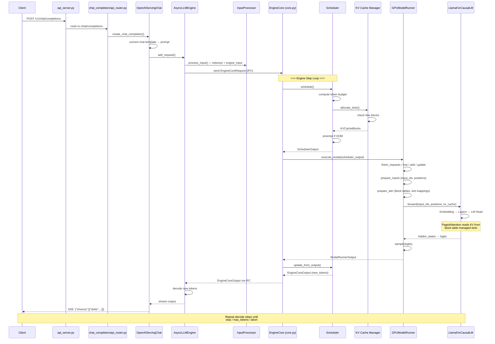
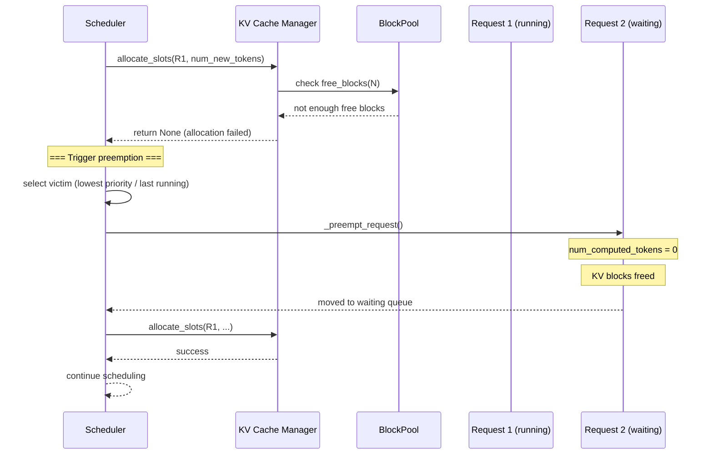

# vLLM · 程式碼追蹤

## 追蹤的場景

**場景**: 一個 client 發送 `POST /v1/chat/completions` 請求到 OpenAI 相容 API server，vLLM 處理 prefill + 多步 decode，最後回傳完整 completion。

**啟動命令**:
```bash
vllm serve meta-llama/Llama-3.1-8B-Instruct --port 8000
```

## 流程圖



**圖意說明**: 從 HTTP request 到 token 輸出的完整路徑。關鍵的設計選擇在於 (1) conversation 到 prompt 的轉換由 `OpenAIServingChat` 負責，在 engine 外部完成；(2) EngineCore 的 `step()` 方法整合了 schedule、execute、update 三個階段，但透過 `non_block=True` 和 batch queue 實現非同步 pipeline；(3) GPUModelRunner 的 execute_model 不是直接回傳結果，而是回傳 `None` 並由 `sample_tokens()` 產生實際輸出，這讓 grammar bitmask 可以在 forward 之後、sampling 之前插入。

---

## 逐步追蹤

### Step 1: FastAPI route → OpenAIServingChat

**檔案**: [`vllm/entrypoints/openai/chat_completion/api_router.py:40-53`](https://github.com/vllm-project/vllm/blob/0902d8e/vllm/entrypoints/openai/chat_completion/api_router.py#L40-L53)

```python
@router.post("/chat/completions")
async def create_chat_completion(request: ChatCompletionRequest, raw_request: Request):
```

FastAPI router 接收 client 的 JSON body，解析成 `ChatCompletionRequest`（Pydantic model），然後傳給 `OpenAIServingChat.create_chat_completion()`。

**檔案**: [`vllm/entrypoints/openai/chat_completion/serving.py:85-400+`](https://github.com/vllm-project/vllm/blob/0902d8e/vllm/entrypoints/openai/chat_completion/serving.py#L85)

`OpenAIServingChat` 負責：
- 將 ChatML 格式的 messages 轉換成模型適用的 prompt（使用 chat template）
- 處理 sampling params override（temperature、top_p、max_tokens 等）
- 呼叫 `self.engine.add_request()` 將請求加入 engine

### Step 2: AsyncLLMEngine.add_request

**檔案**: [`vllm/v1/engine/llm_engine.py:47-155`](https://github.com/vllm-project/vllm/blob/0902d8e/vllm/v1/engine/llm_engine.py#L47-L155)

`LLMEngine`（注意：原本在 `vllm/engine/llm_engine.py` 的 class 現在只是 V1 的 alias）的 `add_request()` 方法：
1. 接收 prompt + sampling params
2. 透過 `InputProcessor.process_input()` 進行 tokenization
3. 包裝成 `EngineCoreRequest`（包含 `prompt_token_ids`、`sampling_params`、`arrival_time` 等）
4. 傳送給 EngineCore（透過 IPC 或 in-process，取決於 executor 模式）

**IPC 通訊**: `EngineCoreRequest` 使用 `msgspec.Struct` 序列化為 msgpack。Frontend 與 EngineCore 分離在不同進程時，透過 socket 或 shared memory 傳輸；同一進程時則直接呼叫。

### Step 3: EngineCore.step() — 排程與執行

**檔案**: [`vllm/v1/engine/core.py:428-457`](https://github.com/vllm-project/vllm/blob/0902d8e/vllm/v1/engine/core.py#L428-L457)

```python
def step(self) -> tuple[dict[int, EngineCoreOutputs], bool]:
    if not self.scheduler.has_requests():
        return {}, False
    scheduler_output = self.scheduler.schedule()
    future = self.model_executor.execute_model(scheduler_output, non_block=True)
    grammar_output = self.scheduler.get_grammar_bitmask(scheduler_output)
    model_output = future.result()
    if model_output is None:
        model_output = self.model_executor.sample_tokens(grammar_output)
    self._process_aborts_queue()
    engine_core_outputs = self.scheduler.update_from_output(
        scheduler_output, model_output
    )
    return engine_core_outputs, ...
```

這是核心循環。`non_block=True` 讓 execute_model 可以在另一個執行緒執行，engine core 同時處理 grammar bitmask 運算。`future.result()` 會 blocking 直到 model 執行完成。

### Step 4: GPUModelRunner.execute_model

**檔案**: [`vllm/v1/worker/gpu/model_runner.py:1009-1225`](https://github.com/vllm-project/vllm/blob/0902d8e/vllm/v1/worker/gpu/model_runner.py#L1009-L1225)

這是實際執行模型 forward 的方法：

**4.1 狀態更新（第 1019-1027 行）**

```python
self.model_state.finish_requests(scheduler_output)
self.model_state.free_states(scheduler_output)
self.model_state.add_requests(scheduler_output)
self.model_state.update_requests(scheduler_output)
self.block_tables.apply_staged_writes()
```

**4.2 Input 準備 — prepare_inputs（~第 1060 行）**

建立 `input_ids`、`positions`、`cu_seq_lens` 等張量。prefill 時 input_ids 包含整條 prompt 的 token IDs；decode 時只包含最新產生的 token。

**4.3 Attention 準備 — prepare_attn（~第 1061-1121 行）**

透過 `block_tables.gather_block_tables()` 和 `compute_slot_mappings()` 建立 attention 所需要的 metadata：
- `block_tables`：每個 request 的 block 映射表（logical → physical）
- `slot_mappings`：每個 token 在 KV cache 中的 slot 位置
- `kv_cache_config`：KV cache 的後設資料（block size、cache type 等）

**4.4 Model Forward（第 1168-1193 行）**

```python
if batch_desc.cg_mode == CUDAGraphMode.FULL:
    model_output = self.cudagraph_manager.run_fullgraph(batch_desc)
else:
    with set_forward_context(..., cudagraph_runtime_mode=batch_desc.cg_mode):
        model_output = self.model(**model_inputs)
```

FULL mode 時直接 replay CUDA graph（預先 capture 的完整計算圖），PIECEWISE 或 NONE 時直接執行 `model(**model_inputs)`。

**4.5 Sampling（第 1229-1349 行）**

```python
def sample_tokens(self, grammar_output):
    # 1. 取樣
    logits = self.get_forward_output()
    sampled = self.sampler(logits)
    # 2. Prompt logprobs
    self.prompt_logprobs_worker.compute_prompt_logprobs()
    # 3. Speculative decoding 的 draft 生成
    self.speculator.propose()
    # 4. 後處理
    self.postprocess()
    return ModelRunnerOutput(...)
```

`execute_model` 回傳 `None`（第 1211-1218 行），保留 `execute_model_state` 並由 `sample_tokens()` 使用。這讓 EngineCore 能在 model forward 完成後、sampling 之前插入 grammar bitmask 運算。

### Step 5: Scheduler.update_from_output

**檔案**: [`vllm/v1/core/sched/scheduler.py:990-1050`](https://github.com/vllm-project/vllm/blob/0902d8e/vllm/v1/core/sched/scheduler.py#L990-L1050)

`update_from_output()` 處理 model 的輸出：
1. 更新每個 request 的 `num_computed_tokens`（等於之前排程的總 token 數）
2. 檢查 finish reason（stop / length / abort / error / repetition）
3. 組裝 EngineCoreOutput（含 new_token_ids、logprobs、events）
4. 回傳給 EngineCore → AsyncLLMEngine → decodes tokens → stream 給 client

### Step 6: Streaming 回傳

**檔案**: [`vllm/entrypoints/openai/chat_completion/serving.py`](https://github.com/vllm-project/vllm/blob/0902d8e/vllm/entrypoints/openai/chat_completion/serving.py)

`OpenAIServingChat` 使用 `StreamingResponse` 以 SSE（Server-Sent Events）格式逐步回傳 token。每個 chunk 包含 `choices[0].delta.content`。

---

## 關鍵路徑上的重要節點

| 步驟 | 檔案 | 行數 | 注意事項 |
|------|------|------|---------|
| API 入口 | `entrypoints/openai/chat_completion/api_router.py` | 53 | FastAPI router |
| Engine 加入請求 | `v1/engine/llm_engine.py` | 150-200 | EngineCoreRequest 包裝 |
| 核心循環 | `v1/engine/core.py` | 428-457 | schedule → execute → update |
| Scheduler 決策 | `v1/core/sched/scheduler.py` | 329-922 | Continuous batching 核心 |
| KV cache 分配 | `v1/core/kv_cache_manager.py` | 236-427 | Block allocate + prefix cache |
| Model 執行 | `v1/worker/gpu/model_runner.py` | 1009-1225 | Forward + sample |
| Sampling | `v1/worker/gpu/model_runner.py` | 1229-1349 | Logits → tokens |
| Output 後處理 | `v1/engine/llm_engine.py` | 250-350 | Decode + stream |

---

## 想學更多時，在哪裡下中斷點

- **想看 scheduler 的 token budget 計算**: `v1/core/sched/scheduler.py:380-400`
- **想看 KV cache 分配 / 釋放**: `v1/core/kv_cache_manager.py:236-437`
- **想看 block table 的內容**: `v1/worker/gpu/model_runner.py:909-925`
- **想看一次 forward 的 input tensor**: `v1/worker/gpu/model_runner.py:1060-1070`
- **想看 sampling 結果**: `v1/worker/gpu/model_runner.py:1255`
- **想看 prefix cache hit 狀況**: `v1/core/kv_cache_manager.py:194-234`
- **想看 CUDA graph dispatch 決策**: `v1/cudagraph_dispatcher.py:239-328`
- **想看 PP 通訊的中間張量**: `v1/worker/gpu_worker.py:826-868`

## 沒追蹤到但值得留意

- **Disaggregated prefill/decode**: 這是另一個完整的使用場景，prefill 節點和 decode 節點分離運作，透過 KV cache transfer 溝通。路徑涉及 `v1/core/kv_cache_coordinator.py` 和 `entrypoints/serve/disagg/` 下的多個檔案
- **Offline inference via `LLM` class**: 使用 `LLM.generate()` 時不走 HTTP server，直接透過 `LLMEngine` 操作，適合批量離線推論
- **Speculative decoding pipeline**: 涉及 `v1/worker/gpu/spec_decode/` 下的 draft model、verification、rejection sampling 流程，跟標準 decode 路徑有顯著不同

## Failure Path: 請求中止與異常處理

並非所有請求都能順利完成。以下是常見的 failure path：

### 客戶端中止（Abort）

```mermaid
sequenceDiagram
  participant C as Client
  participant API as FastAPI
  participant AS as AsyncLLMEngine
  participant EC as EngineCore
  participant S as Scheduler
  participant MR as Model Runner

  C->>API: POST /v1/chat/completions
  API->>AS: add_request()
  AS->>EC: EngineCoreRequest
  EC->>S: schedule() → prefill
  EC->>MR: execute_model
  C-->>API: DISCONNECT (TCP close)
  API->>AS: abort(req_id)
  AS->>EC: abort_request(req_id)
  EC->>EC: _process_aborts_queue()
  Note over EC: Sets request.finish_reason = ABORT
  Note over S: Preempted request's KV blocks freed
  EC-->>AS: EngineCoreOutput(finished, ABORT)
  Note over API: Response already closed
  Client never receives remaining tokens
```

**實作細節**:
- Abort 請求透過 `_process_aborts_queue()` 在每次 `step()` 中處理（[`core.py:452`](https://github.com/vllm-project/vllm/blob/0902d8e/vllm/v1/engine/core.py#L452)）
- Scheduler 不立即從 running queue 移除 request — 而是等待下次 `schedule()` 時偵測到 finish reason 再做 cleanup
- KV cache 的 block 在 `free()` 中被釋放，逆序釋放讓尾部 block 優先參與 prefix caching

### KV Cache 記憶體不足（Preemption）



**實作細節**:
- Preemption 策略分為 PRIORITY（優先搶佔高 priority request）和 FCFS（搶佔最後一個）（[`scheduler.py:456-487`](https://github.com/vllm-project/vllm/blob/0902d8e/vllm/v1/core/sched/scheduler.py#L456-L487)）
- `_preempt_request()`（[`scheduler.py:929-949`](https://github.com/vllm-project/vllm/blob/0902d8e/vllm/v1/core/sched/scheduler.py#L929-L949)）重置 `num_computed_tokens=0` 並清空 KV cache
- 這意味著被搶佔的 request 重新被排程時，需要從頭開始 prefill —— 這是簡化實作的取捨，對長 prompt 的代價較大

### Engine Dead Error

當 EngineCore 進程意外終止時，[`EngineDeadError`](https://github.com/vllm-project/vllm/blob/0902d8e/vllm/v1/engine/exceptions.py) 被拋出：
- Frontend 的 EngineCoreClient 會偵測到連線中斷
- 所有進行中的請求以 error 狀態完成
- HTTP server 回傳 500 Internal Server Error
