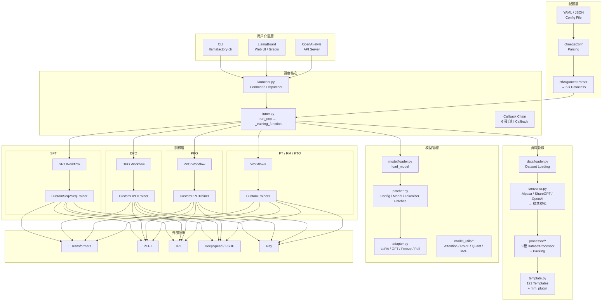
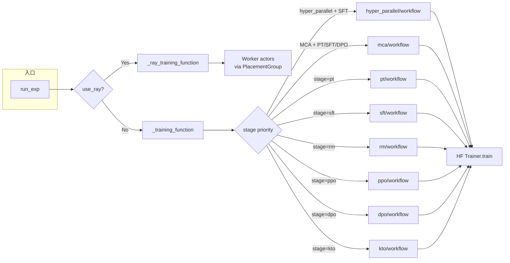

# LLaMA-Factory · 架構

## 系統高層圖



### 圖意說明

這張圖展示了 LLaMA-Factory 的五層架構。最關鍵的設計決策在於**「配置層 → 調度核心 → 訓練層」**的縱向切分：用戶透過 CLI / WebUI / API 三種入口傳入 YAML 配置，經過 OmegaConf 解析並轉換為 5 個 HuggingFace Argument 類別（`ModelArguments`、`DataArguments`、`TrainingArguments`、`FinetuningArguments`、`GeneratingArguments`），然後由 `_training_function()` 根據 `finetuning_args.stage` 發動對應的訓練流程。每一個訓練流程都獨立封裝在 `workflow.py` + `trainer.py` 的配對中，共用底層的 data pipeline 與 model pipeline。

注意圖中省略了多個可選路徑：`use_hyper_parallel`（SFT 專用）、`use_mca`（PT / SFT / DPO 專用）和 `use_ray`（任意階段），它們在 tuner.py 中被優先檢查，會替代標準的 `run_sft()` / `run_dpo()` 呼叫。

## 訓練階段調度流程



### 圖意說明

LLaMA-Factory 的調度策略是「三層優先權」：`use_hyper_parallel` > `use_mca` > `stage`。hyper_parallel 與 MCA 是替代性 backend（分別取代標準 HF Trainer），只能在特定訓練階段使用。Ray 則是最外層的包裝，不影響內部流程選擇——它透過 `ray.remote` 啟動多個 Worker，每個 Worker 各自呼叫 `_training_function()`。

這個設計的取捨：標準 HF Trainer 路徑最容易除錯和擴展新訓練階段；hyper_parallel 提供自訂的 tensor parallelism；MCA 提供多上下文注意力（Multi-Context Attention）的支援。三者互斥，由用戶在 YAML config 選擇。

## 資料管線

### 資料來源

LLaMA-Factory 支援 6 種資料來源，全部透過 `dataset_info.json` 或 `dataset_info.yaml` 配置：

- **hf_hub** — HuggingFace Hub 資料集（`load_dataset()` 直接載入）
- **ms_hub / om_hub** — ModelScope / OpenMind Hub（中國用戶常用，自動切換）
- **script** — 本地 Python 資料集 script（與 HuggingFace datasets 的 loading script 相容）
- **cloud_file** — 雲端檔案（支援 JSON format，透過 `read_cloud_json()` 讀取）
- **file** — 本地檔案（自動偵測 JSON / JSONL / Arrow / Parquet / CSV 等格式）
- **remote** — 遠端 `dataset_info.json`，從指定 repo_id 下載配置

**位置**: [src/llamafactory/data/loader.py:60-143](https://github.com/hiyouga/LLaMA-Factory/blob/16ff5a23/src/llamafactory/data/loader.py#L60-L143)

### 三層格式轉換

原始資料經過三個層次轉換才會進入模型：

1. **Converter** — 將 Alpaca、ShareGPT、OpenAI 三種格式標準化為 `_prompt` / `_response` / `_system` / `_tools` / `_images` 等內部欄位。使用 registration-based 的 `register_dataset_converter()` 模式，可擴展自訂格式。
2. **Template** — 根據模型類型（llama / qwen / chatml / deepseek 等 121 種）應用對應的 conversation template，將標準化訊息編碼為 token IDs。
3. **Processor** — 根據訓練階段應用不同的處理策略（SFT 的 packing / Pairwise 的 chosen-rejected 對 / KTO 的 KL pair 創建）。

### Dataset Processor 策略

| Processor | 階段 | 關鍵行為 |
|---|---|---|
| `PretrainDatasetProcessor` | PT | 直接 tokenize，可選 packing（串接後切 block） |
| `SupervisedDatasetProcessor` | SFT | multi-turn encode，`train_on_prompt` / `mask_history` 支援 |
| `PackedSupervisedDatasetProcessor` | SFT+packing | greedy knapsack packing，4D attention mask |
| `PairwiseDatasetProcessor` | RM | 共享 prompt，分開編碼 chosen / rejected |
| `FeedbackDatasetProcessor` | KTO | 目標 response + KL pair（+1 offset shift） |
| `UnsupervisedDatasetProcessor` | PPO | 無 response 時的 fallback |

**位置**: [src/llamafactory/data/processor/](https://github.com/hiyouga/LLaMA-Factory/blob/16ff5a23/src/llamafactory/data/processor/)

### Packing 策略的設計取捨

LLaMA-Factory 實作了兩種 packing 模式，這是 SFT 訓練效率的關鍵設計：

**標準 packing** (`packing=True`):
- 使用 `greedy_knapsack()`（[processor_utils.py:54-73](https://github.com/hiyouga/LLaMA-Factory/blob/16ff5a23/src/llamafactory/data/processor/processor_utils.py#L54-L73)）將多個 sequence 打包進同一個 `cutoff_len` 區塊
- 透過 binary search 尋找最佳 packing 數量（`search_for_fit()`），最大化 batch 填充率
- 打包後的資料透過 `PackingParams` 記錄 boundary 資訊，供 collator 使用

**neat packing** (`neat_packing=True`):
- attention mask 中使用 sub-sequence index（如 `[1,1,2,2,2,3,3,0]`），表示 3 個 sequence 打包在一起
- `prepare_4d_attention_mask()` 將這些 index 轉換為 block-diagonal causal mask
- 使用 Flash Attention 2 時，透過 `_unpad_packed_features()` 移除 padding token，讓 FA2 只處理實際 token

**取捨**: 標準 packing 相容性更高（所有 attention backend），但會產生跨 sequence 的 cross-attention（每個 token 都能 attend 到同 batch 的其他 sequence）。Neat packing 透過 4D block-diagonal mask 避免 cross-sequence attention，但需要 `SFTDataCollatorWith4DAttentionMask` 的支援，且 Flash Attention 2 需要 unpad 處理。

[UNVERIFIED] 我推測 LLaMA-Factory 選擇 greedy knapsack 而非更複雜的 bin packing algorithm（如 FF / FFD），是因為 sequence length 分佈相對集中在 cutoff_len 附近（用戶通常截斷長序列），knapsack 在實務上已經足夠高效。

## 模型載入管線

### 完整流程

```python
# src/llamafactory/model/loader.py:131-241
1. load_tokenizer()       → AutoTokenizer + AutoProcessor + patches
2. load_config()          → AutoConfig.from_pretrained()
3. patch_config()         → 7 個 config 層級 patch
4. apply_liger_kernel()   → 融合 kernel（選擇性）
5. [Unsloth path]         → FastLanguageModel.from_pretrained()
   OR
   [Standard path]        → AutoModelForCausalLM / Seq2Seq / ImageTextToText
6. patch_model()          → generation fix + vhead prep + training prep
7. register_autoclass()   → 自訂 auto class
8. init_adapter()         → LoRA / OFT / Freeze / Full
9. [PPO path]             → AutoModelForCausalLMWithValueHead
```

### Config 層級 Patch（patch_config）

`patch_config()` 是模型載入前最重要的客製化步驟，它會依序應用 7 個 sub-patcher：

1. **`configure_attn_implementation()`** — 選擇 eager / SDPA / Flash Attention 2 / Flash Attn 3，依硬體與模型型號自動決定
2. **`configure_rope()`** — 動態 NTK / YaRN / Linear RoPE scaling，auto-compute scaling factor
3. **`configure_longlora()`** — S²-Attn（Shift-Short-Attention）啟用
4. **`configure_quantization()`** — BNB（4/8-bit）/ HQQ（1-8-bit）/ EETQ（8-bit）/ GPTQ / AWQ / AQLM / MXFP4 / FP8
5. **`configure_moe()`** — MoE auxiliary loss coef（DeepSeek / Mixtral / Qwen 等 20+ MoE 模型）
6. **`configure_visual_model()`** — VLM projector patch（Yi-VL）
7. **`configure_kv_cache()`** — KV cache enable/disable（training vs inference）

**位置**: [src/llamafactory/model/patcher.py:308-373](https://github.com/hiyouga/LLaMA-Factory/blob/16ff5a23/src/llamafactory/model/patcher.py#L308-L373)

### Adapter 系統的設計取捨

`init_adapter()` 根據 `finetuning_args.finetuning_type` 路由到三種策略。以 LoRA 為例的處理流程：

```python
# src/llamafactory/model/adapter.py:141-286
1. [Existing adapters?]   → PeftModel.from_pretrained() + merge_and_unload()
2. [Resume training?]     → load last adapter
3. [New adapter]          → LoraConfig / OFTConfig + get_peft_model()
   - target_modules       → find_all_linear_modules() (default) or user-specified
   - PiSSA init           → init_lora_weights="pissa" / "pissa_niter_{N}"
   - Unsloth backend      → FastLanguageModel.get_peft_model()
```

**關鍵取捨** — `target_modules` 的預設行為是 `"all"`（所有 Linear 層都加 LoRA）。這與 PEFT 的預設行為（只加 attention 的 query/value）不同。[`find_all_linear_modules()`](https://github.com/hiyouga/LLaMA-Factory/blob/16ff5a23/src/llamafactory/model/model_utils/misc.py#L28) 會掃描模型所有的 nn.Linear 實例，排除 `lm_head`、`output_layer`、vision tower 和 projector。

**為什麼 LLaMA-Factory 這麼做？** 因為微調場景下（不是預訓練），加上所有 Linear 層的 LoRA 通常會得到更好的效果，代價只是多一點參數。這是一個以效果為優先的預設值選擇。

**代價**: 對大模型（70B+），`"all"` 可能導致 LoRA 參數量過大，且 optimizer state 量跟著增加。用戶需手動指定 `lora_target` 來限制範圍。

## 訓練系統

### Optimizer Plugin 模式

LLaMA-Factory 支援 7 種 optimizer 變體，全部透過 `create_custom_optimizer()` 動態選擇：

| Optimizer | 原理 | 適合場景 | 位置 |
|---|---|---|---|
| **GaLore** | Gradient Low-Rank Projection | 記憶體受限的全參數微調 | [trainer_utils.py:200](https://github.com/hiyouga/LLaMA-Factory/blob/16ff5a23/src/llamafactory/train/trainer_utils.py#L200) |
| **APOLLO** | 近似 SVD 梯度壓縮 | 類似 GaLore，但更快收斂 | [trainer_utils.py:288](https://github.com/hiyouga/LLaMA-Factory/blob/16ff5a23/src/llamafactory/train/trainer_utils.py#L288) |
| **LoRA+** | LoRA A/B 矩陣不同 LR | LoRA 微調的最佳化 | [trainer_utils.py:372](https://github.com/hiyouga/LLaMA-Factory/blob/16ff5a23/src/llamafactory/train/trainer_utils.py#L372) |
| **BAdam** | Block-wise Adam | 記憶體受限，逐區塊更新 | [trainer_utils.py:412](https://github.com/hiyouga/LLaMA-Factory/blob/16ff5a23/src/llamafactory/train/trainer_utils.py#L412) |
| **Adam-mini** | 每個 head 共用一個 Adam state | Adam 記憶體減半 | [trainer_utils.py:473](https://github.com/hiyouga/LLaMA-Factory/blob/16ff5a23/src/llamafactory/train/trainer_utils.py#L473) |
| **Muon** | Newton-Schulz 迭代 | 2D 參數矩陣的 optimizer | [trainer_utils.py:498](https://github.com/hiyouga/LLaMA-Factory/blob/16ff5a23/src/llamafactory/train/trainer_utils.py#L498) |
| **AdamW (default)** | HF Trainer 預設 | 通用 | — |

**設計模式**: 所有的 custom trainer 都 override `create_optimizer()` 方法，先檢查 `create_custom_optimizer()` 是否有匹配，沒有才 fallback 到 HF 預設。這是一個典型的 **hook / template method** 模式——主訓練迴圈完全不受 optimizer 切換影響。

### Callback 鏈

Callback 的添加順序在 [`_training_function()`](https://github.com/hiyouga/LLaMA-Factory/blob/16ff5a23/src/llamafactory/train/tuner.py#L73-L89)：

```python
1. LogCallback          → Web UI 進度更新、時間估計、SIGABRT 處理
2. PissaConvertCallback → PiSSA adapter lifecycle（train_begin save → train_end convert）
3. SwanLabCallback      → 實驗追蹤（如啟用）
4. EarlyStoppingCallback → HuggingFace 原生 early stopping
5. TorchProfilerCallback → PyTorch profiler trace 輸出
6. ModuleProfilerCallback → 逐模組 forward/backward 時間統計
7. ReporterCallback     → 最後添加，將 config push 到 W&B / TrackIO / SwanLab
```

其中 `LogCallback` 是最複雜的：[628 行的 callback](https://github.com/hiyouga/LLaMA-Factory/blob/16ff5a23/src/llamafactory/train/callbacks.py#L174-L341)，它透過 `ThreadPoolExecutor(max_workers=1)` 將 log 寫入非同步化，避免檔案 I/O 阻塞訓練。還支援 `TRAINER_LOG` JSON 持久化，供 Web UI 即時讀取訓練進度。

## 配置系統

### OmegaConf + HfArgumentParser 雙層解析

LLaMA-Factory 的配置系統是少數混合使用 OmegaConf 和 HuggingFace HfArgumentParser 的專案：

```
YAML/JSON → OmegaConf.load() → dict → HfArgumentParser.parse_dict() → dataclass
                                                  + CLI overrides (key=value)
```

**為什麼不只用其中一個？** OmegaConf 提供了方便的 CLI override 語法（`--key=value`）和 merge 語法，但 HuggingFace 生態的 `TrainingArguments` 等類別已經有完善的 `@dataclass` 定義。LLaMA-Factory 的解法是先讓 OmegaConf 處理檔案解析和 override merge，再轉換為 dict 餵給 HfArgumentParser。

**位置**: [src/llamafactory/hparams/parser.py:85-99](https://github.com/hiyouga/LLaMA-Factory/blob/16ff5a23/src/llamafactory/hparams/parser.py#L85-L99)

### 跨欄位驗證

`get_train_args()` 包含大量的跨欄位驗證（[parser.py:316-518](https://github.com/hiyouga/LLaMA-Factory/blob/16ff5a23/src/llamafactory/hparams/parser.py#L316-L518)），例如：
- `neat_packing` → 只能搭配 SFT
- `predict_with_generate` → 只能搭配 SFT
- PPO → 不能做 eval
- DeepSpeed ZeRO-3 → 與 `predict_with_generate`、PiSSA init、`pure_bf16`、Unsloth、KTransformers 不相容
- FP8 → 與任意 quantization 互斥

這些驗證確保用戶在組合各種選項時不會掉進已知的坑，是 production-grade 體現。

## 關鍵設計決策分析

### 決策 1: `_training_function()` 單一入口 vs 每個階段獨立入口

**LLaMA-Factory 的做法**: 所有訓練階段共用同一個 `_training_function()`，由 `finetuning_args.stage` 做內部 dispatch。

**替代方案**: Axolotl 的做法是每個訓練階段有獨立的 config 和入口。

**取捨**: 單一入口的好處是共享 callbacks、config parsing、distributed init、training prep 等 boilerplate code。壞處是 `_training_function()` 變成了一個長 if/elif chain（[tuner.py:91-127](https://github.com/hiyouga/LLaMA-Factory/blob/16ff5a23/src/llamafactory/train/tuner.py#L91-L127)），新增一個訓練階段需要修改這個函數。LLaMA-Factory 的解法是保持 `_training_function()` 只做 routing，每個階段的實作邏輯完全獨立在各自的 `workflow.py` + `trainer.py` 中——這讓 `_training_function()` 的複雜度可控（~130 行），即使未來擴展到 10+ 階段也不會爆炸。

### 決策 2: 深度依賴 HuggingFace 生態

**LLaMA-Factory 的做法**: 所有的 Trainer 都是 HF Transformers / TRL 的 subclass（`CustomSeq2SeqTrainer` ← `Seq2SeqTrainer`，`CustomDPOTrainer` ← `DPOTrainer` 等）。

**取捨**: 完全繼承 HF 的 Trainer 介面，好處是可以無痛利用 HF 的所有功能（分布式、mixed precision、checkpointing、push to Hub）。壞處是被 HF 的 Trainer 架構限制——例如自訂 loss function 需要 `compute_loss` override，無法完全掌控訓練迴圈。對 PPO 這種與標準 supervised training 差異極大的階段，就必須部分偏離 HF Trainer 架構（`ppo_trainer.ppo_train()` 而非 `trainer.train()`）。

**推測**: 作者選擇深度依賴 HF 生態，主要是因為目標用戶群（LLM 研究社群）已經熟悉 HF 工具鏈，且 HF 是最快支援新模型（如 DeepSeek、Qwen 發布後幾小時內就有 `AutoModel` 支援）的平台。

### 決策 3: 121 個 Conversation Template 的維護策略

**LLaMA-Factory 的做法**: 每個模型家族有自己的 Template 類別，全部註冊在 `TEMPLATES` 字典中。

**替代方案**: HuggingFace 的 `tokenizer.apply_chat_template()` 會讀取 tokenizer 的 `chat_template` 屬性來決定格式。

**取捨**: LLaMA-Factory 的方案更可控——可以針對每個模型家族微調 behavior（如 ReasoningTemplate 的 think 開關），也可以無視 tokenizer 的 `chat_template` 直接用自己的格式。代價是維護 121 個 template 的工作量，以及當 HF 更新 tokenizer 的預設 `chat_template` 時的同步問題。LLaMA-Factory 的解法是支援 `template=None` 時自動解析 tokenizer 的 `chat_template` 來動態建立 Template（[template.py:565-625](https://github.com/hiyouga/LLaMA-Factory/blob/16ff5a23/src/llamafactory/data/template.py#L565-L625)），作為 fallback 機制。
