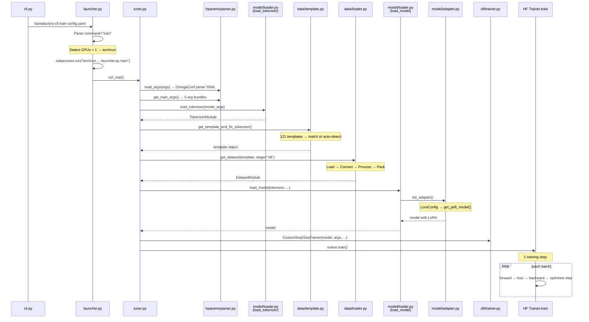

# LLaMA-Factory · 程式碼追蹤

## 追蹤的場景

**場景**: 從 CLI 輸入開始，追蹤一個完整的 LoRA SFT 訓練流程，到第一個 training step 完成。這是 LLaMA-Factory 最常見的使用情境。

**啟動命令**:
```bash
llamafactory-cli train examples/train_lora/llama3_lora_sft.yaml
```

## 流程圖



### 圖意說明

這張圖展示了從 CLI 到 HF Trainer 的完整呼叫鏈。注意幾個關鍵分支點：

1. **launcher.py 的 torchrun dispatch**（藍色區塊）：當偵測到多 GPU 且不是 Ray/KT 模式時，`launcher.py` 會 fork 出 `torchrun` 子程序重新啟動自己。這意味著 `launcher.py` 同時扮演了入口與 worker 兩種角色。
2. **template 選擇**：在資料載入之前，template 就必須確定——它會影響 tokenization 的方式。
3. **Adapter 初始化**：在模型載入後緊接 adapter 掛載，然後才傳給 Trainer。

## 逐步追蹤

### Step 1: CLI 入口與命令分派

**檔案**: [`src/llamafactory/cli.py`](https://github.com/hiyouga/LLaMA-Factory/blob/16ff5a23/src/llamafactory/cli.py#L16-L24)

```python
def main():
    if is_env_enabled("USE_V1"):
        from .v1 import launcher
    else:
        from . import launcher
    launcher.launch()
```

`cli.py` 只有 31 行——它只做兩件事：檢查 `USE_V1` 環境變數決定走 v1 還是 v2 路徑（v1 是舊版架構已被 deprecated），然後呼叫 launcher。

**檔案**: [`src/llamafactory/launcher.py`](https://github.com/hiyouga/LLaMA-Factory/blob/16ff5a23/src/llamafactory/launcher.py#L38-L186)

`launch()` 從 `sys.argv` 取出第一個參數作為 command。以 `train` 為例：

```python
# launcher.py:60-61
if command == "train" and (
    is_env_enabled("FORCE_TORCHRUN") or (get_device_count() > 1 and not use_ray() and not use_kt())
):
```

這裡有一個重要的分支邏輯：

- **多 GPU + 非 Ray/非 KT** → 透過 `subprocess.run("torchrun ...")` 啟動分散式訓練
- **單 GPU / Ray / KT** → 直接呼叫 `tuner` 模組

當觸發 torchrun 時，launcher 會透過 `__file__` 重新呼叫自己（[launcher.py:106-107](https://github.com/hiyouga/LLaMA-Factory/blob/16ff5a23/src/llamafactory/launcher.py#L106-L107)），但這次 `__name__ == "__main__"` 會命中檔案底部的 `run_exp()` 呼叫（[launcher.py:183-185](https://github.com/hiyouga/LLaMA-Factory/blob/16ff5a23/src/llamafactory/launcher.py#L183-L185)），而非 `launch()`。這是因為 torchrun 設定 `WORLD_SIZE` 等環境變數後，每個 worker 會獨立執行這個檔案。

### Step 2: Config 解析

**檔案**: [`src/llamafactory/hparams/parser.py`](https://github.com/hiyouga/LLaMA-Factory/blob/16ff5a23/src/llamafactory/hparams/parser.py#L85-L99)

```python
def read_args(args=None):
    if args is not None:
        return args
    if sys.argv[1].endswith(".yaml") or sys.argv[1].endswith(".yml"):
        override_config = OmegaConf.from_cli(sys.argv[2:])
        dict_config = OmegaConf.load(Path(sys.argv[1]).absolute())
        return OmegaConf.to_container(OmegaConf.merge(dict_config, override_config))
```

YAML 配置被 OmegaConf 載入，CLI override（`key=value`）合併進去，然後轉為 dict。

**檔案**: [`src/llamafactory/hparams/parser.py`](https://github.com/hiyouga/LLaMA-Factory/blob/16ff5a23/src/llamafactory/hparams/parser.py#L102-L116)

接著 `get_train_args()` 使用 `HfArgumentParser.parse_dict()` 或 `parse_args_into_dataclasses()` 將 dict / list args 解析為 5 個 dataclass：`ModelArguments`、`DataArguments`、`TrainingArguments`、`FinetuningArguments`、`GeneratingArguments`。

**值得注意**：`FinetuningArguments` 包含 `stage` 欄位，這是控制整個訓練流程的核心開關。其他引數（如 `use_hyper_parallel`、`use_mca`）會影響後續的路由選擇。

### Step 3: Dataset 載入與處理

**這是最複雜的一步，涉及 4 個子階段：**

#### 3a. Tokenizer 載入

**檔案**: [`src/llamafactory/model/loader.py:71-120`](https://github.com/hiyouga/LLaMA-Factory/blob/16ff5a23/src/llamafactory/model/loader.py#L71-L120)

`load_tokenizer()` 使用 `AutoTokenizer.from_pretrained()` 載入 tokenizer，然後應用一系列 patch：
- 修復 `_pad` 方法（若 tokenizer 未實作）
- 設定 `model_max_length`
- 加上特殊 token（`additional_special_tokens`）

如果模型是多模態（VLM），也會載入 `AutoProcessor` 處理圖像/影片/音訊。

#### 3b. Template 選擇

**檔案**: [`src/llamafactory/data/template.py:490-625`](https://github.com/hiyouga/LLaMA-Factory/blob/16ff5a23/src/llamafactory/data/template.py#L490-L625)

`get_template_and_fix_tokenizer()` 根據 `data_args.template` 從 `TEMPLATES` 字典查找對應的 Template。若 `template=None`，則自動從 tokenizer 的 `chat_template` 屬性解析（`parse_template()`，[template.py:565-625](https://github.com/hiyouga/LLaMA-Factory/blob/16ff5a23/src/llamafactory/data/template.py#L565-L625)）。

Template 影響每個 message 的編碼方式——user 訊息、assistant 回應、system prompt、tool call 全部透過 Template 的 formatters 處理。

#### 3c. Dataset 載入與轉換

**檔案**: [`src/llamafactory/data/loader.py:51-163`](https://github.com/hiyouga/LLaMA-Factory/blob/16ff5a23/src/llamafactory/data/loader.py#L51-L163)

`_load_single_dataset()` 根據 `dataset_attr.load_from` 從 HuggingFace Hub、ModelScope、本地檔案等不同來源載入資料集。載入後，經由 Converte r（Alpaca / ShareGPT / OpenAI）標準化為 `_prompt` / `_response` 內部格式。

**檔案**: [`src/llamafactory/data/converter.py:85-367`](https://github.com/hiyouga/LLaMA-Factory/blob/16ff5a23/src/llamafactory/data/converter.py#L85-L367)

#### 3d. Dataset 編碼與 Packing

**檔案**: [`src/llamafactory/data/processor/supervised.py:51-252`](https://github.com/hiyouga/LLaMA-Factory/blob/16ff5a23/src/llamafactory/data/processor/supervised.py)

`SupervisedDatasetProcessor._encode_data_example()` 對每個 example 的每輪對話應用 `template.encode_multiturn()`，將文字轉為 token IDs。

若 `packing=True`（SFT 的常見設定），`PackedSupervisedDatasetProcessor` 使用 `greedy_knapsack()` 將多個 sequence 打包進同一個 `cutoff_len` 區塊（[processor_utils.py:54-73](https://github.com/hiyouga/LLaMA-Factory/blob/16ff5a23/src/llamafactory/data/processor/processor_utils.py#L54-L73)）。每個區塊會記錄 `packing_params`（sequence boundaries、media sub-sequence IDs 等）。

**為什麼 packing 在此發生而不是在 collator？** 因為許多 sequence-to-sequence transformers 需要知道每個 sequence 的邊界來正確處理 position IDs、attention masks 和 multi-modal media 的歸屬。在 dataset 層預先做好 packing 可以讓 collator 更簡單（只需要處理 padding 和 batch 維度）。

### Step 4: 模型載入與 Adapter 掛載

**檔案**: [`src/llamafactory/model/loader.py:131-241`](https://github.com/hiyouga/LLaMA-Factory/blob/16ff5a23/src/llamafactory/model/loader.py#L131-L241)

`load_model()` 的執行順序：

1. **`patch_config()`** — 應用 attention implementation、RoPE scaling、quantization、MoE 設定（[patcher.py:308-373](https://github.com/hiyouga/LLaMA-Factory/blob/16ff5a23/src/llamafactory/model/patcher.py#L308-L373)）
2. **模型實例化** — 根據 config 自動選擇 `AutoModelForCausalLM` 或 `AutoModelForSeq2SeqLM`
3. **`patch_model()`** — 修復 generation config、prepare training（gradient checkpointing、layernorm fp32 cast）
4. **`init_adapter()`** — 這是 LoRA 掛載的關鍵

**檔案**: [`src/llamafactory/model/adapter.py:141-286`](https://github.com/hiyouga/LLaMA-Factory/blob/16ff5a23/src/llamafactory/model/adapter.py#L141-L286)

對於第一次訓練的場景（無已存在的 LoRA adapter）：

```python
# 1. 掃描所有 Linear 層
target_modules = find_all_linear_modules(model, ...)  # misc.py:28

# 2. 建立 LoraConfig
lora_config = LoraConfig(
    r=finetuning_args.lora_rank,        # 如 8
    lora_alpha=finetuning_args.lora_alpha,  # 如 16
    target_modules=target_modules,
    lora_dropout=finetuning_args.lora_dropout,
    use_rslora=finetuning_args.use_rslora,
    init_lora_weights="pissa" if finetuning_args.use_pissa else True,
)

# 3. 建立 PEFT model
model = get_peft_model(model, lora_config)
```

**重點**: `find_all_linear_modules()` 排除 `lm_head`、`output_layer`、vision tower 和 projector。這代表 LLaMA-Factory 的 LoRA 預設會套用到所有其他 Linear 層（包括 FFN 的 gate/up/down projection），而不只是 attention 層——這與 PEFT 的預設行為不同。

### Step 5: Trainer 初始化

**檔案**: [`src/llamafactory/train/sft/workflow.py:106-117`](https://github.com/hiyouga/LLaMA-Factory/blob/16ff5a23/src/llamafactory/train/sft/workflow.py#L106-L117)

```python
trainer = CustomSeq2SeqTrainer(
    model=model,
    args=training_args,
    finetuning_args=finetuning_args,
    data_collator=data_collator,       # SFTDataCollatorWith4DAttentionMask
    callbacks=callbacks,               # 從 tuner.py 傳入的 callback chain
    gen_kwargs=gen_kwargs,             # generation config
    ref_model=ref_model,               # ASFT loss 用的參考模型
    **dataset_module,                  # train_dataset, eval_dataset
    **tokenizer_module,                # tokenizer, processor
    **metric_module,                   # compute_metrics
)
```

**檔案**: [`src/llamafactory/train/sft/trainer.py`](https://github.com/hiyouga/LLaMA-Factory/blob/16ff5a23/src/llamafactory/train/sft/trainer.py)（230 行）

`CustomSeq2SeqTrainer` 繼承自 HuggingFace `Seq2SeqTrainer`，主要 override：

- **`create_optimizer()`** — 先檢查是否有 `create_custom_optimizer()` 匹配（GaLore、APOLLO、LoRA+ 等），若無則 fallback 到預設 AdamW
- **`create_scheduler()`** — 支援 `warmup_stable_decay` schedule
- **`compute_loss()`** — 若 `use_asft_loss` 啟用，計算 Advantage SFT loss（含 KL divergence against reference logits）
- **`_get_train_sampler()`** — 支援 `disable_shuffling`
- **`prediction_step()`** — 支援 `predict_with_generate`

### Step 6: 一個 Training Step

當呼叫 `trainer.train()` 時，HF Trainer 會進入標準訓練迴圈。每個 step 的流程：

1. **取 batch** — `data_collator` 將 packed dataset 組裝成 batch（4D attention mask、position_ids 等）
2. **Forward** — `model(**batch)` 計算 logits
3. **Loss 計算** — `custom_seq2seq_trainer.compute_loss()`：
   - 若 `use_asft_loss` → `asft_loss_func()`（[trainer_utils.py:686](https://github.com/hiyouga/LLaMA-Factory/blob/16ff5a23/src/llamafactory/train/trainer_utils.py#L686)）：以 reference logits 為基礎，計算 Advantage SFT loss + KL divergence
   - 否則 → standard CrossEntropyLoss（HF 預設的 `ForCausalLM` loss）
4. **Backward** — `loss.backward()`；若有 gradient accumulation，延遲更新
5. **Optimizer step** — `optimizer.step()`：若使用 custom optimizer（如 GaLore），step 時會進行 low-rank projection
6. **Scheduler step** — `lr_scheduler.step()`
7. **Logging** — `LogCallback` 記錄 loss、token/s、learning rate 等

### Step 7: Checkpoint / 結束

訓練結束後：
- `trainer.save_model()` 儲存 LoRA adapter weights
- `trainer.save_metrics()` 寫入 `train_results.json`
- `trainer.save_state()` 記錄 optimizer state、scheduler state
- `plot_loss()` 輸出 loss 曲線圖
- `create_modelcard_and_push()` 產生 model card

## 想學更多時，在哪裡下中斷點

| 要看什麼 | 中斷點 |
|---|---|
| YAML config 怎麼被解析 | `hparams/parser.py:85` `read_args()` |
| 資料集每個 example 長什麼樣 | `data/loader.py:275` `get_dataset()` return |
| 打包後的 sequence 結構 | `data/processor/supervised.py:196` 建構 knapsack 後 |
| LoRA adapter 被掛到哪些層 | `model/adapter.py:263` `get_peft_model()` |
| 一個 training step 的 loss 值 | `train/sft/trainer.py` `compute_loss()` |
| Custom optimizer 是否被使用 | `train/trainer_utils.py:527` `create_custom_optimizer()` |
| Callback 執行順序 | `train/tuner.py:73-89` callback assembly |

## 沒追蹤到但值得留意

- **PPO 路徑** — 完全不同於 SFT。使用 `ppo_trainer.ppo_train()` 進行生成→打分→更新的迭代，而非標準 forward-backward
- **Distributed init** — torchrun 由 launcher.py 啟動，Worker 透過環境變數 `RANK`、`WORLD_SIZE`、`MASTER_ADDR` 進行 NCCL 初始化
- **斷點續訓** — HF Trainer 的 checkpoint 偵測在 `training_args.resume_from_checkpoint`，會自動從 output_dir 找最後一個 checkpoint
- **Ray 路徑** — tuner.py 的 `_ray_training_function()` 會建立 PlacementGroup，在所有節點上啟動 Worker actor
