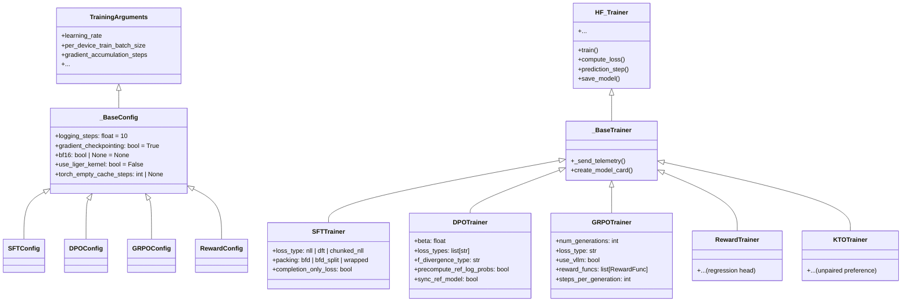

# TRL · 架構

## 系統高層圖

```mermaid
flowchart TB
    subgraph "User Interface"
        CLI["TRL CLI<br/>trl/cli/main.py"]
        API["Python API<br/>trl/__init__.py"]
    end

    subgraph "Config System (_BaseConfig)"
        SFTConfig["SFTConfig<br/>sft_config.py"]
        DPOConfig["DPOConfig<br/>dpo_config.py"]
        GRPOConfig["GRPOConfig<br/>grpo_config.py"]
        RewardConfig["RewardConfig<br/>reward_config.py"]
        KTOConfig["KTOConfig<br/>kto_config.py"]
    end

    subgraph "Trainers (_BaseTrainer)"
        SFT["SFTTrainer<br/>sft_trainer.py"]
        DPO["DPOTrainer<br/>dpo_trainer.py"]
        GRPO["GRPOTrainer<br/>grpo_trainer.py"]
        Reward["RewardTrainer<br/>reward_trainer.py"]
        KTO["KTOTrainer<br/>kto_trainer.py"]
    end

    subgraph "HF Ecosystem"
        HF_T["transformers.Trainer"]
        ACC["🤗 Accelerate"]
        PEFT["🤗 PEFT"]
    end

    subgraph "Generation Backends"
        VLLM["vLLM Engine<br/>vllm_generation.py"]
        NATIVE["Transformers generate()"]
    end

    subgraph "Reward Functions"
        ACC_REW["accuracy_reward()"]
        THINK_REW["think_format_reward()"]
        CUSTOM["Custom Callables"]
    end

    subgraph "Data Pipeline"
        COLLATOR["DataCollatorForPreference"]
        CHAT_UTILS["chat_template_utils"]
        DATA_UTILS["data_utils.py"]
    end

    CLI --> SFTConfig
    CLI --> DPOConfig
    CLI --> GRPOConfig
    API --> Configs

    SFTConfig --> SFT
    DPOConfig --> DPO
    GRPOConfig --> GRPO
    KTOConfig --> KTO

    SFT --> HF_T
    DPO --> HF_T
    GRPO --> HF_T
    Reward --> HF_T

    HF_T --> ACC
    HF_T --> PEFT

    GRPO --> VLLM
    GRPO --> ACC_REW
    GRPO --> THINK_REW
    GRPO --> CUSTOM

    DPO --> COLLATOR
    SFT --> DATA_UTILS

    subgraph "Experimental"
        EXP["trl/experimental/<br/>27+ algorithms"]
    end

    style VLLM fill:rgba(251,146,60,0.3),stroke:#fb923c
    style HF_T fill:rgba(6,78,59,0.4),stroke:#34d399
```

### 圖意說明

這張圖展示 TRL 的四層架構：

1. **使用者介面層**：CLI（`trl sft` / `trl dpo` / `trl grpo`）與 Python API 兩條路徑，最終都會透過 Config 物件決定使用哪個 Trainer
2. **Config 層**：每個 Trainer 有對應的 Config（繼承 `_BaseConfig` → `transformers.TrainingArguments`），定義演算法特有的超參數
3. **Trainer 層**：五個主要 Trainer 繼承 `_BaseTrainer` → `transformers.Trainer`，共享分散式訓練等基礎設施，各自實作不同的 loss function 與 training pipeline
4. **底層生態系**：HuggingFace Transformers、Accelerate、PEFT 提供模型載入、分散式訓練、量化、LoRA 等能力

GRPOTrainer 是唯一需要外部 generation backend 的 Trainer（vLLM 或 Transformers），也是唯一整合 reward functions 的 Trainer。

## Trainer 架構



### 圖意說明

TRL 的類別設計是典型的「雙層繼承 + 組合」：

- **Config 層**：`_BaseConfig` 繼承 `TrainingArguments`，加上 TRL 通用預設值（gradient_checkpointing=True、bf16 自動推斷）與 Liger Kernel 支援。各 Trainer 的 Config 再繼承 `_BaseConfig` 加上演算法特有參數
- **Trainer 層**：`_BaseTrainer` 繼承 `transformers.Trainer`，加入 telemetry 與 model card 產生器。各 Trainer 再繼承 `_BaseTrainer` 實作不同的 loss function

這個設計的關鍵取捨：**繼承深但可複用性高**。所有 Trainer 共用 HF Trainer 的 training loop、save/load checkpoint、分散式訓練、log/metric 系統。代價是：不太能偏離 HF Trainer 假設的 training 流程——例如 DPO 需要一次 forward 兩個序列（chosen + rejected），但 HF Trainer 預設一次只處理一條序列，DPOTrainer 必須用 concat batch 的方式繞過這個限制。

## 關鍵設計決策

### 1. 統一 API vs 各 Trainer 獨立的 Config 架構

TRL 選擇讓每個 Trainer 搭配專屬的 Config 類別，而不是一個通用的 `dict` 或單一 `TrainingConfig`：

- **取捨**：程式碼重複較多（每個 Config 要維護自己的 field 與 docstring），但使用者體驗好——開一個 Config 檔就能看到該演算法所有相關參數，不需要在文件來回切換
- **常見替代方案**：LLaMA-Factory 用單一 `dict` + stage flag 切換演算法，更簡潔但 debug 難度高
- **判斷**：對 HuggingFace 生態的 library 來說，這是正確的 trade-off——`TrainingArguments` 已經是 HF 使用者熟悉的 pattern

### 2. Batch 內 concat chosen + rejected（DPO）

DPOTrainer 的 `DataCollatorForPreference` 將 batch 內的 chosen 和 rejected 序列 concat 成一個 2×batch_size 的張量：

```
Input batch (batch_size=4):
  [chosen_0, chosen_1, chosen_2, chosen_3, rejected_0, rejected_1, rejected_2, rejected_3]
```

- **為什麼要這樣**：確保 chosen 和 rejected 經過相同的 dropout mask 和模型狀態，這對 pairwise loss 的正確性很重要。如果分成兩次 forward，Dropout 模式不同會引入雜訊
- **代價**：batch size 在記憶體層面變成 2×，且最長序列決定整個 batch 的 padding 長度
- **常見替代方案**：兩次 forward + seed control（如 OpenRLHF），節省記憶體但較複雜
- **參考**：[`trl/trainer/dpo_trainer.py:152`](https://github.com/huggingface/trl/blob/7877695/trl/trainer/dpo_trainer.py#L152)

### 3. GRPO 的 vLLM 整合策略

GRPOTrainer 將 vLLM engine 與 training model 放在同一 GPU（`colocate` 模式），透過 `sync_weights()` 在每次 generation 前從 HuggingFace model 拷貝權重到 vLLM：

- **為什麼要這樣**：GRPO 的「線上」本質需要每 N steps 重新產生 completions，用 vLLM 可以比 Transformers `generate()` 快 5-10 倍。放在同一 GPU 避免跨節點傳輸權重
- **代價**：GPU 記憶體壓力大（同時載入訓練模型 + vLLM engine + reference model）。`vllm_gpu_memory_utilization` 參數控制記憶體分配比例，預設 0.3（30% 給 vLLM）
- **重要性取樣校正**：由於 vLLM 與 training model 的權重不完全同步（兩次 sync 之間有多次 gradient update），使用 `log(π_θ) - log(π_sampler)` 校正分佈偏移
- **參考**：[`trl/generation/vllm_generation.py:439`](https://github.com/huggingface/trl/blob/7877695/trl/generation/vllm_generation.py#L439)

### 4. 參考模型的 five-mode 策略

根據不同的訓練場景，DPO/GRPO 的參考模型（reference model）有五種不同的處理方式：

| 模式 | 情境 | 實作方式 |
|------|------|----------|
| 獨立模型 | Full fine-tune | `create_from_path(original_model_id)` |
| PEFT 跳過 adapter | 新的 LoRA adapter | forward 時暫時禁用 adapter |
| PEFT ref adapter | 已存在的 adapter | 初始化時複製一份 "ref" adapter |
| 預計算 logps | 離線 DPO | 訓練前一次性計算，存於 dataset |
| EMA 同步 | TR-DPO | `SyncRefModelCallback` 定期 EMA 更新 |

- **取捨**：每個模式都有專屬的程式碼路徑，複雜度較高，但能處理所有使用案例。特別是「PEFT 跳過 adapter」模式不需要額外的模型拷貝，對記憶體友善
- **參考**：[`trl/trainer/dpo_trainer.py:756`](https://github.com/huggingface/trl/blob/7877695/trl/trainer/dpo_trainer.py#L756)

### 5. Chunked CE Loss — 記憶體優化的 SFT loss

SFTTrainer 的 `_chunked_cross_entropy_loss()` 跳過 `lm_head` 的完整矩陣乘法，先過濾掉 `labels==-100` 的位置，再以 `chunk_size=256` 批次計算 CE loss：

- **為什麼要這樣**：標準 CE 需要 `B × S × V` 的 logits 張量（V = vocab size ≈ 128K），對長序列訓練是記憶體殺手。Chunked 版本讓記憶體峰值降到 `chunk_size × V`
- **代價**：不能同時使用 `compute_metrics`（因為不產出完整 logits）
- **參考**：[`trl/trainer/sft_trainer.py:104`](https://github.com/huggingface/trl/blob/7877695/trl/trainer/sft_trainer.py#L104)

## 測試

- **單元測試**：`tests/` 目錄包含 trainer 測試、分散式測試、experimental 測試
- **資料集測試**：`tests/data/` 包含測試用資料
- **分散式測試**：`tests/distributed/` 包含多節點測試
- **參考**：[`trl/trainer/sft_trainer.py:104`](https://github.com/huggingface/trl/blob/7877695/trl/tests/)

## 失敗模式與降級策略

TRL 的錯誤處理相對寬鬆——大部分失敗（如 OOM、config 不一致）會直接拋出異常，沒有優雅的降級策略。這是因為 post-training 的執行方式通常是 script 而非服務，使用者預期會看到 stack trace。

唯一值得注意的降級模式是 vLLM colocate 模式下的 OOM：若 GPU 記憶體不足，vLLM 初始化會失敗，使用者需要降低 `vllm_gpu_memory_utilization` 或改用 `server` 模式（獨立 GPU 運行 vLLM）。
