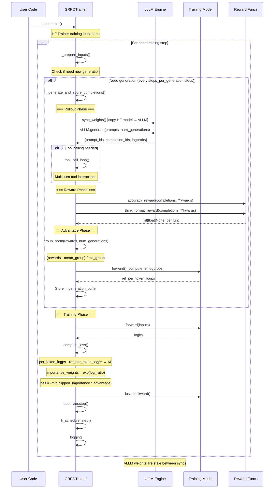

# TRL · 程式碼追蹤

## 追蹤的場景

**場景**: 一次 GRPO 訓練 step——從原始 prompt 到完整的 rollout（vLLM generate → reward → advantage）再到 loss backward。

GRPO 是 TRL v1 最具代表性的演算法，它示範了：
1. 如何跟 vLLM 整合做超高速 generation
2. 如何做 online RL 的 rollout pipeline（generate → score → advantage）
3. 如何在 HF Trainer 框架內嵌入非標準的 train/eval 流程

**啟動命令**（典型）:
```python
from trl import GRPOTrainer
trainer = GRPOTrainer(
    model="Qwen/Qwen2.5-0.5B-Instruct",
    reward_funcs=accuracy_reward,
    train_dataset=dataset,
)
trainer.train()
```

## 流程圖



## 逐步追蹤

### Step 1: 進入點與初始化

[`trl/trainer/grpo_trainer.py:270`](https://github.com/huggingface/trl/blob/7877695/trl/trainer/grpo_trainer.py#L270)

`GRPOTrainer.__init__()` 是一個**超長建構子**（~620 行），主要任務：

1. 載入模型（支援 str / PreTrainedModel / PeftModel）
2. 載入 tokenizer/processor
3. 初始化 reward functions：支援三種型態（str → 載入分類模型、PreTrainedModel、Callable）
4. 初始化 vLLM engine（若 `use_vllm=True`）：[`trl/trainer/grpo_trainer.py:764`](https://github.com/huggingface/trl/blob/7877695/trl/trainer/grpo_trainer.py#L764)
5. 建立 reference model（若 `beta != 0.0`）
6. 呼叫 `super().__init__()` 將控制權交給 HF Trainer

**值得注意**：
- `DS3GatherForGeneration` 設計：在 DeepSpeed ZeRO-3 下，模型參數是分片的，generation 時需要先 gather → 效率問題
- 若使用 Colocate vLLM，`vllm_gpu_memory_utilization`（預設 0.3）決定多少 GPU 記憶體分配給 vLLM。剩餘 70% 給訓練模型 + reference model

### Step 2: _prepare_inputs() — Generation 排程

[`trl/trainer/grpo_trainer.py:1138`](https://github.com/huggingface/trl/blob/7877695/trl/trainer/grpo_trainer.py#L1138)

`_prepare_inputs()` 是 GRPO 獨有的 hook——HF Trainer 在每個訓練 step 前會呼叫它來準備 batch。在 GRPO 中它被重寫為 generation 排程器：

```
if self.generation_buffer is None or need_regenerate:
    self._generate_and_score_completions()
return self._get_next_batch()
```

**need_regenerate 的條件**：
- `generation_buffer` 已耗盡
- 當前 step 是 `steps_per_generation` 的倍數
- 非 PEFT 且未呼叫 `forward()` 後無法繼續從 buffer 取資料

**Buffer 管理**: `generation_buffer` 是一個 deque，容量 = `num_generations × len(train_dataset)`。每次產生一批新 completions 後，逐步消耗 buffer 做多個 gradient updates。

### Step 3: _generate() — vLLM Rollout

[`trl/trainer/grpo_trainer.py:1692`](https://github.com/huggingface/trl/blob/7877695/trl/trainer/grpo_trainer.py#L1692)

#### 3.1 Tokenization

[`trl/trainer/grpo_trainer.py:1287`](https://github.com/huggingface/trl/blob/7877695/trl/trainer/grpo_trainer.py#L1287)

`_tokenize_prompts()` 將原始 prompt 文字轉為 token IDs：
- 使用 `apply_chat_template()` 處理對話式 prompt
- 若為多模態（VLM），一併處理 pixel_values
- 輸出：`prompt_ids` + `prompt_mask`

#### 3.2 實際 generation

[`trl/trainer/grpo_trainer.py:1338`](https://github.com/huggingface/trl/blob/7877695/trl/trainer/grpo_trainer.py#L1338)

三條 generation 路徑：

1. **vLLM 模式**（最快）:
```python
# 若 step 變了，同步權重
if self.state.global_step != self._last_loaded_step:
    self._vllm_generation.sync_weights()
# 使用 vLLM batch generate
outputs = self._vllm_generation.generate(**gen_kwargs)
```

2. **Transformers paged 模式**:
```python
outputs = unwrapped_model.generate_batch(**gen_kwargs)
```

3. **Transformers 標準模式**（最慢但相容性最好）:
```python
outputs = unwrapped_model.generate(**gen_kwargs)
```

**每 prompt 產生 G 個 completion**：`RepeatSampler`（[`trl/trainer/utils.py:652`](https://github.com/huggingface/trl/blob/7877695/trl/trainer/utils.py#L652)）將 dataset 的每個 sample 重複 `num_generations` 次。在分散式環境下，`gather()` 確保所有 GPU 的 completions 聚集後以 `view(-1, G)` 組織成 group。

### Step 4: Tool Calling Loop（可選）

[`trl/trainer/grpo_trainer.py:1485`](https://github.com/huggingface/trl/blob/7877695/trl/trainer/grpo_trainer.py#L1485)

若模型支援 tool calling，GRPO 可以執行多回合工具呼叫：
- `add_response_schema` 注入工具 schema 到 chat template
- `parse_response` 解析模型的工具呼叫決定
- 支援同步與非同步（async）工具函數
- 最多 `max_tool_calling_iterations` 回合（預設 3）

### Step 5: Reward 計算

[`trl/trainer/grpo_trainer.py:1196`](https://github.com/huggingface/trl/blob/7877695/trl/trainer/grpo_trainer.py#L1196)

`_calculate_rewards()` 遍歷所有 `reward_funcs`：

```python
rewards_per_func = []
for reward_func in self.reward_funcs:
    reward_kwargs = {...}  # 傳入 prompts, completions, 額外欄位等
    reward = reward_func(**reward_kwargs)
    rewards_per_func.append(reward)
```

**每個 reward_func** 是一個 `(prompts, completions, **kwargs) -> list[float | None]` 的 callable：
- `accuracy_reward()`：用 `math_verify` 解析 LaTeX 數學答案，比對 ground truth
- `think_format_reward()`：檢查 `...` 格式
- `get_soft_overlong_punishment()`：對過長 completion 施加懲罰

回傳 `None` 的 reward 函數對該樣本不計入加權。（多任務訓練時很有用，不同 reward function 各自專注不同子集）

### Step 6: Advantage 計算 — Group Normalization

[`trl/trainer/grpo_trainer.py:2142`](https://github.com/huggingface/trl/blob/7877695/trl/trainer/grpo_trainer.py#L2142)

這是 GRPO 相較於 PPO 最大的差異——不需要 critic network：

```python
# sum_then_normalize 模式
rewards = Σ(reward_k * weight_k)                    # (B*G,)  加總各 reward func
mean_grouped = mean(rewards).view(-1, G)             # 每 prompt 的平均
std_grouped = std(rewards).view(-1, G)               # 每 prompt 的標準差
advantages = (rewards - mean_grouped) / (std_grouped + 1e-4)  # (B*G,)
```

**為什麼 group normalization 有效**：
- 同一 prompt 下的 G 個 completion 共享「語境」——好的 completion 獲得正 advantage，差的獲得負 advantage
- 自然對齊了 reward function 在不同 prompt 間的 scale 差異

**分散式聚集**：跨 GPU 的 rewards 透過 `gather_object()` 聚集到 rank 0，計算 group stats，再 broadcast 回去。

### Step 7: Loss 計算

[`trl/trainer/grpo_trainer.py:2436`](https://github.com/huggingface/trl/blob/7877695/trl/trainer/grpo_trainer.py#L2436)

`_compute_loss()` 是 GRPO 訓練 pipeline 的終點：

```python
# 7a. Per-token policy logprobs
shift_logits = outputs.logits[..., :-1, :].contiguous()
per_token_logps = selective_log_softmax(shift_logits, shift_labels)

# 7b. KL penalty（若 beta != 0）
if self.beta != 0.0:
    ref_per_token_logps = inputs["ref_per_token_logps"]
    per_token_kl = (torch.exp(ref_per_token_logps - per_token_logps)
                    - (ref_per_token_logps - per_token_logps) - 1)

# 7c. Importance sampling correction
log_importance_weights = per_token_logps - old_per_token_logps
coef_1 = torch.exp(log_importance_weights)
coef_2 = torch.clamp(coef_1, 1 - epsilon_low, 1 + epsilon_high)

# 7d. Clipped surrogate loss (GRPO loss type)
per_token_loss1 = coef_1 * advantages
per_token_loss2 = coef_2 * advantages
per_token_loss = -torch.min(per_token_loss1, per_token_loss2)

# 7e. 加上 KL penalty
loss = per_token_loss.mean() + self.beta * per_token_kl.mean()
```

**支援的 loss type**：`loss_type` 參數可選 7 種變體（DAPO、BNPO、VESPO、SAPO、CISPO、LUSPO、DR-GRPO），差異主要在 clipping 策略與正規化方式。

## 想學更多時，在哪裡下中斷點

- 想看一次 generation 的完整輸出：`_generate()` 回傳處 [`:1429`](https://github.com/huggingface/trl/blob/7877695/trl/trainer/grpo_trainer.py#L1429)
- 想看 reward 分配：`_calculate_rewards()` 回傳後 [`:1196`](https://github.com/huggingface/trl/blob/7877695/trl/trainer/grpo_trainer.py#L1196)
- 想看 advantage 分佈：group normalization 後 [`:2185`](https://github.com/huggingface/trl/blob/7877695/trl/trainer/grpo_trainer.py#L2185)
- 想看 KL penalty 大小：KL 計算處 [`:2511`](https://github.com/huggingface/trl/blob/7877695/trl/trainer/grpo_trainer.py#L2511)
- 想看 vLLM weight sync 是否正常：`sync_weights()` 內部 [`vllm_generation.py:439`](https://github.com/huggingface/trl/blob/7877695/trl/generation/vllm_generation.py#L439)

## 沒追蹤到但值得留意

- **DPO training step**：跟 GRPO 不同，DPO 是離線訓練——不需要 generation 階段。batch 直接從 dataset 載入 (prompt, chosen, rejected) triple，forward 過 policy model + reference model 後計算 DPO loss
- **SFT training step**：最簡單——標準 next-token prediction，但多了 packing（多個 sequences 打包成一個來減少 padding waste）與 chunked CE loss
- **vLLM server 模式**（`vllm_mode="server"`）：獨立 GPU 運行 vLLM 服務，透過 HTTP API 與訓練節點通訊，適合多節點訓練
