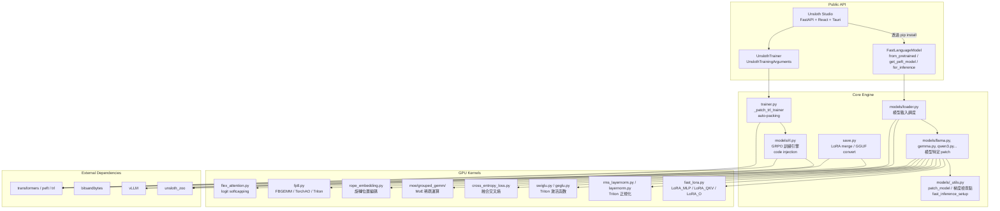

# unsloth · 架構

## 系統高層圖



**圖意說明**：這張圖展示 Unsloth 的三層結構——Public API、Core Engine、GPU Kernels。關鍵設計是：Public API 極簡（只有 `FastLanguageModel` 和 `UnslothTrainer` 兩個主要入口），所有複雜度被向下推送到 Core Engine 的 import-time patching 層。GPU Kernels 是真正的競爭優勢，每一類都包成 `torch.autograd.Function`，被 model patcher 在 load 時替換進 transformers 的 forward 路徑。

### 為什麼是 monkey-patch 而不是 subclass

Unsloth 不做 `class MyLlamaModel(LlamaModel):`，而是直接修改 `transformers.models.llama.modeling_llama.LlamaAttention.forward`。原因：subclass 要求使用者在 `from_pretrained` 時指定 `trust_remote_code=False` 的客製類別，但 Unsloth 希望使用者只需要 `pip install unsloth` 就能讓**既有程式碼**變快。Monkey-patch 在 import time 被執行，使用者不需要改任何一行原本的訓練腳本。

代價是難以追蹤（誰改了哪個函式？），所以 Unsloth 在每個 patched class 上打 `.__name__` 標記（例如 `pre_patch()` 後 attention 的 `__class__` 被替換為自訂 `fast_forward`），且用 `_NEEDS_ROPE_FIX` 等版本常數處理 transformers 版本相容性。

## 模型載入流程

這是 Unsloth 最關鍵的一條路徑，值得用 flow 圖展開：

```mermaid
flowchart LR
    Start["FastLanguageModel<br/>.from_pretrained()"] --> Route{"8bit / full-ft / QAT<br/>| 一般 LoRA ?"}
    Route -->|一般 LoRA 路徑| Name[get_model_name<br/>型號名稱解析]
    Route -->|8bit / full / QAT| FastModel[FastModel<br/>.from_pretrained]
    Name --> Config[AutoConfig 偵測<br/>是否為 base model / PEFT adapter]
    Config --> Dispatch["依 model_type 分派<br/>FastLlamaModel / FastGemmaModel<br/>FastQwen2Model / ..."]

    subgraph ModelLoad["模型載入 (model-specific)"]
        Pre["pre_patch()<br/>← monkey-patch 所有 forward"]
        Load["AutoModelForCausalLM<br/>.from_pretrained(input)"]
        Post["post_patch()<br/>← patch_model_and_tokenizer"]
    end

    Dispatch --> Pre
    Pre --> Load
    Load --> Post

    Post --> GC["apply_unsloth_gradient_checkpointing()<br/>← seq<512 原生, seq>=512 offloaded"]
    GC --> FastInfer["fast_inference_setup()<br/>← patch_vLLM (選用)"]
    FastInfer --> Peft["PeftModel.from_pretrained()<br/>載入 LoRA adapter"]
    Peft --> PatchPeft["patch_peft_model()<br/>← LoRA_MLP / LoRA_QKV / LoRA_O 替換"]
    PatchPeft --> Done[return model, tokenizer]
```



**圖意說明**：這個流程展示了 Unsloth 的「先 patch 再 load + 再 patch」三階段策略。`pre_patch()` 在 HF model constructor 執行前替換 class 方法，確保 model 建好時用的就是 Unsloth 的 forward；`from_pretrained` 載入完整 weight 後，`post_patch()` 處理 tokenizer 和 RoPE 相關修正；最後 `patch_peft_model()` 將 LoRA 計算融合進 MLP/QKV/O 的 linear layer。這個三階段設計確保了 HF 生態系的相容性。

## 資料管線

Unsloth 不自己管理資料集載入——它依賴 TRL 的 `SFTDataCollator` 或自訂 data collator。它的貢獻在 **padding-free 訓練**與 **sample packing** 兩個模式：

### Sample Packing

```python
# 多個不等長樣本 → 拼接成單一長序列
# 例: [1,2,3] + [4,5] + [6,7,8,9] → [1,2,3,4,5,6,7,8,9]
# 用 cu_seqlens = [0, 3, 5, 9] 記錄邊界
# 用 block-diagonal causal mask 確保跨樣本不會互相 attention
```

### Padding-Free

```python
# 不 pad 到 batch 內最長的那個樣本
# batch 內每個樣本保持原始長度
# 記錄 per-sample seq_lengths → attention kernel 用
```

兩者都避免 `pad_token_id` 的大量 padding token 佔用 VRAM，訓練 throughput 提升 2-3x。

### 自動偵測啟用邏輯

[`trainer.py`](https://github.com/unslothai/unsloth/blob/eeb49d5/unsloth/trainer.py#L459-L590) 的 `_patch_sft_trainer_auto_packing()` 在 SFTTrainer `__init__` 時自動檢查：
- 若 config 有 `packing=True` → 啟用 sample packing（`configure_sample_packing`）
- 若 config 無 packing 且無自訂 data collator → 啟用 padding-free（`configure_padding_free`）
- 若 model 在 blocklist 中（gemma2 的 `slow_attention_softcapping`、gpt_oss 的 Flex Attention 問題）或環境變數 `UNSLOTH_DISABLE_AUTO_PADDING_FREE` 被設定 → 關閉

## 訓練流程

### 訓練迴圈

Unsloth 不自己寫訓練迴圈——它透過 monkey-patch 修改 TRL 的 `SFTTrainer`：

1. `_patch_trl_trainer()` 掃描 `trl.trainer` 的所有 `*Trainer` / `*Config` 配對
2. 對每組配對（SFTTrainer、GRPOTrainer、DPOTrainer 等），用 `_backwards_compatible_trainer()` 包裝其 `__init__`
3. 這個包裝處理 TRL 版本的 API 遷移（例如 `tokenizer` → `processing_class` 改名，0.13+ 的 `args` → `*Config` 分拆）
4. SFTTrainer 的 `compute_loss` 使用 Unsloth 的 fused cross-entropy loss kernel

### RL 訓練（GRPO）

Unsloth 的 GRPO 實作最特殊——它不走繼承，而是用 **code injection** 動態生成 trainer class。機制：

1. 掃描 `trl.trainer.grpo_trainer.GRPOTrainer` 的原始碼
2. 用模板字串產生 `UnslothGRPOTrainer`，替換掉關鍵方法（`generate_single_turn`、`compute_loss`、`_generate_and_score_completions`）
3. 注入 `RL_FUNCTIONS`、`RL_PRE_ITEMS`、`RL_EXTRA_ARGS` 等預先定義的程式碼片段
4. 用 `create_new_function()` 動態 compile 新 class
5. 同時 patch vLLM 的權重同步機制——訓練時 LoRA weight 變動要自動傳遞給 vLLM engine

### 核心優化

| 優化 | 原理 | VRAM 節省 | 速度提升 |
|------|------|-----------|---------|
| LoRA fusion | LoRA A@B 融入 base linear 計算 | 不直接省 VRAM | 2x (kernel launch 減少) |
| Offloaded gradient checkpointing | 中間啟動值 offload 到 CPU/disk | 30-50% | 略慢（但省 VRAM 換更長 seq） |
| Padding-free / sample packing | 消除 padding tokens | 20-40% | 2-3x |
| Fused cross-entropy | 不 materialize full logits tensor | vocab_size 成正比 | 略快 |
| Q-GaLore | 低秩梯度更新 + 8-bit optimizer states | 4x (optimizer) | — |

每個優化都有 trade-off：padding-free 更省 VRAM 但需要 block-diagonal attention mask；offloaded gc 省 VRAM 但增加 D2H/H2D 延遲；Q-GaLore 省 optimizer RAM 但每 200 steps 多做一次 SVD。

## 推論

Unsloth 支援三種推論路徑：

1. **原生 PyTorch** — 用 patched forward + KV cache，最快啟動
2. **vLLM fast inference** — `fast_inference_setup()` 下載並 patch vLLM，支援 continuous batching 與 PagedAttention
3. **GGUF / llama.cpp** — 透過 `save_to_gguf()` 將模型轉換後用 llama.cpp 推論

第三條路徑也是部署路線——Unsloth 內建從訓練到 GGUF 輸出的完整 pipeline，安裝 llama.cpp、convert、quantize 全部自動化。

## 實驗管理

- **Config 系統**: [`UnslothTrainingArguments`](https://github.com/unslothai/unsloth/blob/eeb49d5/unsloth/trainer.py#L159-L214) 繼承 TRL 的 `SFTConfig`，增加 `embedding_learning_rate`（分離的 embedding LR）和 `q_galore_config`（Q-GaLore 設定）兩個欄位
- **觀察性**: Unsloth Studio 的 live training monitor（loss、GPU 用量圖表）
- **Checkpoint**: 支援 LoRA adapter 單獨存（`save_pretrained_merged("lora")`）、merged 16bit/4bit 存（`"merged_16bit"` / `"merged_4bit"`）、GGUF 匯出（`save_to_gguf()`）

## 分散式訓練

多 GPU 支援透過 [`_infer_device_map_from_loaded_model()`](https://github.com/unslothai/unsloth/blob/eeb49d5/unsloth/models/vision.py#L102-L132)（vision.py）和 `accelerate.dispatch_model` 實現。對 BnB 4-bit 模型，`_attach_bnb_multidevice_hooks`（vision.py:134）用 `force_hooks=True` 確保跨 GPU 的參數存取正確路由。

## 測試

- 位置: [`tests/`](https://github.com/unslothai/unsloth/tree/eeb49d5/tests)
- 子目錄: `notebooks/`、`python/`、`qlora/`、`saving/`、`security/`、`sh/`、`studio/`、`utils/`、`version_compat/`、`vllm_compat/`
- 測試涵蓋: 微調品質驗證、量化正確性、不同 transformers 版本相容性、vLLM 整合、安全測試（security 目錄）
