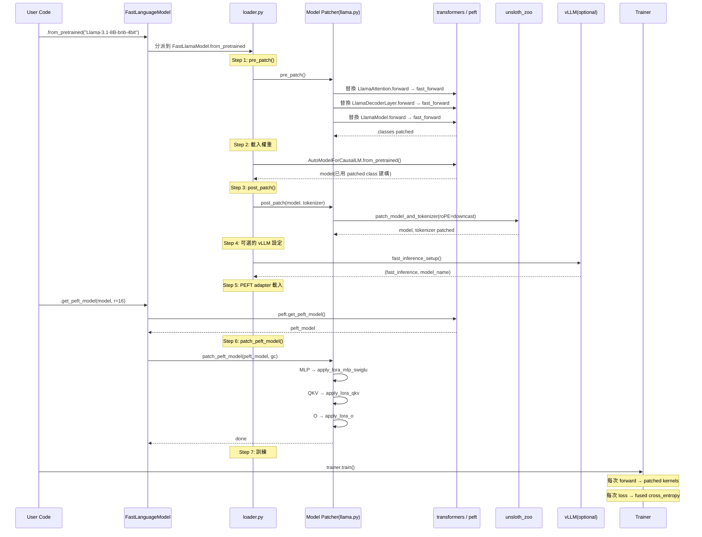

# unsloth · 程式碼追蹤

## 追蹤的場景

**場景**: 用 Unsloth 載入 Llama 3.1 8B 模型並執行 LoRA 微調的一個 training step。

**啟動命令**:
```python
from unsloth import FastLanguageModel
model, tokenizer = FastLanguageModel.from_pretrained(
    "unsloth/Llama-3.1-8B-bnb-4bit",
    max_seq_length=2048,
    load_in_4bit=True,
)
model = FastLanguageModel.get_peft_model(model, r=16)

from unsloth import UnslothTrainer, UnslothTrainingArguments
# ... SFTTrainer init → trainer.train()
```

## 流程圖



## 逐步追蹤

### Step 1: Entry — `FastLanguageModel.from_pretrained()`

入口在 [`unsloth/__init__.py`](https://github.com/unslothai/unsloth/blob/eeb49d5/unsloth/__init__.py#L85-L96)：若 `_IS_MLX=True`（Apple Silicon + MLX 可用），`FastLanguageModel` 被替換為 `unsloth_zoo.mlx.loader.FastMLXModel`。MLX 路徑繞過整個 CUDA 架構，有獨立的 loader/trainer。

**若非 MLX**，進入 [`unsloth/models/loader.py`](https://github.com/unslothai/unsloth/blob/eeb49d5/unsloth/models/loader.py#L241-L832)。`FastLanguageModel` 繼承自 `FastLlamaModel`。

### Step 2: pre_patch() — import-time monkey-patch

[`unsloth/models/llama.py#L2187-L2223`](https://github.com/unslothai/unsloth/blob/eeb49d5/unsloth/models/llama.py#L2187-L2223) `pre_patch()` 在 transformers model constructor **之前**被呼叫。它替換：

| 目標 class | 替換為 | 位置 |
|-----------|--------|------|
| `LlamaAttention.__init__` | 修改 RoPE scaling init | llama.py:2198 |
| `LlamaAttention.forward` | `LlamaAttention_fast_forward` | llama.py:2199 |
| `LlamaSdpaAttention.forward` | 同上 | llama.py:2200 |
| `LlamaFlashAttention2.forward` | 同上 | llama.py:2201 |
| `LlamaDecoderLayer.forward` | `LlamaDecoderLayer_fast_forward` | llama.py:2202 |
| `LlamaModel.forward` | `LlamaModel_fast_forward` | llama.py:2203 |
| `PeftModelForCausalLM.forward` | `PeftModel_fast_forward` | llama.py:2207 |
| `LlamaRotaryEmbedding` class | Unsloth 版 | llama.py:2217-2219 |

**為什麼在 load 之前 patch？** 因為 `AutoModelForCausalLM.from_pretrained()` 在建構時會呼叫 LlamaModel `__init__`，而 `__init__` 中的 `LlamaAttention` 用的是 `transformers` module 中當前的 class 定義。如果 pre_patch 在 `from_pretrained` 之後才執行，attention layer 已經用原始 class 建好了。

### Step 3: 型號解析與分派

[`loader.py#L399-L713`](https://github.com/unslothai/unsloth/blob/eeb49d5/unsloth/models/loader.py#L399-L713)：

1. `get_model_name()` 將 shorthand 名映射到完整 HF 名（`loader_utils.py`）
2. 處理 FP8 量化：解析預量化 FP8 或觸發即時量化
3. 對 AMD Instinct GPU 去除 BnB-4bit 後綴
4. `-bf16` 後綴啟用 16-bit LoRA
5. `AutoConfig.from_pretrained()` 偵測 `model_type` → `"llama"` → 分派到 `FastLlamaModel`

### Step 4: 梯度檢查點策略

[`loader.py#L716-L718`](https://github.com/unslothai/unsloth/blob/eeb49d5/unsloth/models/loader.py#L716-L718)：

```python
use_gradient_checkpointing = apply_unsloth_gradient_checkpointing(use_gradient_checkpointing, max_seq_length, dtype)
```

若 `use_gradient_checkpointing="unsloth"`（或 `True` 且序列長 >= 512），啟用 **offloaded gradient checkpointing**（[`models/_utils.py#L195-L226`](https://github.com/unslothai/unsloth/blob/eeb49d5/unsloth/models/_utils.py#L195-L226)）。這個機制將中間啟動值 offload 到 CPU 或磁碟，而非傳統的重新計算。短序列（<512）時 offloading overhead 不值得，退回原生 gc。

### Step 5: 實際載入權重

[`llama.py#L2549-L2617`](https://github.com/unslothai/unsloth/blob/eeb49d5/unsloth/models/llama.py#L2549-L2617) `FastLlamaModel.from_pretrained()`：

若 `fast_inference=True`，載入 vLLM engine → 將 vLLM state dict 轉回 HF 格式 → 存 `model.vllm_engine`。否則，直接用 `AutoModelForCausalLM.from_pretrained()`。

載入後，`post_patch()`（[llama.py#L2826-L2830](https://github.com/unslothai/unsloth/blob/eeb49d5/unsloth/models/llama.py#L2826-L2830)）呼叫 `unsloth_zoo` 的 `patch_model_and_tokenizer()`。

### Step 6: PEFT adapter 載入 + LoRA fusion

回到 `loader.py#L812-L821`：`PeftModel.from_pretrained()` 載入 LoRA weights。然後：

**`patch_peft_model()`**（[`llama.py#L3348-L3585`](https://github.com/unslothai/unsloth/blob/eeb49d5/unsloth/models/llama.py#L3348-L3585)）：

這是真正執行 **LoRA fusion** 的地方。對每個 transformer layer：

1. 判斷 MLP activation 類型（SwiGLU / GeGLU）
2. 呼叫 `prepare_model_for_kbit_training()` 設定梯度
3. **MLP patching**（llama.py:3457-3493）：每個 layer 的 `mlp.forward` 被替換為 `apply_lora_mlp` — 使用 `LoRA_MLP` autograd Function，**融合 gate/up/down 三個 projection 與 LoRA 計算**
4. **QKV patching**（llama.py:3500-3524）：`self_attn.apply_qkv` 被替換為 `apply_lora_qkv`
5. **O projection patching**（llama.py:3526-3539）

### Step 7: 一個 training step

#### 7.1 Forward pass（patched）

Llama 的 forward 經過 patch 後，關鍵路徑是：

1. [`LlamaModel_fast_forward`](https://github.com/unslothai/unsloth/blob/eeb49d5/unsloth/models/llama.py#L896) — 處理 packed sequences、causal mask、compiled graph 支援
2. [`LlamaDecoderLayer_fast_forward`](https://github.com/unslothai/unsloth/blob/eeb49d5/unsloth/models/llama.py#L800) — 使用 `fast_rms_layernorm_inference` + `fast_swiglu_inference` + 優化的 KV cache
3. [`LlamaAttention_fast_forward`](https://github.com/unslothai/unsloth/blob/eeb49d5/unsloth/models/llama.py#L700) — 透過 `self.apply_qkv()` 計算 fused QKV，`fast_rope_embedding` 做 RoPE，`run_attention()` 動態選擇 attention backend

#### 7.2 Attention dispatch

[`unsloth/utils/attention_dispatch.py#L93-L105`](https://github.com/unslothai/unsloth/blob/eeb49d5/unsloth/utils/attention_dispatch.py#L93-L105)：

```python
def select_attention_backend(use_varlen):
    # 優先: FlashAttention varlen → FlashAttention dense → xFormers → SDPA
```

`run_attention()` 在以下情況做 **fallback**：
- flash varlen 若 `seq_info is None` → 退回 flash dense
- flash 或 xFormers 若 `attention_mask` 存在 → 退回 SDPA（因為 flash/xformers 不支援 arbitrary padding mask）
- SDPA 對 packed sequences 產生 block-diagonal causal mask

#### 7.3 Loss 計算

[`kernels/cross_entropy_loss.py#L295-L380`](https://github.com/unslothai/unsloth/blob/eeb49d5/unsloth/kernels/cross_entropy_loss.py#L295-L380) `Fast_CrossEntropyLoss`：

- logits reshape `(batch, seq_len, vocab) → (batch*seq_len, vocab)`
- vocab ≤ 65,536（Llama, Mistral）: 單一 Triton kernel 做 logsumexp + loss
- vocab > 65,536（Gemma 256K）: chunked logsumexp，chunk 分別算後再 reduce
- backward 直接 in-place 修改 logits tensor（省一次 allocation）

#### 7.4 Optimizer step

若使用 `UnslothTrainer`，`create_optimizer()` 會檢查是否啟用 Q-GaLore（[`trainer.py#L216-L338`](https://github.com/unslothai/unsloth/blob/eeb49d5/unsloth/trainer.py#L216-L338)）。Q-GaLore 三層節省：
1. 8-bit optimizer states（bitsandbytes）、2. 低秩梯度投影（SVD 每 200 steps）、3. 可選 INT8 權重量化

## 想學更多時，在哪裡下中斷點

- 想看 patch 是否生效: `model.model.layers[0].self_attn.forward.__name__` — 應顯示 `"LlamaAttention_fast_forward"`
- 想看 fused LoRA 計算: `unsloth/kernels/fast_lora.py:LoRA_MLP.forward` — 觀察 `matmul_lora` 參數
- 想看 padding-free 的 data batch: `unsloth/utils/packing.py:get_packed_info_from_kwargs` — 觀察 `packed_seq_lengths`
- 想看 GRPO code injection 結果: `trl.trainer.grpo_trainer.UnslothGRPOTrainer`（注意 class 名被改）

## 沒追蹤到但值得留意

- **MLX path**: Apple Silicon 上完全繞過上述所有 CUDA 路徑，使用 `unsloth_zoo.mlx.trainer.MLXTrainer` — 相當於平行實作
- **Multi-GPU**: `_infer_device_map_from_loaded_model()` + `accelerate.dispatch_model` + `force_hooks=True` 處理多 GPU
- **Unsloth Studio**: Tauri 桌面端 + FastAPI backend + React frontend，整個 web UI 不在這次追蹤範圍內
