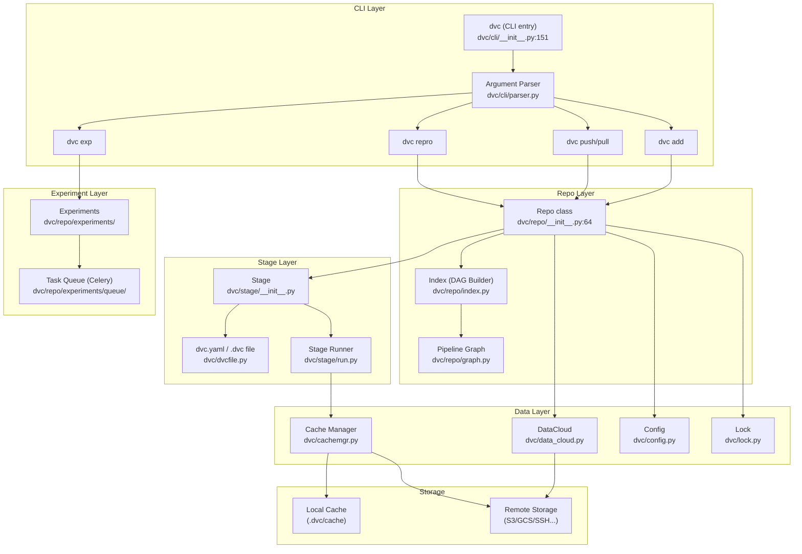
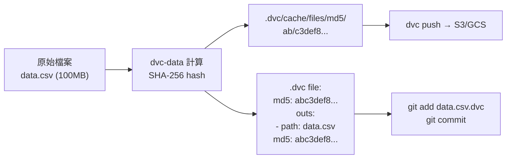
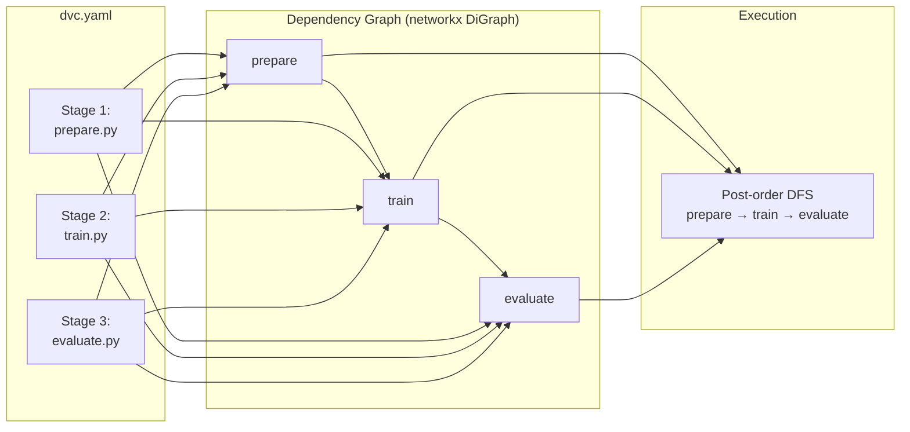

# DVC · 架構

## 系統高層圖

### 圖意說明

DVC 的架構大致分為四層。CLI 層（`dvc/cli/__init__.py`）是唯一的使用者入口，透過 `argparse` parser 分派到各 command handler（`dvc/commands/`）。每個 command handler 通常只做參數驗證，實際邏輯在 Repo 層（`dvc/repo/`）執行。

Repo 層是真正的核心——`dvc.repo.Repo` class 以「透過 Python module import 注入方法」的方式組裝所有操作（`add`、`push`、`reproduce` 等），這種 pattern 讓單一 Repo class 可以承載數十個方法而不會變成單體怪物。

Stage 層負責將 `dvc.yaml`／`.dvc` 檔案解析為 `Stage` 物件，並在 pipeline reproduce 時執行實際的 shell command。

Data 層處理所有跟檔案儲存有關的事——cache 管理、remote storage 的 push/pull、config 讀寫、檔案鎖。值得注意的是 DVC 本身只存 hash，不存完整檔案內容；實際檔案內容存在 `dvc-data`（獨立套件）管理的 content-addressed object store 中。

## 內容定址機制

DVC 跟 Git 最核心的概念共通點是**內容定址（content-addressing）**：用檔案內容的 hash 作為檔名。

**跟 Git 的主要差異**：

| 面向 | Git | DVC |
|---|---|---|
| Hash 對象 | 檔案內容 + metadata | 純檔案內容 |
| Hash 演算法 | SHA-1（transitioning to SHA-256） | SHA-256（default, 支援 legacy md5-dos2unix） |
| 版本對照表 | tree object（目錄結構） | `.dvc` / `dvc.yaml` / `dvc.lock` |
| 大檔案支援 | 差（binary diff 膨脹） | 好（hash 不變就不重傳） |
| 分散式 | 天生 | 依賴 Git + remote storage |

DVC 的 hash 存在 `.dvc` 檔案或 `dvc.lock` 中，這些小文字檔可以被 Git 正常追蹤。真正的資料 blob 則存在 `.dvc/cache/` 或 remote storage 中。這個「hash pointer + blob store」的模式基本上是參照 Git 的內容定址，但針對大檔案做了兩項關鍵調整：

- 不存 binary delta（Git 會對 packfile 做 diff compression，對 ML 場景的大檔案效果差）
- cache 層支援 symlink/hardlink/reflink/copy 四種 mode，避免重複複製（[`dvc/config_schema.py:46`](https://github.com/iterative/dvc/blob/06ff81c/dvc/config_schema.py#L46)）

## Pipeline 架構

**Pipeline 的關鍵設計決策**：

**1. 用 `networkx.DiGraph` 管理 DAG** — 每個 `Stage` 是一個 node，dependencies 之間是 edge。這個選擇的 trade-off 是：networkx 是純 Python 實作，對數百 stage 的圖來說夠用，但動輒上千 stage 的場景（某些 data pipeline）會有記憶體壓力。

**2. reproduce 策略是 post-order DFS** — 從 target stage 出發，做 depth-first post-order traversal，確保 dependencies 先執行（[`dvc/repo/reproduce.py:109`](https://github.com/iterative/dvc/blob/06ff81c/dvc/repo/reproduce.py#L109)）。這比 topological sort 更適合「我只想重新跑這個 stage 跟它的上游」的常見場景。

**3. Run-cache 機制** — 如果 stage 的 dependencies（input data hash、command string、params）都沒變，直接從 run-cache 恢復 output，不必實際執行 command（[`dvc/stage/run.py:173`](https://github.com/iterative/dvc/blob/06ff81c/dvc/stage/run.py#L173)）。這是 DVC 效率的核心——在 ML 場景下，改的通常是程式碼或參數，而不是每次都在動資料。

**4. 三種 error handling 模式** — `fail`（立刻失敗）、`keep-going`（跳過失敗 stage 但最後回報）、`ignore`（安靜跳過）（[`dvc/repo/reproduce.py:167`](https://github.com/iterative/dvc/blob/06ff81c/dvc/repo/reproduce.py#L167)）。

## Config 系統

DVC 的 config 分為四個層級，從最底層（system）往最上層（local）shadow：

| 層級 | 位置 | 用途 |
|---|---|---|
| system | Linux: `/etc/dvc.config`, Windows: registry | 機器級預設值 |
| global | `~/.config/dvc/config` | 使用者級偏好 |
| repo | `.dvc/config` | 專案級設定（可 commit） |
| local | `.dvc/config.local` | 本機專案設定（不 commit，通常放 credential） |

Schema validation 使用 `voluptuous`（[`dvc/config_schema.py:1`](https://github.com/iterative/dvc/blob/06ff81c/dvc/config_schema.py#L1)），這是一個比 `jsonschema` 更 Pythonic 的選擇。主要的 trade-off 是 voluptuous 的錯誤訊息較難讀，但 schema 定義更簡潔。

## 鎖機制

DVC 使用 `flufl.lock`（NFS-safe 的 file lock）作為主要鎖實作，fallback 到 `zc.lockfile`（[`dvc/lock.py:10-11`](https://github.com/iterative/dvc/blob/06ff81c/dvc/lock.py#L10-L11)）。鎖的 timeout 預設 3 秒（[`dvc/lock.py:17`](https://github.com/iterative/dvc/blob/06ff81c/dvc/lock.py#L17)）。

這不是分散式鎖，所以多台機器同時操作同一個 remote storage 時不會衝突——DVC 的 remote 操作是 atomic 的（content-addressed，不會有覆蓋問題）。鎖只保護本機 cache 的讀寫一致性。

## 失敗模式與降級策略

| 失敗情境 | 行為 | 程式碼 |
|---|---|---|
| Lock 取得失敗 | 拋出 `LockError`，提示其他 DVC process 可能佔用 | [`dvc/lock.py:27`](https://github.com/iterative/dvc/blob/06ff81c/dvc/lock.py#L27) |
| Remote 不可用 | `DataCloud` 操作拋 `AuthError` / `ConfigError` / `RemoteMissingDepsError` | [`dvc/cli/__init__.py:111`](https://github.com/iterative/dvc/blob/06ff81c/dvc/cli/__init__.py#L111) |
| Pipeline stage 失敗 | `on_error` 參數控制行為：`fail`、`keep-going`、`ignore` | [`dvc/repo/reproduce.py:167`](https://github.com/iterative/dvc/blob/06ff81c/dvc/repo/reproduce.py#L167) |
| cyclie pipeline | `check_acyclic` 在圖構建時檢測並拋出 `CyclicGraphError` | [`dvc/repo/graph.py:15`](https://github.com/iterative/dvc/blob/06ff81c/dvc/repo/graph.py#L15) |
| Broken pipe | 捕獲 `BrokenPipeError`，回傳 exit code 141 | [`dvc/cli/__init__.py:219`](https://github.com/iterative/dvc/blob/06ff81c/dvc/cli/__init__.py#L219) |

## 不顯然（但重要）的設計決定

1. **Git stash 作為實驗佇列** — 實驗佇列用 Git stash ref（`refs/exps/`）存狀態，而不是獨立的 DB 或 Redis。這讓實驗狀態跟著 repo 走，但意味著 `git stash` 操作如果出錯會影響整個佇列。

2. **方法注入（Method Injection via Module Import）** — `Repo` class 大量使用 `from dvc.repo.add import add` 作為 class body 裡的 import assignment（[`dvc/repo/__init__.py:67-91`](https://github.com/iterative/dvc/blob/06ff81c/dvc/repo/__init__.py#L67-L91)）。這讓 Repo 類別自然地「長出」方法，同時每個方法可以獨立測試。

3. **fsspec 作為統一 storage 抽象** — 所有 remote storage（S3、GCS、SSH、WebDAV、HDFS）都透過 `fsspec` 抽象。這讓新增 storage backend 只需要實作 fsspec 的 interface，不需要修改 DVC 核心。

4. **把 stage cache 跟 file cache 分開** — DVC 有兩個快取系統：run-cache（stage 層級，避免重複執行）和 file cache（blob 層級，避免重複儲存）。兩者獨立運作，但都依賴內容定址。
