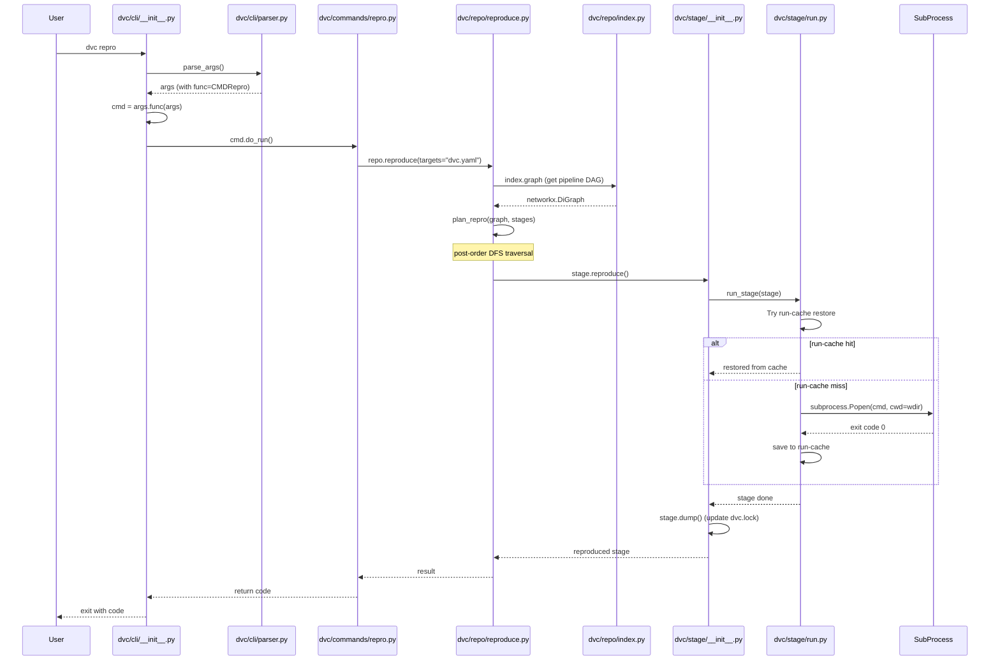

# DVC · 程式碼追蹤

## 追蹤的場景

**場景**: 執行 `dvc repro` — 從 CLI 入口到 pipeline stage 執行的完整路徑。

**啟動命令**:
```bash
dvc repro
```

這條路徑涵蓋了 DVC 最核心的三層（CLI → Repo → Stage），最能展示架構的運作方式。

## 流程圖



## 逐步追蹤

### Step 1: CLI 入口

[`dvc/cli/__init__.py:151`](https://github.com/iterative/dvc/blob/06ff81c/dvc/cli/__init__.py#L151)

`main()` 是整個 DVC 的統一入口。它先呼叫 `parse_args(argv)`（L180），然後 `args.func(args)` 產生 command instance（L211），最後 `cmd.do_run()` 執行（L212）。

這裡值得注意的設計：

- 三層例外處理：`ConfigError` → exit 251, `KeyboardInterrupt` → exit 252, `NotDvcRepoError` → exit 253, `DvcParserError` → exit 254, `DvcException` → exit 255。這些 exit code 讓 CI 腳本可以區分不同類型的錯誤。
- `BrokenPipeError` 的特殊處理：將 stdout 重導向到 `/dev/null`，避免 Python shutdown 時的 secondary BrokenPipeError（[`dvc/cli/__init__.py:225`](https://github.com/iterative/dvc/blob/06ff81c/dvc/cli/__init__.py#L225)）。

### Step 2: Parser 與命令分派

[`dvc/cli/parser.py:1`](https://github.com/iterative/dvc/blob/06ff81c/dvc/cli/parser.py#L1)

Parser 透過 `COMMANDS` list 註冊所有 subcommand（L59-101）。每個 command module 透過 `CmdBase.add_parser(subparsers)` classmethod 來註冊自己的 argument parser。這是 argparse 常見的「子命令」pattern。

### Step 3: CMDRepro.do_run()

[`dvc/commands/repro.py`](https://github.com/iterative/dvc/blob/06ff81c/dvc/commands/repro.py)

Command handler 的 `do_run()` 主要做：

1. 從 `self.args` 收集 reproduce 參數（targets、pipeline、downstream 等）
2. 呼叫 `self.repo.reproduce(...)`（實際邏輯在 `dvc/repo/reproduce.py`）

Command handler 層「只做參數整理」，是 DVC 的良好分層設計。

### Step 4: Repo.reproduce() — 核心排程

[`dvc/repo/reproduce.py:210`](https://github.com/iterative/dvc/blob/06ff81c/dvc/repo/reproduce.py#L210)

這裡有幾件事：

1. **收集 target stages**（L232-234）：如果沒指定 target，預設為 `dvc.yaml`（`PROJECT_FILE`）。透過 `collect_stages()` 從檔案系統搜集。

2. **Pull run-cache**（L236-241）：如果設定了 `pull=True`，先從 remote 拉 run-cache。

3. **建立 pipeline DAG**（L243-247）：`plan_repro(graph, stages)` 利用 networkx 的 `dfs_postorder_nodes` 做 post-order traversal，決定 stage 的執行順序（[`dvc/repo/reproduce.py:65-109`](https://github.com/iterative/dvc/blob/06ff81c/dvc/repo/reproduce.py#L65-L109)）。

   **最值得注意的變數**：
   - `pipeline`：是否包含整個 pipeline 而不只是 dependencies
   - `downstream`：是否包含 downstream stages（反向追蹤）
   - `single_item`：只跑指定的 stage

### Step 5: _reproduce() — 執行 pipeline

[`dvc/repo/reproduce.py:158`](https://github.com/iterative/dvc/blob/06ff81c/dvc/repo/reproduce.py#L158)

迭代 stage（L176），對每個 stage 做：

1. 檢查是否在 `to_skip` mapping 中（skip failed upstream 的 downstream）（L177-178）
2. 取得 upstream / downstream nodes（L183）
3. 呼叫 `_reproduce_stage()` 執行 stage（L187）
4. 如果失敗，依照 `on_error` 模式處理（L188-195）：
   - `fail`：立刻 `_raise_error`
   - `keep-going`：跳過 failed stage 的 downstream，繼續
   - `ignore`：安靜跳過

這裡的 `force_downstream` flag 是關鍵——當上游 stage 真的被重新執行過時，下游 stage 才會被標記為需要 force reproduce。如果上游沒有變動（run-cache hit），下游不需要重跑。

### Step 6: Stage.reproduce() — Stage 層級

[`dvc/stage/__init__.py`](https://github.com/iterative/dvc/blob/06ff81c/dvc/stage/__init__.py)

`Stage.reproduce()` 是 DVC 的最小執行單位。它：

1. 檢查 dependencies 的 hash 是否變更
2. 如果沒變更、且 outputs 存在 → 跳過（run-cache）
3. 如果有變更 → 呼叫 `run_stage()`
4. 執行完後更新 outputs 的 hash 並 dump 到 `dvc.lock`

### Step 7: run_stage() — 實際執行 command

[`dvc/stage/run.py:166`](https://github.com/iterative/dvc/blob/06ff81c/dvc/stage/run.py#L166)

這是「到底做事」的地方：

1. **Pull missing deps**（L168-169）：如果 stage 的 dependency 不存在，先 pull
2. **嘗試 restore run-cache**（L173）：如果 run-cache 命中，直接 return，不執行 command
3. **執行 command**（L182）：`unlocked_repo(cmd_run)(stage, ...)` — 注意它先 unlock repo 再執行，避免長時間的子行程佔住檔案鎖

`cmd_run()` 最終透過 `subprocess.Popen` 執行使用者在 `dvc.yaml` 中定義的 command（[`dvc/stage/run.py:126`](https://github.com/iterative/dvc/blob/06ff81c/dvc/stage/run.py#L126)）。

### Step 8: Stage dump

執行完後，`_reproduce_stage()` 會呼叫 `stage.dump()`（[`dvc/repo/reproduce.py:119`](https://github.com/iterative/dvc/blob/06ff81c/dvc/repo/reproduce.py#L119)），更新 `dvc.lock` 中的 output hash。這樣 Git 使用者才能看到「這個 pipeline 這次產出了哪些檔案」。

## 這條路徑的瓶頸點

1. **Index 建構** — 在大型專案中，`collect_files()` 在檔案系統中搜尋所有 `.dvc` / `dvc.yaml` 檔案可能需要數百毫秒到數秒。
2. **Hash 計算** — 對大型檔案計算 SHA-256 是 I/O-bound 的，DVC 在 `dvc add` 時做這個計算，`dvc repro` 時則只需比對 hash。
3. **Subprocess overhead** — 每次 `run_stage()` 都產生新的 subprocess，對於 pipeline 中有很多小 stage 的場景，overhead 會疊加。
4. **Run-cache 檢查** — 每次 reproduce 都要檢查 run-cache，雖然是 O(1) 的 hash lookup，但在 network 環境下 pull run-cache 可能很慢。

## 想學更多時，在哪裡下中斷點

- 想看 pipeline DAG 長怎樣：`dvc/repo/graph.py` 的 `get_pipelines()` 處
- 想看一個 stage 的 dependencies 跟 outputs：`Stage` class 的 `deps` 跟 `outs` property
- 想看 run-cache 有沒有命中：`stage.repo.stage_cache.restore()` 處
- 想看 subprocess 怎麼執行：`dvc/stage/run.py` 的 `cmd_run()` 內
- 想看 lock 是否正常：`dvc/lock.py` 的 `lock()` 方法

## 沒追蹤到但值得留意

- `dvc exp run` 的執行路徑：跟 `dvc repro` 共用 reproduce 邏輯，但多了一層 Git stash 的實驗管理
- `dvc push` / `dvc pull` 的資料傳輸路徑：走 `DataCloud` → `dvc-data` library
- `dvc fs` filesystem API：被設計成 fsspec 相容的 `DVCFileSystem`，讓外部工具可以直接掛載 DVC repo
