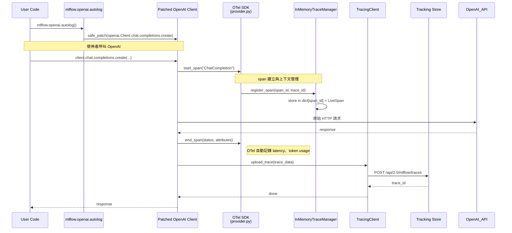

# MLflow · 架構

## 系統高層圖

```mermaid
flowchart TB
    subgraph User["使用者端"]
        SDK["Python SDK<br/>(mlflow.* fluent API)"]
        CLI["CLI (click-based)<br/>mlflow/cli/"]
        REST["REST Client<br/>(任何語言)"]
        UI["React UI<br/>mlflow/server/js/"]
    end

    subgraph Server["MLflow Server"]
        FLASK["Flask HTTP Handlers<br/>mlflow/server/handlers.py"]
        FASTAPI["FastAPI Gateway<br/>mlflow/gateway/"]
        MID["Security Middleware<br/>Host validation / CORS / X-Frame"]
    end

    subgraph Store["Store Layer"]
        AS[("AbstractStore<br/>mlflow/store/tracking/abstract_store.py")]
        FS[("FileStore<br/>local filesystem")]
        SAS[("SQLAlchemyStore<br/>SQL DB")]
        RRS[("RestStore<br/>remote MLflow server")]
        DRS[("DatabricksRestStore<br/>Databricks workspace")]
        MRS[("ModelRegistryStore<br/>model registry")]
    end

    subgraph Tracing["Tracing & Observability"]
        OTel["OpenTelemetry SDK<br/>mlflow/tracing/provider.py"]
        TM[("InMemoryTraceManager<br/>mlflow/tracing/trace_manager.py")]
        TC[("TracingClient<br/>mlflow/tracing/client.py")]
        ARCH[("TraceArchivalService<br/>mlflow/tracing/trace_archival_service.py")]
    end

    subgraph GenAI["GenAI Features"]
        EVAL["Evaluation<br/>mlflow/evaluation/"]
        JUDGE[("LLM Judges<br/>mlflow/genai/judges/")]
        PROMPT[("Prompt Registry<br/>mlflow/genai/prompts.py")]
        OPT[("Prompt Optimization<br/>mlflow/genai/optimize.py")]
        SCORER[("Online Scorers<br/>mlflow/genai/scorers/")]
        LABEL[("Labeling<br/>mlflow/genai/labeling/")]
    end

    subgraph Integrations["ML Framework Integrations"]
        OPENAI["OpenAI / Autolog<br/>mlflow/openai/"]
        LANGCHAIN["LangChain / LlamaIndex<br/>mlflow/langchain/"]
        AUTOGEN["AutoGen / CrewAI<br/>mlflow/autogen/"]
        SKLEARN["scikit-learn / XGBoost<br/>mlflow/sklearn/"]
        PYTORCH["PyTorch / TF / Keras<br/>mlflow/pytorch/"]
    end

    subgraph Serving["Model Serving"]
        PYFUNC[("PyFunc<br/>mlflow/pyfunc/")]
        DEPLOY[("Deployments<br/>mlflow/deployments/")]
        DOCKER[("Docker images<br/>docker/")]
    end

    SDK --> FLASK
    CLI --> FLASK
    REST --> FLASK
    REST --> FASTAPI
    UI --> FLASK

    FLASK --> AS
    AS --> FS
    AS --> SAS
    AS --> RRS
    AS --> DRS
    AS --> MRS

    FLASK --> TM
    OTel --> TM
    TM --> TC
    TC --> ARCH

    FLASK --> EVAL
    FLASK --> JUDGE
    FLASK --> PROMPT
    FLASK --> SCORER

    SDK -.autolog.-x OPENAI
    SDK -.autolog.-x LANGCHAIN
    SDK -.autolog.-x AUTOGEN
    SDK -.autolog.-x SKLEARN

    SDK --> PYFUNC
    PYFUNC --> DEPLOY
    DEPLOY --> DOCKER
```

### 圖意說明

這張圖展示 MLflow 的四層架構。上層是使用者端（SDK / CLI / REST / UI），中間是 server 層（Flask 為主的 REST handlers + FastAPI 的 Gateway），下層是 store 抽象層。右側是 LLM-genAI 新功能的集群：tracing 子系統、genAI 功能（evaluation、judges、prompt registry）、以及 framework 整合層。

關鍵設計觀察：

- **Server 雙軌制**：主要 REST API 走 Flask（歷史原因），Gateway 模組走 FastAPI（較新的通道）。兩者透過同一個 security middleware 保護。
- **Store 是核心抽象**：所有 tracking 操作透過 `AbstractStore` 介面，實作有 FileStore（本地開發）、SQLAlchemyStore（production）、RestStore（remote server proxy）、DatabricksRestStore（Databricks 整合）。這讓 MLflow 可以無痛切換 backend。
- **Autolog 是橫切關注點**：它不屬於 server 層，而是透過 `safe_patch` 在 client SDK 直接 monkey-patch 各 framework 的關鍵方法。

## 資料流：一次 tracing 請求

### 圖意說明

這個 sequence diagram 展示 MLflow 最核心的新功能——tracing 的完整路徑。從使用者的角度，只是一行 `mlflow.openai.autolog()` 加上原本的 OpenAI 呼叫。但在背後：

1. `safe_patch` 用 monkey-patch 取代 `openai.Client.chat.completions.create`，包裹 tracing 邏輯
2. span 透過 OpenTelemetry 的 context propagation 管理父子關係
3. `InMemoryTraceManager` 是記憶體中的 span dict，提供低延遲的本地存取
4. span 結束後，`TracingClient` 將完整 trace 上傳到 tracking store（可以是 local file、SQL DB 或 remote server）
5. 使用者可在 UI 中即時看到剛剛的 trace

## 關鍵設計決策

### 1. Protobuf 驅動的 API contract（而非 OpenAPI）

MLflow 的 REST API 不是手寫 Flask route，而是從 `.proto` 檔案自動產生 handler skeleton 和 request/response 類別。
[`mlflow/protos/service.proto`](https://github.com/mlflow/mlflow/blob/1c491e7/mlflow/protos/service.proto) 定義了所有 tracking endpoint 的 message 格式。

**為什麼選 protobuf 而非 OpenAPI**：歷史原因——早期 MLflow 團隊來自 Databricks，而 Databricks 內部使用 protobuf 作為 API contract。好處是 client-server 的 message 格式永遠一致（code gen 保證），壞處是 protobuf 不如 OpenAPI 普及，非 Python client 需要額外處理。

**Trade-off**：protobuf 讓 MLflow SDK（Python、R、Java）的 API 介面完全一致，但新增一個 endpoint 需要修改 proto → code gen → server handler → client 共四層，開發成本較高。

### 2. Store 抽象層的四種實作策略

[`mlflow/store/tracking/abstract_store.py:57-85`](https://github.com/mlflow/mlflow/blob/1c491e7/mlflow/store/tracking/abstract_store.py#L57-L85) 定義了 `AbstractStore`，GatewayStoreMixin 多重繼承提供 gateway 相關方法。

四種實作的切換策略：

| Store | 啟用時機 | 儲存方式 | 適用場景 |
|---|---|---|---|
| `FileStore` | `mlflow server` 無指定 backend | 本地檔案系統（`.mlruns/`） | 單機開發、快速實驗 |
| `SQLAlchemyStore` | `--backend-store-uri sqlite:///...` 或 postgresql | SQL database（Alembic migration） | Production、多用戶 |
| `RestStore` | `mlflow.set_tracking_uri(http://...)` | 遠端 MLflow server | 分散式部署 |
| `DatabricksRestStore` | tracking_uri="databricks" | Databricks workspace | Databricks 用戶 |

[UNVERIFIED] `FileStore` 雖然被歸類為 production-stable，但在 2,000+ concurrent 場景下 SQLAlchemyStore 是標準建議。FileStore 的鎖定機制（file lock）在高併發下可能成為瓶頸。

### 3. Autolog 的 safe_patch 架構（橫切關注點）

[`mlflow/utils/autologging_utils/safety.py`](https://github.com/mlflow/mlflow/blob/1c491e7/mlflow/utils/autologging_utils/safety.py) 實作了 `safe_patch`——一個可以安全替換任意物件方法的 decorator。

**為什麼不做 framework-native integration**：MLflow 支援 20+ 個 framework，如果每個都要釘在框架的 plugin 系統（例如 PyTorch hook、LangChain callback），維護成本太高。Monkey-patch 雖然 dirty，但提供**一致的 intercept 模式**：在原始方法呼叫前後插入 logging/tracing。

**安全機制**：`safe_patch` 保證即使 patch 的邏輯拋例外，原始方法仍會被呼叫（透過 try/finally）。這避免了 autolog 崩潰導致使用者 code 也不執行的災難。

**Trade-off**：Monkey-patch 讓 tracing 對使用者透明，但也使得 stack trace 多了一層 wrapper，debug 時可能困惑。LangFuse 選擇手動 instrument 的路線，stack trace 更乾淨但需要使用者明確整合。

### 4. OpenTelemetry 作為 tracing 底層（而非自創格式）

[`mlflow/tracing/provider.py`](https://github.com/mlflow/mlflow/blob/1c491e7/mlflow/tracing/provider.py) 封裝了 OpenTelemetry SDK，MLflow 的 span 建立在 OTel span 之上。

**為什麼選 OTel**：生態系整合——Otel 已經被 Datadog、Grafana、Honeycomb 等支援。選擇 OTel 意味著 MLflow 的 tracing 資料可以 export 到任何 OTel-compatible observability backend，不需要 vendor lock-in。

**MLflow 的包裝層**：`InMemoryTraceManager` 同時維護一份 MLflow 自己的 span dict，因為 OTel 的 span 設計偏向 streaming export（不可變、一次性），而 MLflow 需要 in-memory 的 mutable span 來支援即時 UI 更新。

### 5. Gateway 的 provider registry 模式

[`mlflow/gateway/provider_registry.py`](https://github.com/mlflow/mlflow/blob/1c491e7/mlflow/gateway/provider_registry.py) 實作了 provider 註冊機制，讓新的 LLM provider 可以 plug in。

**為什麼需要 Gateway**：MLflow 的 Gateway 不是傳統的 API gateway（如 Kong），而是**統一的 LLM API 代理層**——讓使用者用一致的接口呼叫 OpenAI、Anthropic、Bedrock、Gemini 等，並在中央管控 cost、rate limit、guardrails。

**Pluggable 的實現**：provider 透過 entry point 註冊（`mlflow.gateway.provider`），類似 Python 的 `pkg_resources` entry points 模式。這讓第三方也可以提供自己的 provider plugin。
