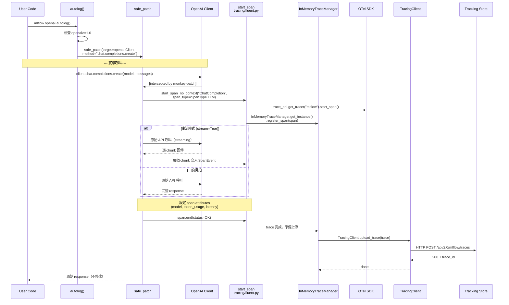

# MLflow · 程式碼追蹤

## 追蹤的場景

**場景**: 使用者啟用 OpenAI autolog，呼叫 OpenAI API，MLflow 自動建立 trace 並上傳到 tracking server。

**啟動命令**（使用者端）:
```python
import mlflow
mlflow.openai.autolog()
mlflow.set_tracking_uri("http://localhost:5000")

from openai import OpenAI
client = OpenAI()
response = client.chat.completions.create(
    model="gpt-4o",
    messages=[{"role": "user", "content": "Hello"}]
)
```

## 流程圖



## 逐步追蹤

### Step 1: autolog() 啟用

**入口**: [`mlflow/openai/autolog.py:36-65`](https://github.com/mlflow/mlflow/blob/1c491e7/mlflow/openai/autolog.py#L36-L65)

```python
def autolog(disable=False, exclusive=False, ..., log_traces=True):
    if Version(importlib.metadata.version("openai")).major < 1:
        raise MlflowException(...)
    _autolog(disable=disable, ...)
```

`autolog()` 首先驗證 OpenAI 版本（>=1.0），然後呼叫內部的 `_autolog()`。Autolog 只在 Python 3.x 的 openai >=1.0 上有效。

### Step 2: safe_patch 注入

**內部 `_autolog`**: [`mlflow/openai/autolog.py`](https://github.com/mlflow/mlflow/blob/1c491e7/mlflow/openai/autolog.py#L85-L140)

`_autolog()` 被 `@autologging_integration("openai")` 修飾，這個 decorator 管理 autolog 的 lifecycle（enable/disable/exception safety）。

核心是 `safe_patch` 的多次呼叫：
- `safe_patch(openai.resources.chat.completions.Completions, "create", patched_fn)` — 攔截 chat completion
- `safe_patch(openai.resources.embeddings.Embeddings, "create", patched_fn)` — 攔截 embedding
- 以及其他 endpoint（images、audio 等）

**`safe_patch` 實作**: [`mlflow/utils/autologging_utils/safety.py`](https://github.com/mlflow/mlflow/blob/1c491e7/mlflow/utils/autologging_utils/safety.py)

`safe_patch` 使用 `functools.wraps` 建立 wrapper function，並用 `__wrapped__` 屬性記錄原始方法。關鍵機制：

```python
# 簡化邏輯
def safe_patch(target_class, method_name, patch_fn):
    original = getattr(target_class, method_name)
    @functools.wraps(original)
    def wrapper(self, *args, **kwargs):
        # patch_fn 在這裡被呼叫，夾在 original 前後
        return patch_fn(original, self, *args, **kwargs)
    wrapper.__wrapped__ = original  # 保留原始方法
    setattr(target_class, method_name, wrapper)
```

**安全保證**：如果 `patch_fn` 拋出例外，`wrapper` 會 catch 後 fallback 呼叫 `original`，確保 autolog 的 bug 不會影響使用者程式。

### Step 3: span 建立（tracing 的核心）

**入口**: [`mlflow/tracing/fluent.py`](https://github.com/mlflow/mlflow/blob/1c491e7/mlflow/tracing/fluent.py)

當 patched 的 openai create 被呼叫時，patch 函數呼叫 `start_span_no_context()` 建立 tracing span：

```python
# mlflow/openai/autolog.py 中的 patch 邏輯
with mlflow.start_span(
    name="ChatCompletion",
    span_type=SpanType.LLM,
    inputs={"messages": messages, "model": model},
) as span:
    result = original(self, *args, **kwargs)  # 實際呼叫 OpenAI
    span.set_outputs(result)
    span.set_attributes({
        "mlflow.llm.token_count": result.usage.total_tokens,
        "mlflow.llm.model_name": model,
    })
```

`start_span_no_context` 與一般的 `start_span` 的差別在於 context propagation——前者用於獨立的 span（沒有 parent），後者用於巢狀 span。

### Step 4: OTel span 與 InMemoryTraceManager

**OTel provider 封裝**: [`mlflow/tracing/provider.py`](https://github.com/mlflow/mlflow/blob/1c491e7/mlflow/tracing/provider.py)

MLflow 的 span 並非自訂類別，而是建立一個 **OpenTelemetry span**，然後包裝成 `LiveSpan`：

```python
# 簡化流程
def start_span(name, span_type, inputs):
    tracer = trace_api.get_tracer("mlflow", mlflow.__version__)
    otel_span = tracer.start_span(name)
    mlflow_span = LiveSpan(otel_span, span_type=span_type, inputs=inputs)
    InMemoryTraceManager.get_instance().register_span(mlflow_span)
    return mlflow_span
```

**`InMemoryTraceManager`**: [`mlflow/tracing/trace_manager.py`](https://github.com/mlflow/mlflow/blob/1c491e7/mlflow/tracing/trace_manager.py)

`InMemoryTraceManager` 是 singleton，內部維護一個 `dict[str, LiveSpan]`。它的存在理由是 OTel 的 span exporter 是 streaming/one-shot 的，而 MLflow 需要能即時查詢的 mutable span dict來支援 UI 的即時更新。所有 span 操作（register、update、end）都會同步寫入這個 dict。

### Step 5: span 結束與 trace 上傳

當 span 結束時（離開 `with` block），MLflow 會：

1. **結束 OTel span** → 記錄 timing、status
2. **計算 token usage** → 從 OpenAI response 的 `usage` 欄位提取
3. **upload trace** → 透過 `TracingClient` 上傳到 tracking store

**上傳端點**: [`mlflow/tracing/client.py`](https://github.com/mlflow/mlflow/blob/1c491e7/mlflow/tracing/client.py)

`TracingClient.upload_trace()` 將 trace 序列化為 JSON，然後 POST 到 MLflow server 的 `/api/2.0/mlflow/traces` endpoint。

**Server 端處理**: handler 收到請求後，透過 `AbstractStore.log_traces()` 寫入 tracking store（預設 SQLAlchemyStore）。

### Step 6: 使用者取得原始 response

Monkey-patch 保證**不修改原始 response**。`safe_patch` 的 wrapper 在 tracing 完成後，直接回傳 `original()` 的結果（未經修改的 OpenAI response 物件）。使用者完全不知道 tracing 發生過。

## 想學更多時，在哪裡下中斷點

- 想看 autolog 如何 patch：`mlflow/utils/autologging_utils/safety.py` 中的 `safe_patch()` → 看 `__wrapped__` 的保留邏輯
- 想看 span 的建立細節：`mlflow/tracing/fluent.py` 中的 `start_span()` → 看 OTel span 的包裝方式
- 想看 trace 如何上傳：`mlflow/tracing/client.py` 中的 `upload_trace()` → 看序列化與 HTTP 請求和錯誤處理
- 想看 server 端如何接收 trace：`mlflow/server/handlers.py` 中的 `_log_traces_handler()` → 看 protobuf deserialization

## 沒追蹤到但值得留意

- **串流模式的處理**：OpenAI 的 streaming response（`stream=True`）不同於一般模式。MLflow 用 chunk event 記錄每個 chunk，而非等完整 response。這在 `mlflow/openai/autolog.py` 的 `_streaming_patcher` 實作。
- **Error handling**：如果 OpenAI API 回傳 error（4xx/5xx），span 的 status 會被設為 `ERROR`，但仍會記錄該次 call。
- **Distributed tracing**：當 OpenAI 呼叫發生在 subprocess 或 microservice 中，MLflow 透過 OTel 的 context propagation header（`_get_tracing_headers_from_span`）傳遞 trace context。這在 `mlflow/tracing/distributed.py` 實作。
