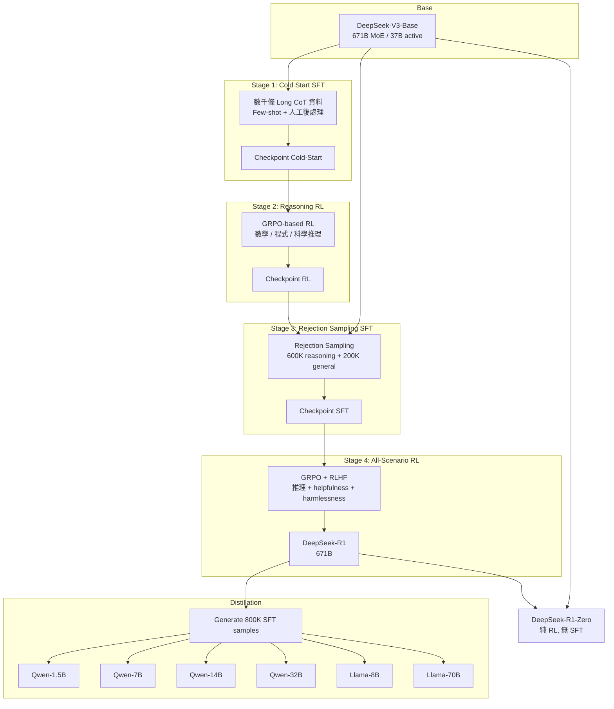
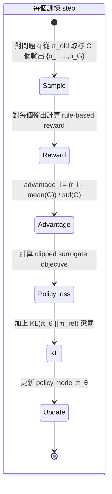

# DeepSeek-R1 · 架構

## 訓練管線高層圖

DeepSeek-R1 的核心架構不是靜態的系統拓樸，而是一條**四階段動態訓練管線**。下圖展示從 Base Model 到最終 DeepSeek-R1 的訓練流程，以及並行的蒸餾路徑：



**圖意說明**：整條管線由兩個 RL 階段和兩個 SFT 階段交錯組成。冷啟動 SFT（Stage 1）為 RL 提供穩定的初始點；Reasoning RL（Stage 2）專注於推理能力的最大化；Rejection Sampling SFT（Stage 3）將 RL 的學習成果轉化為高品質監督資料，並補上通用能力；最後的 All-Scenario RL（Stage 4）在保持推理能力的同時對齊人類偏好。蒸餾路徑（下半）則是使用最終模型的輸出直接 SFT 小模型。DeepSeek-R1-Zero 是一條平行的純 RL 路徑（從 Base 直接 RL，無 SFT）。

### 為什麼要四階段？

這個設計背後的核心問題是：**RL 雖然能有效提升推理，但會犧牲可讀性與通用能力**。R1-Zero 的經驗顯示，純 RL 訓練出的模型雖然推理強，但輸出難以閱讀、語言混合嚴重。R1 的四階段設計就是在保留 RL 效果的前提下，透過兩次 SFT 插入來「校正」模型的輸出品質：

| 階段 | 目的 | 若省略會怎樣 |
|------|------|-------------|
| Cold Start SFT | 避免 base model 在 RL 初期的不穩定探索 | RL 訓練不穩定，收斂慢 |
| Reasoning RL | 最大化推理能力 | 推理能力不足 |
| Rejection SFT | 補上通用能力 + 讓 RL 成果可擴散 | 模型只能做推理，寫作/問答差 |
| All-Scenario RL | 對齊人類偏好（helpful + harmless） | 輸出可能有害或無幫助 |

## 訓練演算法：GRPO

### 跟 PPO 的關鍵差異

GRPO（Group Relative Policy Optimization）是 DeepSeek-R1 使用的主要 RL 演算法。它與標準 PPO 的最大差異在於**不需要 critic model**：

```mermaid
flowchart LR
    subgraph "PPO (標準)"
        Q[Question] --> Policy[Policy Model]
        Policy --> O[Output]
        O --> R[Reward Model]
        O --> C[Critic Model<br/>~= Policy 大小]
        R --> A[Advantage<br/>GAE]
        C --> A
        A --> UP[Update Policy]
    end

    subgraph "GRPO (DeepSeek-R1)"
        Q2[Question] --> Policy2[Policy Model]
        Policy2 --> G1[Output 1]
        Policy2 --> G2[Output 2]
        Policy2 --> G3[Output G<br/>G 個取樣]
        G1 --> RM[Reward Model<br/>Rule-based]
        G2 --> RM
        G3 --> RM
        RM --> ADV[Advantage =<br/>(r_i - mean(G)) / std(G)]
        ADV --> UP2[Update Policy]
    end
```

**圖意說明**：PPO 需要一個與 policy model 差不多大的 critic model 來估計 value function，這意味著接近兩倍的記憶體與運算量。GRPO 的洞見是：對每個問題取樣 G 個輸出（實作中 G 通常為 64），用 group 內的 reward 分布來估計 baseline（`mean(r_i)`）和標準差，據此計算 advantage。這完全省去了 critic model，訓練成本約減半。trade-off 是：當 group 內 reward 變異很小時，advantage 估計的訊號噪聲比會下降。

### Reward 設計

| Reward 類型 | 用途 | 計算方式 |
|-------------|------|---------|
| Accuracy Reward | 答案正確性 | 數學題：規則比對（如 `\boxed{}`）; 程式題：compiler 回饋 |
| Format Reward | 輸出格式規範 | 確保有 `<think>` / `<answer>` 標籤 |
| Language Consistency | 語言一致性（R1 only） | CoT 中目標語言詞彙比例 |

關鍵決策：**不使用 neural reward model**。論文指出，neural reward model 在大規模 RL 中容易 reward hacking，且 retraining reward model 會增加訓練管線複雜度。這個決策大幅簡化了訓練基礎設施，但也限制了 reward 的適用範圍——只能處理有確定答案的任務（數學、程式），無法直接用於開放式任務。

## 資料管線

### Cold-Start Data（Stage 1）

不同於 R1-Zero 直接從 base model 開始 RL，R1 先用數千條 Long CoT 資料做 SFT。資料來源：

- Few-shot prompting（給範例讓模型生成長 CoT）
- 直接 prompting（要求 model 產生有 reflection 和 verification 的詳細回答）
- R1-Zero 的輸出（經可讀性整理）
- 人工 annotator 後處理

輸出格式：`|special_token|<reasoning_process>|special_token|<summary>`

### Rejection Sampling Data（Stage 3）

| 資料類型 | 數量 | 來源 |
|----------|------|------|
| Reasoning data | ~600K | 從 Stage 2 checkpoint rejection sampling + Generative RM (DeepSeek-V3 判斷) |
| Non-reasoning data | ~200K | DeepSeek-V3 pipeline（寫作、QA、翻譯等） |

**Filtering 策略**：過濾掉語言混合、過長段落、混亂 code block 的輸出。每個 prompt 取樣多個 response，只保留正確的。

## GRPO 訓練迴圈



### 核心超參數

- **Group size G**: 64（每個問題取樣 64 個輸出）
- **Clip parameter ε**: 0.2（PPO 慣例值）
- **KL coefficient β**: 控制與 reference model 的偏差
- **KL 形式**: 使用 `KL(π_θ || π_ref) = π_ref/π_θ - log(π_ref/π_θ) - 1`，這是無偏估計

## 蒸餾策略

DeepSeek-R1 的蒸餾是本論文最務實的貢獻之一。關鍵發現：

- **蒸餾 >>> 小模型自訓練 RL**：32B 模型從 R1 蒸餾後 AIME 72.6%，而 32B 自訓練 RL（DeepSeek-R1-Zero-Qwen-32B）僅 47.0%
- **蒸餾 + SFT only**：蒸餾版只做 SFT，不做 RL。論文的理由是「讓社群自己探索 RL 階段」，但實務上這也說明了 SFT 就足以轉移推理模式
- **1.5B 超越 GPT-4o**：DeepSeek-R1-Distill-Qwen-1.5B 在 AIME 28.9%、MATH-500 83.9%，超越 GPT-4o 的 9.3% / 74.6%

### 蒸餾 v.s. RL 的量化對比

| 方法 | AIME 2024 | MATH-500 | GPQA Diamond | LiveCodeBench |
|------|-----------|----------|--------------|---------------|
| 32B 自訓練 RL (R1-Zero-Qwen-32B) | 47.0% | 91.6% | 55.0% | 40.2% |
| 32B 蒸餾 (R1-Distill-Qwen-32B) | **72.6%** | **94.3%** | **62.1%** | **57.2%** |
| 差距 | +25.6pp | +2.7pp | +7.1pp | +17.0pp |

## 失敗經驗的借鑑

論文誠實分享的兩條死路：

1. **Process Reward Model (PRM)**：在一般推理中難以明確定義「細粒度步驟」，自動標註品質差，手動標註無法規模化，且 model-based PRM 會 reward hacking
2. **Monte Carlo Tree Search (MCTS)**：token generation 的 search space 遠大於圍棋（指數級 vs 有限棋盤），value model 難以訓練，很容易陷入局部最優

這兩者的核心教訓是一致的：**對於開放式文字生成任務，基於 step-level 的信號（PRM / MCTS value model）的 training signal 品質遠低於 outcome-level 的信號（rule-based accuracy reward）**。

## 未開源的關鍵決策

此 repo 為 paper release，以下關鍵元件在開源範圍之外：

- **GRPO 訓練的實作細節**（算 cluster 配置、資料平行策略、reward 計算 pipeline）
- **Cold-start data 的具體內容與 prompt 模板**
- **Rejection sampling 的具體閾值與策略**
- **DeepSeek-V3-Base 的訓練細節**（pre-training 部分）

這些不透明處是理解 R1 時最主要的障礙，也是 9-questions.md 的主要問題來源。
