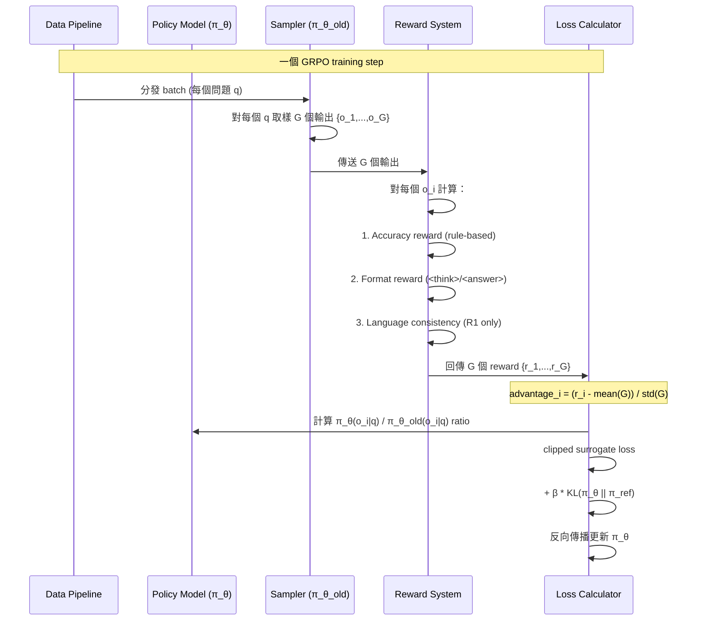
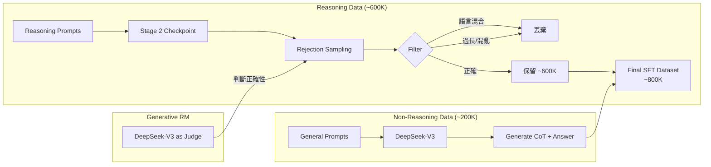

# DeepSeek-R1 · 程式碼追蹤

> **注意**：此 repo 為 paper/model release，原始訓練程式碼未開源。本追蹤基於論文描述的管線與 GRPO 演算法進行推演，所有引用位址指向論文 PDF 中的對應段落。

## 追蹤的場景

**場景**：DeepSeek-R1 的完整四階段訓練流程——從 DeepSeek-V3-Base 開始，經過 Cold Start SFT、Reasoning RL、Rejection Sampling SFT、All-Scenario RL，最終產出 DeepSeek-R1 的過程。

不同於典型的程式碼追蹤（逐行讀取 .py 檔案），這裡追蹤的是**論文描述的訓練資料流**——因為這是理解 R1 最關鍵的部分，而原始碼未開源。

## 流程圖：一個 GRPO 訓練 step 的完整路徑



## 逐步追蹤

### Stage 1: Cold Start

**目的**：為 RL 提供穩定的初始 actor checkpoint

**對應論文章節**：[§2.3.1](https://github.com/deepseek-ai/DeepSeek-R1/blob/0cf7856/DeepSeek_R1.pdf#page=9)

**過程**：
1. 收集數千條 Long CoT 資料，來源包括：
   - Few-shot prompting（給長 CoT 範例讓 model 模仿）
   - 直接 prompt 要求詳細的 reflection / verification 步驟
   - DeepSeek-R1-Zero 的輸出經可讀性整理（filter 掉語言混合、不完整輸出）
   - 人工 annotator 後處理
2. 用這些資料對 DeepSeek-V3-Base 做 SFT
3. 輸出格式採用雙區塊設計：`|special_token|<reasoning_process>|special_token|<summary>`

**關鍵取捨**：只用了「數千條」資料而非數十萬條。這是一個刻意的設計——過多的 cold-start 資料可能會限縮 RL 探索空間，讓模型被 SFT data 的分布綁死。

### Stage 2: Reasoning-oriented RL

**目的**：最大化推理能力

**對應論文章節**：[§2.3.2](https://github.com/deepseek-ai/DeepSeek-R1/blob/0cf7856/DeepSeek_R1.pdf#page=10)

**每一步的內部流程**：

1. **取樣**：對每個問題 q，從 policy model π_θ_old 取樣 G 個輸出（G=64）
2. **Reward 計算**：
   - Accuracy reward：規則比對（數學 `\boxed{}` / 程式 compiler）
   - Format reward：是否有 `<think>` 和 `<answer>` 標籤
   - Language consistency reward（R1 新增）：CoT 中目標語言詞彙比例
3. **Advantage 計算**：`advantage_i = (r_i - mean(G)) / std(G)`
   - 這是 GRPO 的核心創意——完全不用 critic model
4. **Policy loss 計算**：用 clipped surrogate objective（標準 PPO 風格）
5. **KL 懲罰**：`β * D_KL(π_θ || π_ref)`，使用無偏 KL 估計
6. **更新 policy model**

**最容易出問題的點**：Reward hacking。如果 model 發現只要輸出 `<think>...</think>` 就有 format reward，但內容完全隨機，accuracy reward 會揭露這個問題。GRPO 的 group-based advantage 扮演了關鍵角色——如果 group 內所有輸出都是隨機亂猜，那麼 advantage 會被 group 的 reward 分布正規化，gradient signal 接近零。

### Stage 3: Rejection Sampling SFT

**目的**：將 RL 成果轉化為高品質監督資料，補上通用能力

**對應論文章節**：[§2.3.3](https://github.com/deepseek-ai/DeepSeek-R1/blob/0cf7856/DeepSeek_R1.pdf#page=10)

**資料生成管線**：



**過濾策略**：
- 對每個 prompt 取樣多個 response
- 只保留正確的 response
- 過濾掉：語言混合、過長段落（long paragraphs）、混亂 code block
- 部分 data 用 generative reward model（DeepSeek-V3）判斷正確性

### Stage 4: All-Scenario RL

**目的**：在保持推理能力的同時對齊人類偏好

**對應論文章節**：[§2.3.4](https://github.com/deepseek-ai/DeepSeek-R1/blob/0cf7856/DeepSeek_R1.pdf#page=11)

這是雙軌 Reward 設計：
- **Reasoning data**：繼續用 Stage 2 的 rule-based reward
- **General data**：改用 reward model（從 DeepSeek-V3 pipeline 繼承）
- **Helpfulness**：只評估 final summary（不干擾 reasoning process）
- **Harmlessness**：評估完整輸出（reasoning process + summary）

這個設計解決了 RLHF 中常見的衝突：helpfulness 的評估如果看完整輸出，可能會因為 model 輸出長 CoT 而受到干擾。分離評估是精巧的設計決策。

## 蒸餾路徑

```mermaid
sequenceDiagram
    participant R1 as DeepSeek-R1 (Teacher)
    participant D as 800K Training Samples
    participant S as Small Dense Models
    participant B as Benchmarks

    Note over R1: 用 DeepSeek-R1 生成 800K SFT samples
    R1->>D: 生成 reasoning trajectories
    D->>S: SFT fine-tune

    par Qwen 系列
        S->>Q1[Qwen-1.5B]
        S->>Q7[Qwen-7B]
        S->>Q14[Qwen-14B]
        S->>Q32[Qwen-32B]
    and Llama 系列
        S->>L8[Llama-8B]
        S->>L70[Llama-70B]
    end

    Q1->>B: AIME 28.9% / MATH 83.9%
    Q7->>B: AIME 55.5% / MATH 92.8%
    Q14->>B: AIME 69.7% / MATH 93.9%
    Q32->>B: AIME 72.6% / MATH 94.3%
    L8->>B: AIME 50.4% / MATH 89.1%
    L70->>B: AIME 70.0% / MATH 94.5%
```

**Key insight**：蒸餾只做 SFT 不做 RL。論文指出「即使加入 RL 能進一步提升，我們故意留給社群探索」。這暗示 SFT 本身已經能有效轉移推理模式——RL 的主要作用是幫助模型「發現」推理模式，而 SFT 足以讓小模型「學習」這些已發現的模式。

## 沒追蹤到但值得留意

- **分散式訓練**：671B MoE 的訓練 infrastructure 完全未公開。推測使用 8-way expert parallelism + pipeline parallelism + data parallelism
- **Reward hacking 的監控機制**：論文未詳述如何在大規模訓練中即時 detect reward hacking
- **Checkpoint 選擇策略**：何時判斷「convergence」以進入下一階段？這個決策標準未公開
- **語言混合的具體處理**：Language consistency reward 的 ablation 顯示會輕微降低 performance，但「輕微」的量化數據未公開

## 想學更多時，在哪裡下中斷點

- 想了解 GRPO 的數學推導：論文 §2.2.1 + DeepSeek-Math 論文（Shao et al., 2024）
- 想看 distill 模型的實際行為：HuggingFace ckpt + `vllm serve`（如 README 所示）
- 想理解 reward 計算方式：論文 §2.2.2 和 §2.3.2
- 想比較蒸餾 vs RL 的完整數據：論文 §4.1 Table 6
