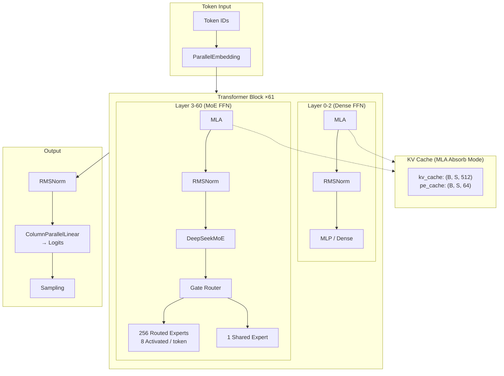

# DeepSeek-V3 · 架構

## 系統高層圖



### 圖意說明

上圖展示 DeepSeek-V3 的完整推論流程。跟標準 Transformer decoder 不同，這裡有兩個關鍵特殊設計：

1. **前 3 層用 Dense MLP，後 58 層用 MoE** — 這是 DeepSeek-V3 跟 V2 不同的設計：最早的幾層用全連接而非專家路由，推測是因為低層的語義較淺、不需要分散到多個專家。
2. **MLA Absorb Mode** — KV cache 不存傳統的 (n_heads, head_dim) 張量，而是存壓縮後的 latent (512) + RoPE embedding (64)，總計僅 576 維/token。這比標準 GQA (8 KV heads × 192 head dim = 1,536) 還省了 62%。

## 資料管線

此 repo 不包含訓練資料管線（論文未開源訓練程式碼），僅有推論流程。推論的資料流程如下：

- **輸入**: Token IDs（torch.long），來自 HuggingFace tokenizer（`AutoTokenizer.from_pretrained`）
- **來源**: 使用者輸入（interactive mode）或檔案（batch mode）[`generate.py:121-153`]
- **預處理**: tokenizer.apply_chat_template() 加入對話格式 [`generate.py:140`]
- **無特殊 augmentation / DataLoader** — 推論場景，直接操作 tensor

## 模型架構

### 整體結構

```
Transformer.forward(tokens, start_pos):
    1. embed(tokens) → h: (B, S, dim)
    2. for each layer: h = layer(h, start_pos, freqs_cis, mask)
    3. norm(h)[:, -1] → last token only
    4. head → logits: (B, vocab_size)
```

關鍵觀察：第 4 步只取 `[:, -1]`（最後一個位置），因為自迴歸推論每次只生成一個 token。[`model.py:772-798`]

### 關鍵元件

| 元件 | 位置 | 備註 |
|------|------|------|
| MLA Attention | `model.py:396-497` | 低秩 KV 壓縮 + absorb mode cache |
| RMSNorm | `model.py:270-294` | 標準 F.rms_norm |
| RoPE (YaRN) | `model.py:297-375` | 支援 128K 的 extended rope scaling |
| Gate Router | `model.py:535-598` | sigmoid scoring + group-limited routing |
| MoE | `model.py:636-693` | 256 routed + 1 shared expert |
| MLP | `model.py:500-532` | SwiGLU: silu(w1(x)) * w3(x) |
| FP8 kernel | `kernel.py:1-196` | act_quant + weight_dequant + fp8_gemm |

### 關鍵超參數（671B config）

```python
# configs/config_671B.json
vocab_size      = 129280
dim             = 7168
inter_dim       = 18432       # FFN hidden dim (dense layers)
moe_inter_dim   = 2048        # Per-expert hidden dim
n_layers        = 61
n_dense_layers  = 3           # 前 3 層用 dense FFN
n_heads         = 128
n_routed_experts = 256
n_shared_experts = 1
n_activated_experts = 8       # top-8 experts per token
n_expert_groups = 8
n_limited_groups = 4           # top-4 groups → each group top-2
route_scale     = 2.5         # routing weight scaling
score_func      = "sigmoid"   # 關鍵：不用 softmax
q_lora_rank     = 1536        # Q low-rank projection
kv_lora_rank    = 512          # KV low-rank projection (cache key)
qk_nope_head_dim = 128
qk_rope_head_dim = 64
v_head_dim      = 128
dtype           = "fp8"
```

### MLA 深度解讀

MLA 是 DeepSeek-V3 最關鍵的架構創新。核心想法是用低秩投影壓縮 KV 的維度：

```
標準 MHA: K = x @ W_k  →  shape (B, S, n_heads * head_dim)
                            KV cache 大小: n_heads * head_dim = 128 * 192 = 24,576/token

MLA:      kv = x @ W_kv_a →  shape (B, S, kv_lora_rank + rope_dim)
                               = (B, S, 512 + 64)
          KV cache 大小: kv_lora_rank + rope_dim = 512 + 64 = 576/token
```

**design decision**: 為什麼 MLA 不用傳統的 QKV 線性投影？

傳統 MHA 的 K/V 權重矩陣是 `(dim, n_heads * head_dim)`，這在推論時 KV cache 會隨著 context 線性增長。DeepSeek-V3 把 K 拆成兩段：一段做低秩壓縮（nope part），一段保留 RoPE（rope part）。`wkv_a` 先投射到低維空間，再透過 `wkv_b` 還原成多頭維度。

**absorb mode**（`attn_impl == "absorb"`）是更激進的優化：把 `wkv_b` 的權重合併進 attention score 計算，直接在低維空間做注意力，輸出時再用 `wkv_b` 的 value 部分還原。[`model.py:481-495`]

這意味著 KV cache 只需存 512 維的 latent（`kv_cache`）+ 64 維的 RoPE（`pe_cache`），而不是傳統的 128 heads × (128+64+128) = 40,960 維的 K/V。壓縮了 **71 倍**。

### 跟論文的差異

- 此 repo 不含訓練程式碼，所有訓練相關（FP8 training framework、DualPipe 通訊排程）**無法驗證**
- MTP 模組的 weights 有提供（`README_WEIGHTS.md` 說明），但推論 demo 未實作 speculative decoding
- `net_scale`（論文 3.3.1 節討論的上層 MLA 架構微調）在 code 中不存在
- 論文提到 TGS（Token Generation with Shared memory）優化，code 未實作

## 推論

### 推論入口

`generate.py:161-185` — argparse CLI，支援 interactive 與 batch mode。

### KV Cache 管理

```python
# MLA 初始化 cache buffer (model.py:439-444)
if attn_impl == "naive":
    k_cache: (B, max_seq_len, n_local_heads, qk_head_dim)
    v_cache: (B, max_seq_len, n_local_heads, v_head_dim)
else:
    kv_cache: (B, max_seq_len, kv_lora_rank)  # 只有 512 維！
    pe_cache:  (B, max_seq_len, qk_rope_head_dim)
```

Cache 是 pre-allocated 的固定 buffer，`start_pos` 控制當前寫入位置。
這意味著預先決定了 `max_batch_size` 和 `max_seq_len`，無法動態擴展。

### Sampling

`generate.py:14-27` — 使用 Gumbel-max trick（`probs.div_(exponential(1)).argmax()`）替代標準 multinomial sampling，這在 GPU 上比 `torch.multinomial` 快。

### Distributed 推論

- `torchrun` 跨節點啟動，使用 NCCL [`generate.py:100-104`]
- Tensor parallelism：ColumnParallelLinear 切 col，RowParallelLinear 切 row，再用 all_reduce 同步 [`model.py:208-267`]
- Expert parallelism：256 experts 平分到所有 rank，每個 rank 只載入 `n_local_experts` [`model.py:658-693`]

## 可重現性

- **Random seed**: 965（hardcoded）[`generate.py:111`]
- **輸入鎖定**: tokenizer 來自 HF hub（無版本鎖定）
- **環境鎖定**: `requirements.txt` 列出 exact versions（torch 2.4.1、triton 3.0.0、transformers 4.46.3）

## 測試

無單元測試：此 repo 為 reference implementation，不含測試檔案。
