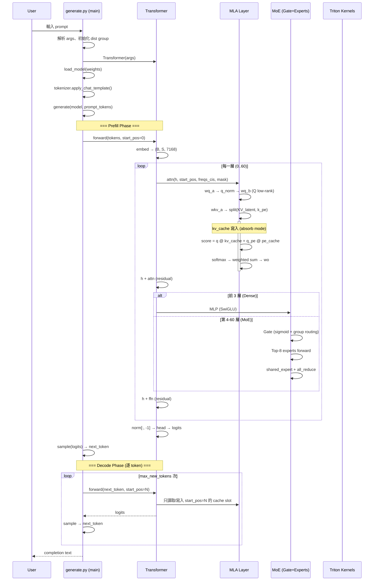

# DeepSeek-V3 · 程式碼追蹤

## 追蹤的場景

**場景**: 一次自迴歸推論 — 從使用者輸入 prompt 到模型產生新 token

**啟動命令**:
```bash
torchrun --nnodes 2 --nproc-per-node 8 generate.py \
  --ckpt-path /path/to/DeepSeek-V3 \
  --config configs/config_671B.json \
  --interactive --temperature 0.7 --max-new-tokens 200
```

## 流程圖



### 圖意說明

上圖追蹤一條完整的推論路徑。關鍵的分界點在 **Prefill** 與 **Decode** 之間。Prefill 階段一次處理整個 prompt（batch size 1 × sequence length = prompt 長度），建立完整的 KV cache；Decode 階段每次只生成 1 個 token，利用已建立的 cache 避免重算。

另一個分界點在層級：**前 3 層用 Dense MLP**，後 58 層用 **MoE**。這是在 MoE 與 Dense 之間做的一個 design decision——低層語義未足夠分化時，先用 dense FFN 處理。

## 逐步追蹤

### Step 1: 啟動與分散式初始化

```python
# generate.py:100-108
world_size = int(os.getenv("WORLD_SIZE", "1"))
if world_size > 1:
    dist.init_process_group("nccl")
torch.cuda.set_device(local_rank)
```

這裡純靠環境變數（`WORLD_SIZE`、`RANK`、`LOCAL_RANK`）初始化，典型 torchrun 模式。
rank 0 以外的 process 會 `print = lambda *_, **__: None`，避免多節點輸出混亂 [`generate.py:106-107`]。

**容易出問題**: 如果不設環境變數就執行，world_size=1，全部跑在單 GPU 上——但 671B 模型需要 16+ GPUs 才能載入。

### Step 2: 模型建構

```python
# generate.py:115-118
with torch.device("cuda"):
    model = Transformer(args)
```

在 `Transformer.__init__` 中 [`model.py:757-770`]：

1. 根據 `args.dtype` 決定全域 `Linear.dtype`（`torch.float8_e4m3fn` 或 `torch.bfloat16`）[`model.py:760`]
2. 建構 61 層 Block，每層包含 MLA + 前 3 層 MLP/後 58 層 MoE [`model.py:766-767`]
3. 預計算 RoPE frequency（支援到 `max_seq_len`）[`model.py:770`]
4. 建構 ParallelEmbedding（vocab 分片）和 lm_head（ColumnParallelLinear）

**設計決策**: 所有模型參數在 `torch.device("cuda")` context manager 下創建，直接分配到 GPU 記憶體——這在 H800 (80GB) 上合理，但在小 GPU 上會 OOM。

### Step 3: 權重載入

```python
# generate.py:119
load_model(model, os.path.join(ckpt_path, f"model{rank}-mp{world_size}.safetensors"))
```

使用 `safetensors.torch.load_model` 將預先轉換好的權重載入模型。
權重檔命名格式 `model{rank}-mp{world_size}.safetensors` 對應 `convert.py` 的輸出結構 [`convert.py:80-81`]——順序跟 TP degree 綁定。

### Step 4: 一個推論 step（Prefill 焦點）

以輸入 token sequence `[t0, t1, ..., tn]` 為例，追蹤 `model.forward(input_tokens, start_pos=0)` 內部：

#### 4.1 Embedding

```python
# model.py:785
h = self.embed(tokens)  # (1, S, 7168)
```

`ParallelEmbedding` 依 vocab 分片做部分查詢，再用 all_reduce 彙整 [`model.py:107-128`]——但單卡（world_size=1）時直接 `F.embedding`。

#### 4.2 RoPE 預計算

```python
# model.py:786
freqs_cis = self.freqs_cis[start_pos:start_pos+seqlen]  # view slice
```

`freqs_cis` 是 `Transformer.__init__` 時預先算好的 `(max_seq_len, rope_half_dim)` 複數表 [`model.py:770`]。

**YaRN 擴展邏輯** [`model.py:367-370`]：如果 `seqlen > original_seq_len`（4096），計算 correction range 後用 linear ramp 混合原本的跟縮放的頻率。這讓模型能外推到 128K context。

#### 4.3 MLA Forward（核心attention）

這是整條路徑最複雜的一步 [`model.py:446-497`]：

```python
# 4.3.1 Q 的低秩投影
q = self.wq_b(self.q_norm(self.wq_a(x)))  # (1, S, n_heads * qk_head_dim)
q = q.view(1, S, n_local_heads, qk_head_dim)  # (1, S, 128, 192)
q_nope, q_pe = torch.split(q, [128, 64], dim=-1)
q_pe = apply_rotary_emb(q_pe, freqs_cis)
```

Q 先降維到 `q_lora_rank=1536`（`wq_a`）、做 RMSNorm（`q_norm`），再升回多頭維度（`wq_b`）。這是低秩投影（LoRA-style）的應用——跟 LoRA 不同，這是在**訓練前就固定**的架構，不是 adaptor。

```python
# 4.3.2 KV 的低秩投影
kv = self.wkv_a(x)  # (1, S, 576)
kv, k_pe = torch.split(kv, [512, 64], dim=-1)
k_pe = apply_rotary_emb(k_pe.unsqueeze(2), freqs_cis)
```

`wkv_a` 把原本 `dim=7168` 壓到 `576`（512 KV latent + 64 RoPE）。這是關鍵的壓縮點。

```python
# 4.3.3 Absorb mode 的 attention 計算（核心優化）
wkv_b = weight_dequant(self.wkv_b.weight, ...)  # 若 FP8
wkv_b = wkv_b.view(n_local_heads, -1, kv_lora_rank)
# 把 wkv_b 的 QK 部分融合進 q_nope
q_nope = torch.einsum("bshd,hdc->bshc", q_nope, wkv_b[:, :qk_nope_head_dim])
# KV cache 寫入
self.kv_cache[:bsz, start_pos:end_pos] = self.kv_norm(kv)
self.pe_cache[:bsz, start_pos:end_pos] = k_pe.squeeze(2)
# 在低維空間做 score
scores = (torch.einsum("bshc,btc->bsht", q_nope, kv_cache) +
          torch.einsum("bshr,btr->bsht", q_pe, pe_cache)) * softmax_scale
```

這裡的設計精華：**不需要先把 KV 還原成多頭格式**。`wkv_b` 的 QK 部分已經融入 `q_nope`，value 部分在 weighted sum 後才作用 [`model.py:495`]：

```python
x = torch.einsum("bsht,btc->bshc", scores, kv_cache)         # 在 latent 空間做 attention
x = torch.einsum("bshc,hdc->bshd", x, wkv_b[:, -v_head_dim:])  # 最後才還原成 V
```

這避免了在 attention score 計算時 O(n_heads × head_dim) 的維度擴張。

#### 4.4 MoE Forward

```python
# model.py:669-693
weights, indices = self.gate(x)          # sigmoid + group routing
for each expert:
    idx, top = torch.where(indices == i)
    y[idx] += expert(x[idx]) * weights[idx, top, None]
z = self.shared_experts(x)               # 每個 token 都經過 shared expert
return (y + z).view(shape)               # y: all_reduce, z: shared
```

**Auxiliary-loss-free 的關鍵**：[`model.py:576-598`]

```python
scores = linear(x, self.weight)   # (dim, n_routed_experts)
scores = scores.sigmoid()         # 用 sigmoid 取代 softmax！
if self.bias is not None:         # bias 是 learnable 的校正項
    scores = scores + self.bias
```

傳統 MoE 用 softmax routing + auxiliary load balancing loss（如 switch transformer 的 z-loss 或 load balancing loss）。DeepSeek-V3 用 sigmoid routing + learnable bias，透過 bias 來平衡專家負載——訓練時把 bias 的梯度保留，載入傾斜的 expert 會增大 bias，後續該 expert 的 scores 降低。[UNVERIFIED: 這是論文宣稱的做法，但 repo 不含訓練程式碼，無法驗證 bias 更新機制]

**Group-limited routing** [`model.py:584-592`]：

先把 256 experts 分成 8 組（每組 32 個），取 top-4 組；在選中的組內取 top-2。最終 8 個 activated experts 均勻分布在 top-4 組內，確保 experts 的地理多樣性。

#### 4.5 Output Projection

```python
# model.py:792-798
h = self.norm(h)[:, -1]         # 只取最後一個 token
logits = self.head(h)           # (1, vocab_size)
if world_size > 1:
    all_gather + cat             # 合併各 rank 的 vocab 分片
```

注意 `[:, -1]`：在自迴歸模式中，只有最後一個 token 的 logits 被保留。Prefill 時雖然一次處理整個序列，但只取最後位置的輸出。

#### 4.6 Sampling

```python
# generate.py:14-27
logits = logits / temperature
probs = torch.softmax(logits, dim=-1)
return probs.div_(torch.empty_like(probs).exponential_(1)).argmax(dim=-1)
```

Gumbel-max trick：用指數分佈的除法定價取代 `torch.multinomial`。兩者在數學上等價（Gumbel-max theorem），但這個實作避免了 multinomial 的內部排序開銷，在 GPU 上更快。

### Step 5: Decode 階段循環

```python
# generate.py:60-71
for cur_pos in range(min(prompt_lens), total_len):
    logits = model.forward(tokens[:, prev_pos:cur_pos], prev_pos)
    next_token = sample(logits, temperature)
    tokens[:, cur_pos] = next_token
    prev_pos = cur_pos
```

**值得注意的設計**：`tokens` 是 `(batch, total_len)` 的 full tensor，用 `-1` 初始化佔位。Prefill 階段把 prompt tokens 填入，decode 階段逐步填入新 token。`prompt_mask` 區分 prompt tokens 和 generated tokens，確保不覆蓋 prompt [`generate.py:59`]。

## 沒追蹤到但值得留意

- **MTP speculative decoding** — 論文宣稱 MTP 模組可用於推論加速，但此 repo 的 `generate.py` 完全是標準自迴歸
- **FP8 training** — 所有 FP8 訓練相關（DualPipe、FP8 communication）不在 repo 內
- **Failure recovery** — 沒有 checkpoint resume 或錯誤恢復邏輯
- **Weight conversion pipeline** — `convert.py` 的 HuggingFace → 推論格式轉換是另一條關鍵路徑

## 想學更多時，在哪裡下中斷點

- 想看 MLA absorb mode 的實際 KV cache 內容: `model.py:484-485`（寫入點後）
- 想看 MoE routing 分佈: `model.py:581`（scores 計算後）
- 想看 FP8 dequantization 效果: `kernel.py:108-110`（weight_dequant 輸出）
- 想看各層的 activated experts: `model.py:683-689`（expert 選擇循環中）
