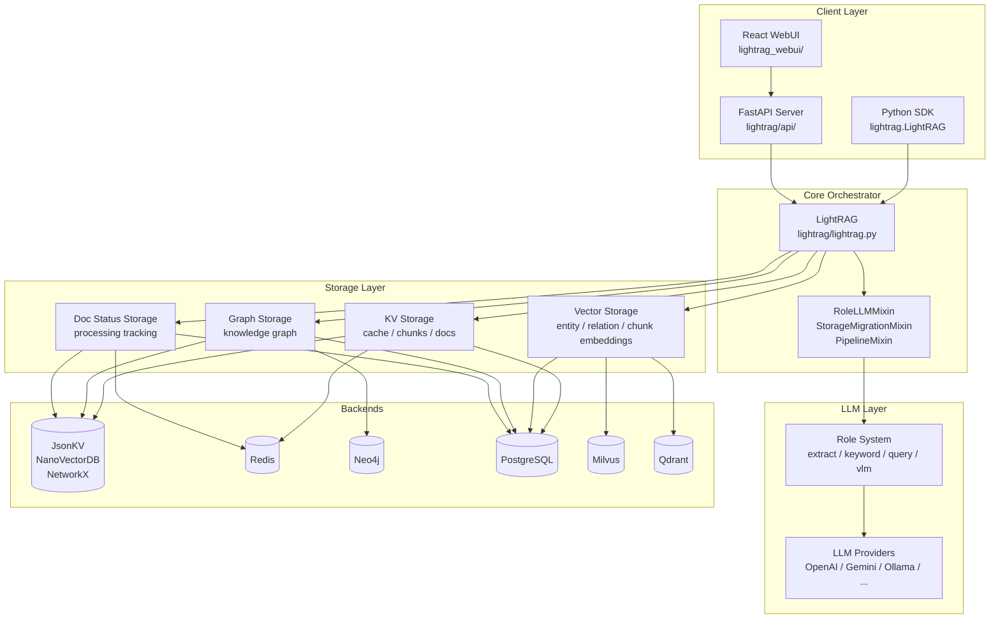
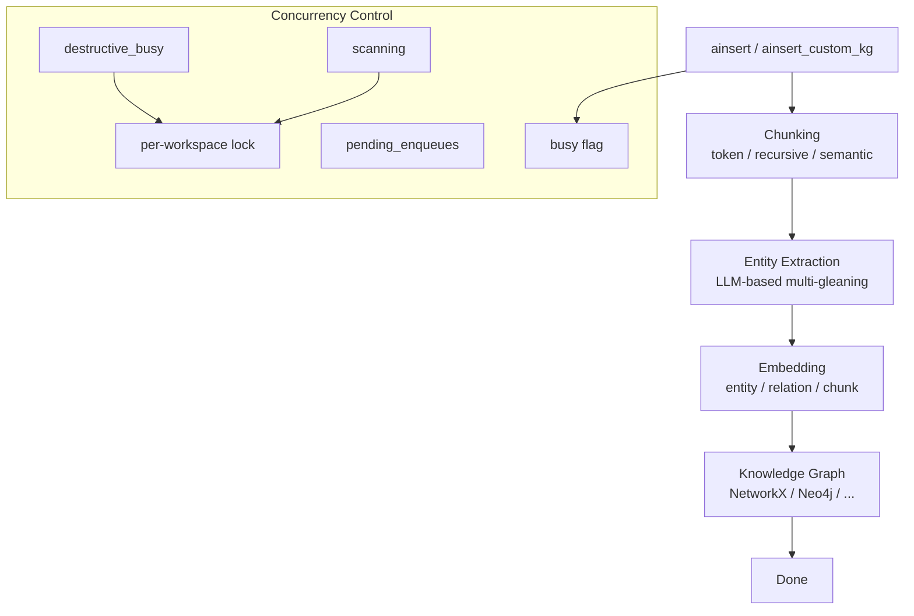
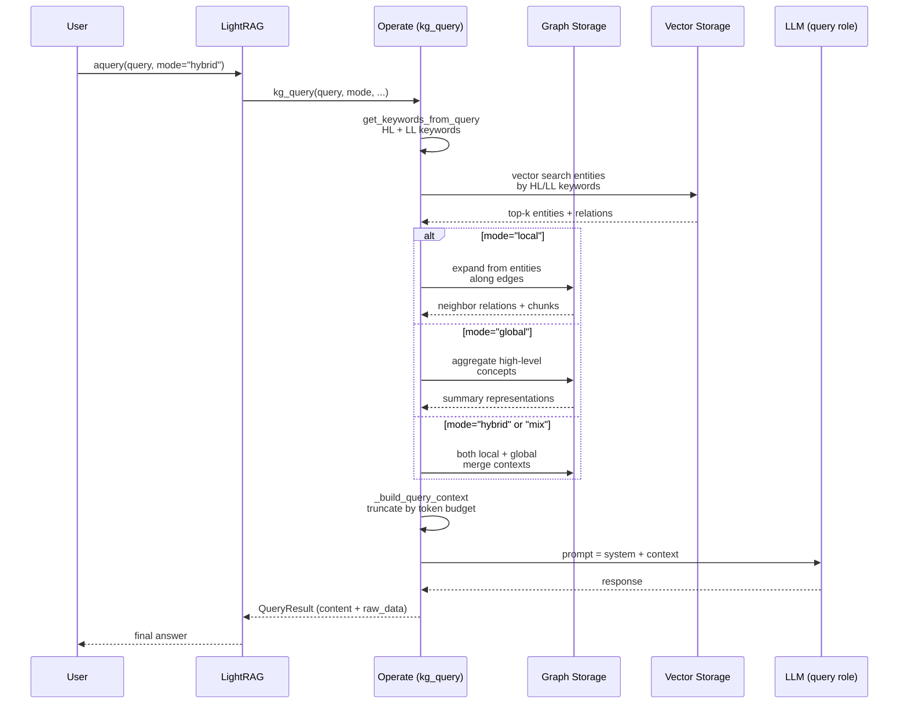
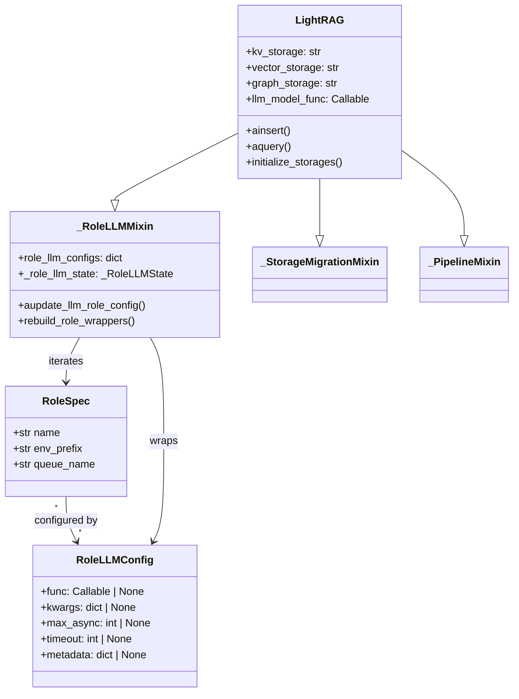

# LightRAG · 架構

## 系統高層圖



### 圖意說明

LightRAG 的架構可分為四層：Client、Core Orchestrator、LLM 與 Storage。核心的 `LightRAG` class 透過 mixin 組合 `_RoleLLMMixin`、`_StorageMigrationMixin`、`_PipelineMixin` 三個職責，避免單一 monolithic class 過於龐大（`lightrag/lightrag.py` 從原始 6000+ 行逐步拆出，目前約 4000 行）。

Storage 層是最大的設計亮點：四種抽象的 storage type 各自定義介面，透過 `lightrag/kg/factory.py::get_storage_class()` 在 runtime 解析使用者設定的 backend class 名稱來決定實作。這讓 LightRAG 可以在沒有外部依賴時用 JSON/NetworkX/NanoVectorDB 跑起來（冷啟動），也可搭配 Neo4j + Milvus + Redis 做生產部署。使用者只需在初始化時指定 `kv_storage="RedisKVStorage"` 等參數即可切換。

## 文件導入管線



### 管線流程說明

1. 使用者呼叫 `ainsert(text)` 或 `ainsert_custom_kg(doc_id, chunks, entities, relations)`（後者跳過 chunking）
2. 文件被 `chunking_by_token_size` 或選定的 chunker 策略（F/R/V/P）切碎
3. 每個 chunk 送 LLM（extract role）做多輪實體萃取（max_gleaning 控制重試次數）
4. 萃取的 entities 與 relations 被存入 graph storage
5. Entities、relations、chunks 各自被 embedding 後存入 vector storage
6. 所有資料透過 `chunk_id → entity → relation` 的雙向連結保持可追溯性

**關鍵設計決策**：實體萃取採用 multi-gleaning 策略——不只做一次 LLM 呼叫，而是反覆要求 LLM 檢查是否遺漏實體。這增加了 LLM 成本（2-3×），但顯著提升召回率，對後續圖檢索的品質至關重要。[`lightrag/operate.py:3232-3312`]

## 查詢引擎流程



### 查詢引擎的關鍵設計

#### 1. 多模式查詢策略

| 模式 | 檢索策略 | 適用場景 | 程式碼位置 |
|---|---|---|---|
| `local` | 從低階關鍵詞擴散實體 → 沿邊取關聯關係與 chunks | 事實性問題（「X 的參數是什麼？」） | `operate.py:3659` |
| `global` | 高階關鍵詞 → 取高層節點 → 彙總 | 抽象總結問題（「文件的主要論點？」） | `operate.py:3659` |
| `hybrid` | local + global 檢索結果並聯 | 需要全面資訊時 | `operate.py:3659` |
| `mix` | KG 檢索 + 向量檢索，用 weighted polling 或 vector similarity 決定取哪些 chunks | 預設模式，多數情況最佳 | `operate.py:3659` |
| `naive` | 純向量檢索，不走圖 | 快速簡單查詢 | `operate.py:5552` |
| `bypass` | 不檢索直接送 LLM | 已包含上下文的情境 | `lightrag.py` 路由 |

**設計決策 trade-off**：`mode="mix"` 是預設值而不是 `hybrid`，這不是技術失誤。`mix` 不僅做圖檢索 + 向量檢索的並聯，還用 `kg_chunk_pick_method`（`WEIGHT` 或 `VECTOR`）決定如何挑選 chunks。`hybrid` 只在圖檢索層做 local+global 合併，不另外跑向量檢索。選擇 `mix` 作為預設是因為它在多數場景下 `hybrid` 的全面性更好。[`lightrag/base.py:88-96`]

#### 2. 關鍵詞萃取

查詢的第一步是從 query 字串中萃取高階（HL）與低階（LL）關鍵詞。HL 關鍵詞傾向於抽象概念（用於 global 檢索），LL 關鍵詞傾向於具體名詞（用於 local 檢索）。兩者皆空時觸發 fallback。

```python
hl_keywords, ll_keywords = await get_keywords_from_query(
    query, query_param, global_config, hashing_kv
)
# oper ate.py:3714-3716
```

#### 3. Context 建構

`_build_query_context()` 是統一的 context 建構器，負責：

1. 根據 mode 決定哪些儲存層需要查詢
2. 對每個儲存層執行向量搜尋（entities / relations / chunks）
3. 對圖儲存層做實體擴散（沿邊抓關聯資料）
4. 用 token budget（`max_entity_tokens` + `max_relation_tokens` + `max_total_tokens`）做 truncation
5. 組裝最終 context 字串

**一個重要細節**：truncation 策略是用 `truncate_list_by_token_size` 依權重取捨，不是簡單的 FIFO。[`lightrag/utils.py`]

## LLM Role 系統



### 為什麼需要 Role 系統

LightRAG 的不同階段（實體萃取、關鍵詞萃取、查詢回應、視覺分析）可能需要不同的 LLM 配置。例如：

- 實體萃取需要高品質、高成本的 LLM（GPT-4 / Claude）
- 關鍵詞萃取可以用輕量 LLM（GPT-4o-mini / Gemini Flash）
- 查詢回應可能需要 streaming
- VLM 任務需要支援 vision 的模型

Role 系統讓每個階段可以獨立設定 `model_func`、`kwargs`、`max_async`、`timeout`，透過 `role_llm_configs` dict 注入。[`lightrag/llm_roles.py:52-57`]

### 四個內建 Role

| Role | env_prefix | 用途 | queue_name |
|---|---|---|---|
| `extract` | `EXTRACT` | 實體與關係萃取 | extract LLM func |
| `keyword` | `KEYWORD` | 查詢關鍵詞萃取 | keyword LLM func |
| `query` | `QUERY` | 查詢回應生成 | query LLM func |
| `vlm` | `VLM` | 視覺語言模型任務 | vlm LLM func |

**設計決策**：Role 系統採用的是 `partial()` wrapper 而非 adapter pattern。`_RoleLLMMixin` 對每個 role 的 config 使用 `functools.partial` 包裝基底 LLM function，傳入該 role 的 kwargs。[`lightrag/llm_roles.py`] 這比傳統的 adapter 介面更輕量，但意味著所有 role 必須共用同一個基底 function 簽名——無法對不同 role 使用完全不同的 LLM library。

## Storage 抽象層

### 四種 Storage Type

| Type | 介面檔案 | 儲存內容 | 預設實作 |
|---|---|---|---|
| `KV_STORAGE` | `base.py:BaseKVStorage` | LLM cache、text chunks、document info | `JsonKVStorage` |
| `VECTOR_STORAGE` | `base.py:BaseVectorStorage` | entity/relation/chunk embeddings | `NanoVectorDBStorage` |
| `GRAPH_STORAGE` | `base.py:BaseGraphStorage` | 實體-關係圖結構 | `NetworkXStorage` |
| `DOC_STATUS_STORAGE` | `base.py:DocStatusStorage` | 文件處理狀態 | `JsonDocStatusStorage` |

### Factory 解析機制

```python
# lightrag/kg/__init__.py
STORAGE_IMPLEMENTATIONS = {
    "KV_STORAGE": {
        "implementations": ["JsonKVStorage", "RedisKVStorage", "PGKVStorage", ...],
        "required_methods": ["get_by_id", "upsert"],
    },
    ...
}
```

`get_storage_class()`（`lightrag/kg/factory.py`）在 runtime 根據 `LightRAG` 初始化時指定的字串名稱（如 `"Neo4JStorage"`），動態 import 對應 module 並回傳 class。這讓使用者不需要在 import 時就決定 backend。

**與傳統 factory 的差異**：不只有 class 名稱 → class 的 mapping，還包含了 `STORAGE_ENV_REQUIREMENTS`（每個實作需要的環境變數），可在初始化時提前驗證環境是否滿足。例如 `Neo4JStorage` 需要 `NEO4J_URI`、`NEO4J_USERNAME`、`NEO4J_PASSWORD`。[`lightrag/kg/__init__.py:48-100`]

## Pipeline 並行控制

文件導入管線的並行控制是 LightRAG 最容易被忽略、但設計最精巧的部分。

### pipeline_status dict

所有狀態存放在 `lightrag/kg/shared_storage` 中，透過 `get_namespace_lock("pipeline_status", workspace=...)` 保護：

| 欄位 | 含義 | 被哪些操作修改 |
|---|---|---|
| `busy` | 任何管線忙碌狀態 | 處理迴圈、清除/刪除 |
| `destructive_busy` | 清除或刪除操作進行中 | `/documents/clear`、`/documents/{doc_id}` |
| `scanning` | 掃描操作進行中 | `/documents/scan` |
| `scanning_exclusive` | 掃描的分類階段 | `run_scanning_process` |
| `pending_enqueues` | 等待處理的上傳計數 | `/upload`、`/text`、`/texts` |
| `request_pending` | 提示處理迴圈重新查詢 | `apipeline_process_enqueue_documents` |

### 互斥規則

- **Enqueue 拒絕條件**：`scanning_exclusive` 或 `destructive_busy`（避免上傳到正在被清除的 storage）
- **Scan 拒絕條件**：`busy` 或 `scanning` 或 `pending_enqueues > 0`（避免 scan 與上傳同時進行）
- **Process 迴圈**：若已 busy 則設 `request_pending=true` 後返回（非阻塞式通知）

**設計決策 trade-off**：使用 `pending_enqueues` 計數器而非二元鎖的原因是支援並發上傳——API server 可能同時收到多個文件上傳，計數器可以準確追蹤「還有多少個上傳任務在進行中」。[`lightrag/pipeline.py`]

## 跨模組通訊與事件流

LightRAG 內部不使用 event bus 或 message queue，而是**直接 async function call + shared state**：

- `LightRAG` → `operate.py` function: 直接 await
- `LightRAG` → `kg/` storage: 透過 abstract interface method call
- `LightRAG` → LLM: 透過 `partial()` wrapper 的 callable
- Pipeline 狀態：透過 `shared_storage` 的 per-workspace dict + lock

**這是一個「不顯然」的決定**：考慮到 LightRAG 支援分散式 storage（Redis、Neo4j、Milvus），卻用 in-process 的 dict + lock 做 pipeline 協調。這意味著多個 LightRAG 實例（多個 process）操作同一個 workspace 時，pipeline 並行控制會失效——每個 process 有自己的 `pipeline_status` dict。這是 LightRAG 從單一 process 場景出發的設計取捨，分散式部署時需自行處理這個問題。[UNVERIFIED]

## 失敗模式與降級策略

| 失敗模式 | 行為 | 程式碼 |
|---|---|---|
| LLM 呼叫失敗 | retry（tenacity），預設 timeout 可設 | `lightrag/llm/` |
| 向量搜尋回傳空 | 回退到原本 query 字串作為關鍵詞 | `operate.py:3726-3731` |
| Storage backend 連線失敗 | 初始化階段拋出異常，不自動降級 | `kg/factory.py` |
| Pipeline cancellation | 透過 `cancellation_requested` 旗標中斷 | `operate.py:3242-3246` |
| Cache missing | 正常重新計算，不阻斷 | `lightrag/utils.py` |
