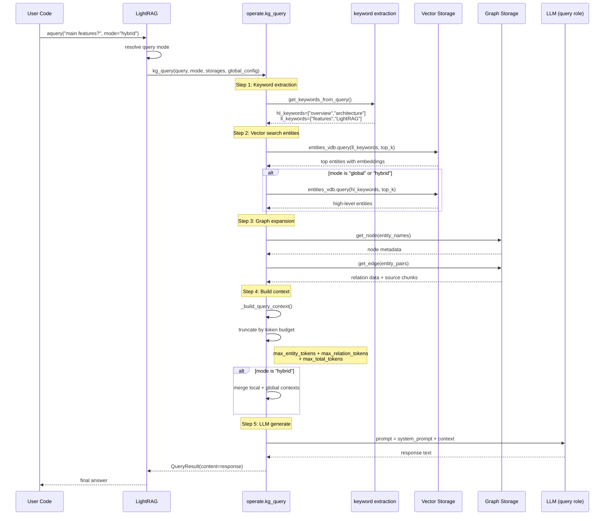

# LightRAG · 程式碼追蹤

## 追蹤的場景

**任務**: 使用者已插入一批文件（建立了 knowledge graph），現在查詢：「What are the main features of LightRAG?」

**查詢模式**: `hybrid`（預設 `mix` 的變體，同時使用 local + global 圖檢索）

**預期的系統行為**:
1. 關鍵詞萃取 → 產生 HL（高階）與 LL（低階）關鍵詞
2. 向量搜尋 → 根據關鍵詞找到相關 entities
3. 圖搜尋 → 從 entities 沿邊擴散取得關聯關係與 chunks
4. Context 建構 → 用 token budget 裁切
5. LLM 回應生成 → query role 處理

## 流程圖



## 逐步追蹤

### Step 0: 查詢入口

**檔案**: [`lightrag/lightrag.py`]

使用者呼叫 `LightRAG.aquery()`。LightRAG 會在 `aquery` 中根據 `QueryParam.mode` 決定走哪條路徑：

```python
# lightrag/lightrag.py (approximate routing)
async def aquery(self, query: str, param: QueryParam | None = None):
    param = param or QueryParam()
    if param.mode == "naive":
        return await naive_query(...)
    else:
        return await kg_query(...)
```

對於 `hybrid` mode，只走 `kg_query()` 路徑。`naive` mode 才會走純向量搜尋。

### Step 1: 關鍵詞萃取

**檔案**: [`lightrag/operate.py:3714-3716`]

```python
hl_keywords, ll_keywords = await get_keywords_from_query(
    query, query_param, global_config, hashing_kv
)
```

`get_keywords_from_query` 對 query 送 LLM（keyword role），要求萃取兩組關鍵詞：

- **HL (High-Level)**：抽象層級，用於 global 檢索。例如 "overview", "architecture", "purpose"
- **LL (Low-Level)**：具體層級，用於 local 檢索。例如 "features", "LightRAG"

**這一步是關鍵瓶頸**：關鍵詞的品質直接決定後續檢索的效果。若 LL 關鍵詞為空且 query 長度 < 50 字元，系統會 fallback 到 `ll_keywords = [query]`（直接用原始 query 當關鍵詞）。若兩者皆空且 query > 50，則回傳 `PROMPTS["fail_response"]`。[`lightrag/operate.py:3722-3731`]

**序列化/反序列化點**：`get_keywords_from_query` 會檢查 LLM cache（`hashing_kv`），若相同的 prompt 已被 cached 則跳過 LLM 呼叫。這是 LightRAG 減少 LLM 成本的關鍵機制。[`lightrag/utils.py:compute_args_hash`]

### Step 2: 向量搜尋 entities

**檔案**: [`lightrag/operate.py` `_build_query_context` 內部]

根據 mode 決定如何查向量 DB：

```python
# _build_query_context 內部邏輯
if query_param.mode in ["local", "hybrid", "mix"]:
    # 用 LL 關鍵詞查 entities VDB
    ll_entities_result = await entities_vdb.query(ll_keywords_str, top_k)
if query_param.mode in ["global", "hybrid", "mix"]:
    # 用 HL 關鍵詞查 entities VDB
    hl_entities_result = await entities_vdb.query(hl_keywords_str, top_k)
```

每個 `entities_vdb.query()` 會對應到 vector storage 的 `query()` 方法，根據 backend 不同實作（NanoVectorDB 是 cosine similarity，Milvus 是 Milvus query，PGVector 是 pgvector）。

### Step 3: 圖擴散

這一步是 LightRAG 與傳統 RAG 最大的差異。

對每個找到的 entity，系統會：

1. 從 graph storage 取出 entity metadata（name, description, source chunk IDs）
2. 從 graph storage 取出連接該 entity 的 edges（relations），包含 relation description 與 source chunk IDs
3. 從 relations 的 source chunk IDs 取得對應的 text chunks

```python
# 簡化邏輯 (operate.py)
for entity_name in entity_names:
    node_data = await knowledge_graph_inst.get_node(entity_name)
    # 沿邊擴散
    relations = await knowledge_graph_inst.get_edge(entity_name, ...)
    for rel in relations:
        chunk_ids.add(rel.source_id)
        chunk_texts = await text_chunks_db.get_by_id(chunk_ids)
```

**設計決策**：擴散深度取決於 `related_chunk_number` 參數（預設值由 `DEFAULT_RELATED_CHUNK_NUMBER` 控制）。這是單層擴散而非 BFS/DFS，因為超過一層的圖擴散會導致 context window 爆炸。[`lightrag/constants.py`]

### Step 4: Context 建構與裁切

**檔案**: [`lightrag/operate.py` `_build_query_context`]

這是查詢引擎中最複雜的環節。`_build_query_context` 需要：

1. 合併所有來源的資料（entities + relations + chunks）
2. 用 `kg_chunk_pick_method` 決定 chunks 選取策略：
   - `WEIGHT`: 根據 entity 關聯權重加權抽樣
   - `VECTOR`: 根據 chunk embedding 與 query 的相似度選擇
3. 用 token budget 裁切：
   - `max_entity_tokens`: entities 用的 token 上限
   - `max_relation_tokens`: relations 用的 token 上限
   - `max_total_tokens`: 整體 context 的 token 上限
4. 對 `hybrid` mode，還要合併 local + global 的 context

**最容易出錯的地方**：多個 token budget 的交互作用。使用者可能設定 `max_entity_tokens=2000`、`max_relation_tokens=2000`、`max_total_tokens=4000`，理論上可容納 4000 tokens。但如果 LLM system prompt 已佔 500 tokens，entity 佔滿 2000，relation 只能再放 1500 tokens 而非 2000。`truncate_list_by_token_size` 的裁切邏輯必須在每個階段感知已使用的 token 量。

**I/O 次數**：一次 `hybrid` query 至少需要：
1. 1× 關鍵詞萃取 LLM call（或 cache hit）
2. 2× 向量搜尋（HL + LL entities）
3. N× graph get_node（每 entity 一次）
4. M× graph get_edge（每 entity 沿邊）
5. K× KV get_by_id（每 chunk）
6. 1× 查詢回應 LLM call

總計約 5-15 次 I/O，其中 2 次是 LLM call（關鍵詞 + 回應）。

### Step 5: LLM 回應生成

**檔案**: [`lightrag/operate.py`]

組裝好的 context 被放入 system prompt：

```python
# 簡化
messages = [
    {"role": "system", "content": system_prompt},
    {"role": "user", "content": context + "\n\nQuery: " + query}
]
response = await use_model_func(messages)
```

`use_model_func` 是透過 `_RoleLLMMixin` 解析的 query role function，支援 streaming（`query_param.stream=True`）與 non-streaming。

最終結果包裝為 `QueryResult`：

```python
return QueryResult(
    content=response_text,
    raw_data={
        "entities": entities_found,
        "relations": relations_found,
        "chunks": chunks_found,
    }
)
```

### 想學更多時，在哪裡下中斷點

- 查詢入口: [`lightrag/lightrag.py` `aquery`]
- 關鍵詞萃取前一刻: [`lightrag/operate.py:3714`]
- Context 建構（看 LLM 實際收到什麼）: [`lightrag/operate.py` `_build_query_context`]
- LLM call 前一刻: [`lightrag/llm_roles.py` role wrapper]
- Cache hit/miss 判斷: [`lightrag/utils.py` `compute_args_hash`]

### 沒追蹤到但值得留意的分支

- **`bypass` mode**: 完全不檢索，直接送 LLM。用於 caller 已提供 context 的場景
- **`only_need_context` / `only_need_prompt`**: debug mode，只看 LLM 收到的內容而不真正呼叫
- **`ainsert_custom_kg`**: 跳過 chunking 與萃取，直接匯入外部 knowledge graph。對接外部 ETL pipeline 的關鍵切入點
