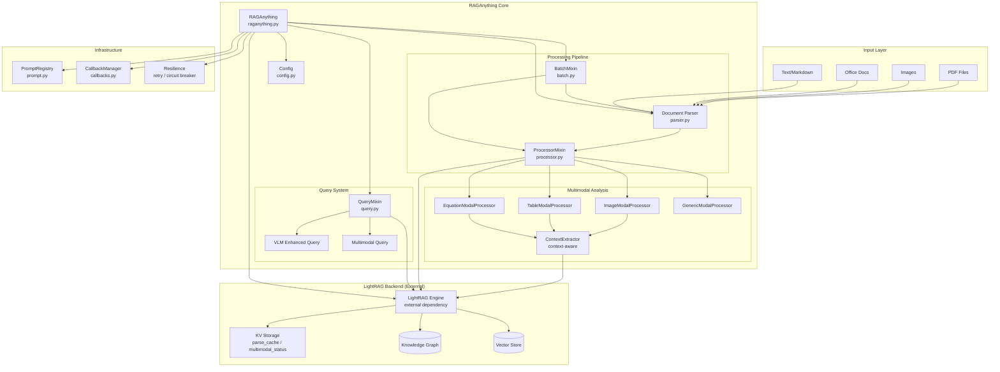
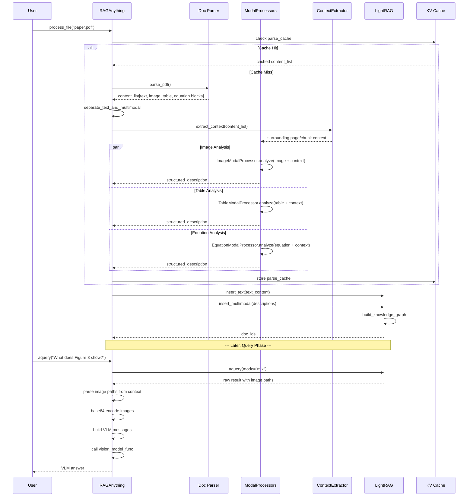

# RAG-Anything · 架構

## 高層架構圖



**圖意說明**: RAG-Anything 的架構可視為三層。最上層是輸入層，支援各種文件格式。中間層是核心——`RAGAnything` 本體透過 mixin 組合了文件處理（ProcessorMixin）、查詢（QueryMixin）、批次處理（BatchMixin）三個職責。文件經由 MinerU/Docling 解析後，會由跨模態處理器（Image/Table/Equation/Generic）分別分析，每個處理器會從 `ContextExtractor` 取得前後文資訊。結果寫入 LightRAG 的 Graph RAG + 向量儲存。查詢時可選擇純文字模式、VLM 增強模式（將檢索結果中的圖片路徑替換為 base64 編碼圖片後餵給 VLM），或直接傳入跨模態內容。

## 模組架構

### RAGAnything 主類別

RAG-Anything 的主類別是一個 **Mixin-based dataclass**（使用 `@dataclass` 裝飾器搭配多個 mixin），而非傳統的類別繼承：

```
@dataclass
class RAGAnything(QueryMixin, ProcessorMixin, BatchMixin):
    lightrag: Optional[LightRAG]
    llm_model_func: Optional[Callable]
    vision_model_func: Optional[Callable]
    embedding_func: Optional[Callable]
    config: Optional[RAGAnythingConfig]
    lightrag_kwargs: Dict[str, Any]
```

關鍵的設計決定：**RAG-Anything 不實作自己的索引/檢索邏輯，而是完全依賴 LightRAG 作為後端**。它的增值在於文件解析與跨模態處理層。這意味著如果你的專案已經在用 LightRAG，可以直接傳入現有的 LightRAG 實例。

實現位置：[`raganything.py:50-643`](https://github.com/HKUDS/RAG-Anything/blob/e8c0081b7c2d3ff0a2e643fb10ea0f582b8f1dcf/raganything/raganything.py#L50-L643)

### Config 設計

`RAGAnythingConfig` 是一個純 dataclass，所有欄位透過 `get_env_value` 從環境變數取得預設值：

- **Parser**: `mineru`（預設），可選 `docling`、`paddleocr`
- **Parse method**: `auto`（預設），可選 `ocr`、`txt`
- **Multimodal processing**: 各 type 獨立開關（image、table、equation）
- **Context extraction**: window size、mode（page/chunk）、max tokens
- **Batch**: max concurrent files、recursive processing、file extensions
- Backward compatibility: 支援 `MINERU_PARSE_METHOD` 舊變數名

實現位置：[`config.py:12-158`](https://github.com/HKUDS/RAG-Anything/blob/e8c0081b7c2d3ff0a2e643fb10ea0f582b8f1dcf/raganything/config.py#L12-L158)

### Document Parser 層

`parser.py` 是最大的一個檔案（~2,660 行），實作了：

- **MineruParser**: 基於 MinerU 的命令列工具封裝，支援 PDF、圖片解析
- **DoclingParser**: 基於 Docling 的替代方案
- **PaddleOCRParser**: 基於 PaddleOCR 的光學辨識方案
- **Custom Parser Registry**: 支援動態註冊自訂 parser
- URL 下載、檔案類型判斷、Office 文件轉 PDF 等工具方法

Parser 選擇透過 `get_parser()` 工廠函式決定，預設為 MinerU：

```python
def get_parser(parser_name="mineru"):
    if parser_name == "mineru":
        return MineruParser()
    elif parser_name == "docling":
        return DoclingParser()
    elif parser_name == "paddleocr":
        return PaddleOCRParser()
```

實現位置：[`parser.py:1-2660`](https://github.com/HKUDS/RAG-Anything/blob/e8c0081b7c2d3ff0a2e643fb10ea0f582b8f1dcf/raganything/parser.py)

### Multimodal Processor 系統

Modal processors 是這份筆記最有價值的部分。每個 processor 負責一種內容類型，接受同一個介面：

- **ImageModalProcessor**: 用 `vision_model_func`（VLM）分析圖片，產生 `detailed_description` + `entity_info`
- **TableModalProcessor**: 用 `llm_model_func` 分析表格資料（包括 table_body、captions），產生結構化分析
- **EquationModalProcessor**: 用 `llm_model_func` 分析 LaTeX 方程式，保留數學語義
- **GenericModalProcessor**: 用於其他未分類內容，作為 fallback

每個 processor 在產生分析時會接收 `ContextExtractor` 提供的上下文（前後頁的文字內容），讓 VLM/LLM 的輸出更有文件脈絡。

實現位置：[`modalprocessors.py:1-1607`](https://github.com/HKUDS/RAG-Anything/blob/e8c0081b7c2d3ff0a2e643fb10ea0f582b8f1dcf/raganything/modalprocessors.py)

### Query 系統

`QueryMixin` 提供了三種查詢模式：

1. **Text query** (`aquery`): 直接呼叫 `LightRAG.aquery()`，標準 Graph RAG 檢索
2. **Multimodal query** (`aquery_with_multimodal`): 接受 text + multimodal_content list，用 processor 分析內容後產生 enhanced query 再檢索
3. **VLM enhanced query** (`aquery_vlm_enhanced`): 先執行 LightRAG 檢索取得 raw prompt，從中提取圖片路徑，base64 編碼後餵給 VLM 進行視覺問答

實現位置：[`query.py:23-868`](https://github.com/HKUDS/RAG-Anything/blob/e8c0081b7c2d3ff0a2e643fb10ea0f582b8f1dcf/raganything/query.py#L23-L868)

### Cache 系統（三層）

RAG-Anything 實作了三層獨立的 cache，全部基於 LightRAG 的 KV storage infrastructure：

| Cache | Namespace | 用途 | 失效策略 |
|---|---|---|---|
| Parse cache | `parse_cache` | 文件解析結果快取 | mtime + config 變更檢測 |
| Multimodal status | `multimodal_status` | 跨模態處理完成狀態 | 文件重新處理時 |
| LLM response cache | `llm_response_cache` | 查詢結果快取（由 LightRAG 管理） | enable_llm_cache config |

Parse cache 特別值得注意：它結合了 `mtime`（檔案修改時間）和 `parse_config`（解析設定）兩個維度來決定快取是否有效，避免重複解析同一份文件。

## 資料流架構



**圖意說明**: 完整的資料流分為 Insertion 和 Query 兩個階段。Insertion 時，文件經 Parser 解析成 content_list（內含 text、image、table、equation 等區塊），接著 `separate_content` 將純文字和跨模態內容分離，跨模態區塊由各自的 processor 搭配 ContextExtractor 產生的上下文進行分析，最後全部寫入 LightRAG。Query 時，使用者發問後系統先進行 LightRAG 檢索，若啟用 VLM 增強模式，會從檢索結果中提取圖片路徑並 base64 編碼後直接餵給 VLM。

## 跨模態通訊

RAG-Anything 的跨模態通訊採用 **function call + shared context** 模式，而非 event bus 或 message queue：

- **Function call**: `ProcessorMixin` 直接呼叫 `ModalProcessor` 的方法，同步等待結果
- **Shared context**: `ContextExtractor` 從解析結果的 content_list 中提取上下文，傳遞給 processor
- **Storage**: 所有結果（包括跨模態描述）最終寫入 LightRAG 的 graph storage，透過 Graph RAG 的 entity/relation 機制整合

**設計取捨**: 這種做法的好處是 pipeline 簡單、易於除錯；代價是各 processor 無法非同步執行（目前版本），大文件的所有跨模態分析是序列進行的。

## 失敗模式與降級

- **Parser 未安裝**: `_ensure_lightrag_initialized` 階段會檢查 parser 安裝狀態，未安裝則回傳 `{"success": false, "error": "..."}`
- **圖檔解析不支援**: 若目前 parser 不支援圖片解析（如 Docling），會 fallback 到 MinerU
- **VLM 不存在**: 若 query 時指定 `vlm_enhanced=True` 但 `vision_model_func` 未設定，自動降級為純文字查詢
- **無跨模態內容**: `aquery_with_multimodal` 收到空 `multimodal_content` 時降級為 `aquery`
- **Cache 讀取失敗**: parse cache / multimodal status cache 的錯誤只會 log warning，不會中斷流程

## 觀測性

- **Callbacks**: `CallbackManager` 支援事件 hook（`on_parse_start`、`on_parse_complete`、`on_query_start`、`on_query_complete`、`on_query_error`），適合整合到 Langfuse 或自製 dashboard
- **Logging**: 使用 LightRAG 的 `logger`（基於 Python logging），每個主要動作都有 info-level log
- **MetricsCallback**: 可選的 metrics tracking callback

## 測試策略

- 測試集中在 parser 和 core modules（`tests/test_core_modules.py`）
- 包含 parser URL 下載、圖片分析 pipeline、content_list 插入等整合測試
- 使用 pytest + pytest-asyncio
- **未見 mock LLM 的 deterministic test** — 跨模態分析的測試依賴實際 LLM呼叫或外部服務
