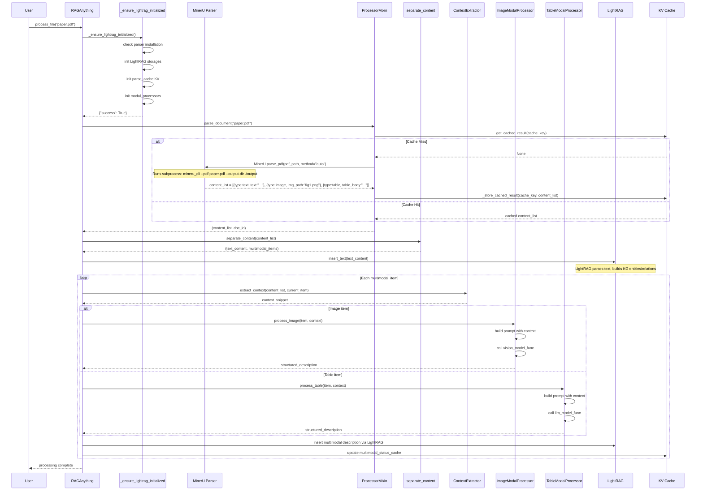

# RAG-Anything · 程式碼追蹤

## 追蹤的場景

**任務**: 使用者餵入一份包含文字、圖片、表格的 PDF 文件（例如一篇學術論文 PDF），系統需要完成：文件解析 → 跨模態分析 → LightRAG 索引。

**預期的流程**:
1. PDF 檔案經 MinerU 解析成 content_list（文字區塊 + 圖片區塊 + 表格區塊 + 公式區塊）
2. 純文字區塊直接插入 LightRAG
3. 圖片區塊由 ImageModalProcessor 經 VLM 分析產生結構化描述
4. 表格區塊由 TableModalProcessor 經 LLM 分析產生結構化描述
5. 所有描述連同原始文字寫入 LightRAG 的知識圖譜

## 流程圖



## 逐步追蹤

### Step 1: 任務進入 RAGAnything

入口點：[`raganything.py:619-643`](https://github.com/HKUDS/RAG-Anything/blob/e8c0081b7c2d3ff0a2e643fb10ea0f582b8f1dcf/raganything/raganything.py#L619-L643)

使用者呼叫 `process_file()` 或 `process_folder_complete()`。以 `process_file` 為例，它先呼叫 `_ensure_lightrag_initialized()` 確保後端就緒，然後呼叫 `parse_document()` 執行文件解析。

**控制流分支點**: `process_file` 內部會先檢查 `check_parser_installation()`。若 parser 未安裝，在 `_ensure_lightrag_initialized` 階段就會回傳錯誤，不會繼續執行。

### Step 2: LightRAG 初始化

位置：[`raganything.py:258-420`](https://github.com/HKUDS/RAG-Anything/blob/e8c0081b7c2d3ff0a2e643fb10ea0f582b8f1dcf/raganything/raganything.py#L258-L420)

`_ensure_lightrag_initialized` 負責：

1. **Parser 安裝檢查**（只做一次，`_parser_installation_checked` 旗號控制）
2. **兩種初始化路徑**：
   - 若使用者傳入了現成的 `lightrag` 實例 → 繼承其 `llm_model_func` / `embedding_func`，初始化 storages
   - 若沒有 → 用 `llm_model_func` + `embedding_func` + `lightrag_kwargs` 建立新的 `LightRAG` 實例
3. 初始化 `parse_cache` 和 `multimodal_status_cache` 兩個 KV storage
4. 初始化 `modal_processors`（透過 `_initialize_processors`）

**設計看點**: 支援「傳入已存在的 LightRAG」和「自動建立」兩種模式，適合既有 LightRAG 專案無痛升級。

### Step 3: 文件解析（含快取）

位置：[`processor.py:386-647`](https://github.com/HKUDS/RAG-Anything/blob/e8c0081b7c2d3ff0a2e643fb10ea0f582b8f1dcf/raganything/processor.py#L386-L647)

`parse_document` 是整條 pipeline 的資料進入點：

1. **Cache key 生成**: 根據 file_path + mtime + parser + parse_method + kwargs 計算 MD5 hash
2. **快取查詢**: 若有快取且 mtime/config 未變，直接回傳
3. **檔案類型判斷**: 根據副檔名決定呼叫 `parse_pdf`、`parse_image`、或 `parse_office`
4. **Parser 呼叫**: 透過 `asyncio.to_thread` 將同步的 MinerU 呼叫包裝為非同步（避免阻塞 event loop）
5. **結果快取**: 解析完成後寫入 KV cache

**值得注意的設計**: `_get_cached_result` 會同時檢查 mtime 和 parse_config 是否一致，確保 parser 參數改變時 cache 自動失效。這是實務上很常見但容易被忽略的細節。

### Step 4: 跨模態內容分離

位置：[`utils.py:89-180`](https://github.com/HKUDS/RAG-Anything/blob/e8c0081b7c2d3ff0a2e643fb10ea0f582b8f1dcf/raganything/utils.py#L89-L180)

`separate_content()` 將 MinerU 產生的 content_list 拆成純文字和跨模態兩部分：

- 若 `item["type"] == "text"` → 累加到 `text_content`
- 若 `item["type"]` 為 `image`/`table`/`equation` 等 → 放入 `multimodal_items`

**先後順序**: 回傳時 `multimodal_items` 保留在 content_list 中的原始順序索引，讓 `ContextExtractor` 可以正確定位前後 context。

### Step 5: 跨模態處理（最關鍵）

位置：[`processor.py:650-1100`](https://github.com/HKUDS/RAG-Anything/blob/e8c0081b7c2d3ff0a2e643fb10ea0f582b8f1dcf/raganything/processor.py#L650-L1100)（估計區段）

對每個 `multimodal_item`：

1. **Context 提取**: `ContextExtractor.extract_context(content_list, current_item_info)` 從 content_list 中找到目前區塊前後數頁/數 chunks 的純文字，作為「上下文」。
   - Mode 支援：`page`（頁級）、`chunk`（區塊級）
   - Window size 預設為 1（前後各 1 單位）

2. **Processor 分派**: `get_processor_for_type()` 根據 content type 選擇對應 processor：
   - `image` → `ImageModalProcessor`
   - `table` → `TableModalProcessor`
   - `equation` → `EquationModalProcessor`
   - 其他 → `GenericModalProcessor`

3. **LLM/VLM 呼叫**: 每個 processor 將 item 內容 + context 組裝成 prompt template，呼叫對應的 model function：
   - Image: `vision_model_func`（VLM，直接看圖片）
   - Table/Equation: `llm_model_func`（純文字 LLM，分析結構化資料）

4. **結構化輸出**: 每個 processor 產生的輸出格式統一為：
   ```json
   {
     "detailed_description": "...",
     "entity_info": {
       "entity_name": "...",
       "entity_type": "image|table|equation",
       "summary": "..."
     }
   }
   ```

### Step 6: 寫入 LightRAG

位置：[`processor.py:1100-end`](https://github.com/HKUDS/RAG-Anything/blob/e8c0081b7c2d3ff0a2e643fb10ea0f582b8f1dcf/raganything/processor.py#L1100)（估計）

跨模態分析完成後，結果透過 `insert_text_content_with_multimodal_content` 寫入 LightRAG：

- 純文字部分用 `LightRAG.insert()`
- 跨模態描述部分包裝成特殊的 text chunk，帶有 type annotation
- 每筆跨模態內容的處理狀態記錄到 `multimodal_status_cache`

### Step 7: 失敗路徑

**Parser 執行錯誤**: `MineruExecutionError` 包裝了 MinerU 命令列的回傳碼。若解析失敗，錯誤訊息會記錄到 `doc_status`。

**跨模態處理失誤**: processor 內的例外不會中斷整個 pipeline——`continue` 會跳過出錯的項目，只 log error。

**快取損毀**: `_get_cached_result` 和 `_store_cached_result` 的例外只會 log warning，讓流程降級為無快取執行。

## 想學更多時，在哪裡下中斷點

- Pipeline 入口: [`raganything.py:619-643`](https://github.com/HKUDS/RAG-Anything/blob/e8c0081b7c2d3ff0a2e643fb10ea0f582b8f1dcf/raganything/raganything.py#L619-L643) (`process_file`)
- LightRAG 初始化（看實際傳了什麼參數）: [`raganything.py:258-420`](https://github.com/HKUDS/RAG-Anything/blob/e8c0081b7c2d3ff0a2e643fb10ea0f582b8f1dcf/raganything/raganything.py#L258-L420) (`_ensure_lightrag_initialized`)
- Cache key 生成（理解快取範圍）: [`processor.py:48-96`](https://github.com/HKUDS/RAG-Anything/blob/e8c0081b7c2d3ff0a2e643fb10ea0f582b8f1dcf/raganything/processor.py#L48-L96) (`_generate_cache_key`)
- Context 提取（看 VLM 收到什麼前後文）: [`modalprocessors.py:68-101`](https://github.com/HKUDS/RAG-Anything/blob/e8c0081b7c2d3ff0a2e643fb10ea0f582b8f1dcf/raganything/modalprocessors.py#L68-L101) (`ContextExtractor.extract_context`)
- VLM 呼叫前一刻（看實際的 vision prompt）: [`modalprocessors.py`](https://github.com/HKUDS/RAG-Anything/blob/e8c0081b7c2d3ff0a2e643fb10ea0f582b8f1dcf/raganything/modalprocessors.py) (`ImageModalProcessor`)

## 沒追蹤到但值得留意的分支

- **Batch processing**（`process_folder_complete`）: 使用 `asyncio.Semaphore` 控制並行度，但檔案層級的並行由 `max_concurrent_files` 限制
- **VLM enhanced query**（`aquery_vlm_enhanced`）: 需要兩階段呼叫——先 LightRAG 檢索取得 raw prompt，再從中提取圖片路徑處理後送 VLM。這種兩階段查詢的 latency 較高，但對圖片內容問答很有效
- **Callback 系統**: `on_parse_start`/`on_parse_complete`/`on_query_start`/`on_query_complete` 事件 hook 可以外掛統計或 tracing
