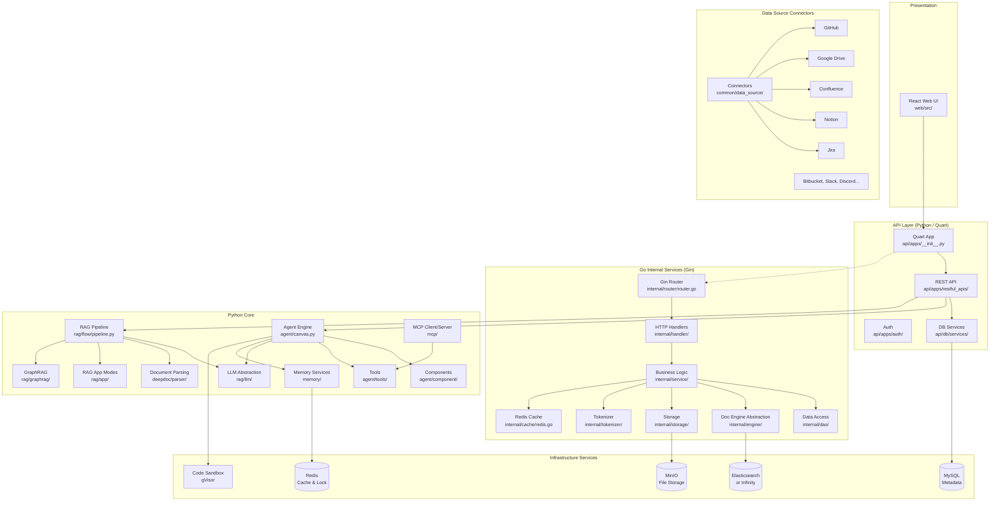
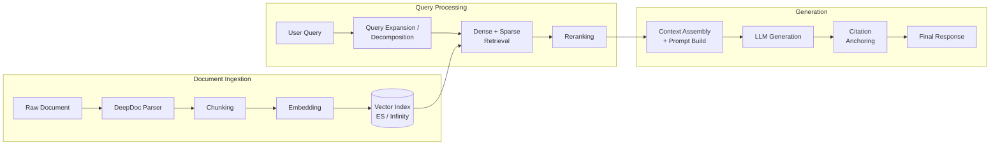
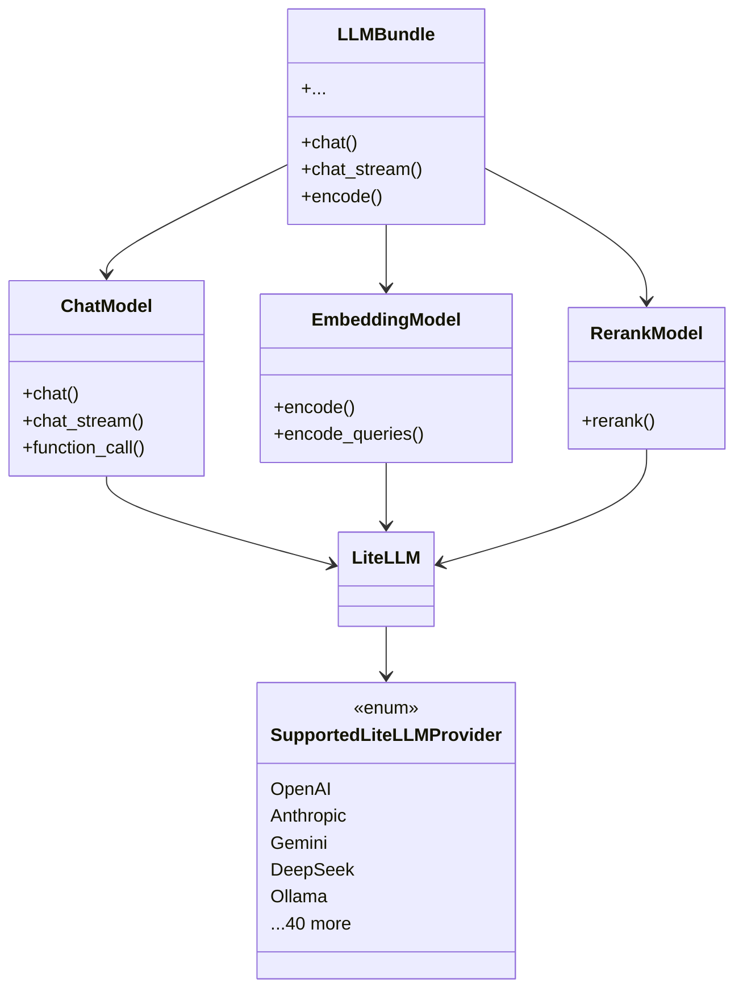
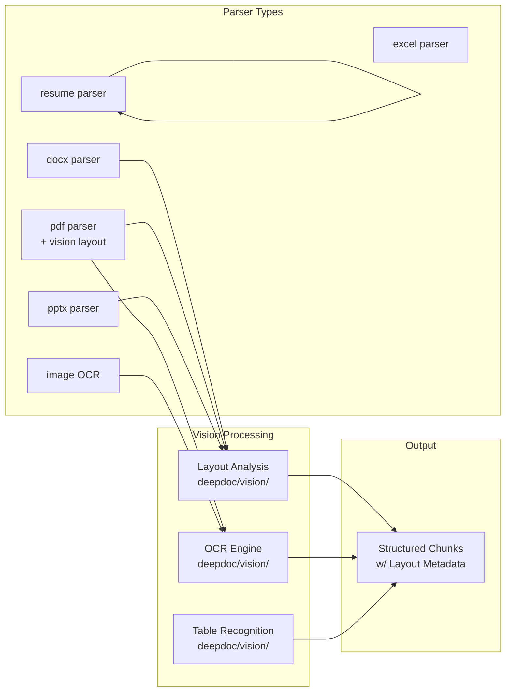

# RAGFlow · 架構

## 高層架構圖

RAGFlow 採用三層架構：前端（React）、後端 API 層（Python Quart）、核心引擎（Python + Go），搭配多種基礎服務。



### 圖意說明

上圖展示 RAGFlow 的三層架構與基礎服務。最關鍵的設計決策是 **Python 與 Go 共存**：Python（Quart）負責高階業務邏輯（RAG pipeline 組裝、agent 編排、文件解析），Go（Gin）負責低階基礎服務（搜尋引擎抽象、資料庫存取、tokenizer）。兩者之間的協作方式是 Python API 在某些操作上透過 HTTP 呼叫 Go service（例如聊天 session 的管理），而文件寫入與 metadata 查找則直接由 Python 操作 MySQL 與 MinIO。

這種雙語言的 split 讓開發者可以用 Python 快速迭代 RAG 與 agent 邏輯，同時讓 Go 處理效能敏感的搜尋與儲存層。代價是部署複雜度增加——需要同時維護兩個 server 進程。

## 跨模組通訊

| 通訊路徑 | 協定 | 位置 |
|----------|------|------|
| 前端 → Python API | HTTP (REST / WebSocket) | `api/apps/restful_apis/` |
| Python → Go 服務 | HTTP (Gin) | `internal/router/router.go` |
| Python → LLM | LiteLLM (HTTP) | `rag/llm/chat_model.py` |
| Python ↔ MySQL | peewee ORM | `api/db/` |
| Python ↔ Redis | redis-py + 自有封裝 | `rag/utils/redis_conn.py` |
| Go ↔ MySQL | GORM | `internal/dao/` |
| Go ↔ Elasticsearch | elastic/go-elasticsearch | `internal/engine/elasticsearch/` |
| Go ↔ Infinity | REST SDK | `internal/engine/infinity/` |
| Go ↔ MinIO | minio-go | `internal/storage/` |
| Go ↔ Redis | go-redis | `internal/cache/redis.go` |
| Python ↔ MinIO | boto3 | `common/storage/` |

Python 與 Go 之間的通訊介面是**簡單的 HTTP REST**，而非 gRPC。這是一個不顯然但務實的選擇：RAGFlow 不需要兩個服務之間高頻率微秒級的呼叫（chat session 建立、document list 查詢都是秒級操作），用 REST 讓除錯更容易（curl 即可測試）、也省去了維護 proto 檔的負擔。

## 狀態管理

RAGFlow 的狀態分散在多個儲存層：

| 狀態類型 | 儲存後端 | 持久性 | 說明 |
|----------|---------|--------|------|
| 對話歷史 | Redis | 有 TTL（30 分鐘） | `rag/utils/redis_conn.py` 中管理 |
| 使用者帳號 | MySQL | 永久 | `api/db/db_models.py` |
| 文件 metadata | MySQL | 永久 | DocumentService |
| 文件內容與 chunk | Elasticsearch / Infinity | 永久 | 可全文檢索與向量檢索 |
| 原始檔案 | MinIO | 永久 | 檔案儲存 |
| Agent DSL（畫布） | MySQL | 永久 | 序列化 JSON |
| Pipeline 執行狀態 | Redis | TTL | `rag/flow/pipeline.py::callback()` |
| 模型配置 | MySQL | 永久 | LLM / embedding / rerank 配置 |
| Session / 快取 | Redis | 可配置 TTL | 分散式鎖、鎖競爭 |

**關鍵設計決策**：對話歷史存在 Redis 而非 MySQL，且預設 30 分鐘 TTL。這表示跨 session 的長期記憶是**選配**（透過 `memory/` 模組），而非內建。這與 LangChain 的 `ConversationBufferMemory` 等內建記憶機制形成對比——RAGFlow 把記憶當作一個 plugin 而非核心功能。

## RAG Pipeline 資料流



### 圖意說明

RAGFlow 的 RAG 流程分三段：**文件導入**（ingestion）、**查詢處理**（query）、**生成**（generation）。文件導入階段的不同於多數 RAG 系統：RAGFlow 透過 `deepdoc/` 的 vision-based parser 做深層結構分析（而非簡單的文字抽取），產出的 chunk 帶有版面資訊（表格、標題層級、圖文關聯）。查詢階段支援 query expansion 與樹狀分解（`rag/advanced_rag/tree_structured_query_decomposition_retrieval.py`），以及在 retrieval 之後的 reranking。

## Agent 系統結構

```mermaid
flowchart TB
  subgraph "DSL Definition"
    DSL[JSON DSL<br/>Components + DAG edges]
  end

  subgraph "Execution Engine"
    CANVAS[Graph(canvas.py)<br/>Topological Sort]
    STEPS[Step-by-step<br/>Execution]
    CONTEXT[Shared Context<br/>(globals dict)]
    CALLBACK[Progress Callback<br/>→ Redis logs]
  end

  subgraph "Component Registry"
    BEGIN[Begin<br/>Entry Point]
    LLM_C[LLM<br/>Chat + Tool Call]
    RETRIEVAL_C[Retrieval<br/>Document Search]
    GENERATE_C[Generate<br/>LLM Response]
    CATEGORIZE[Categorize<br/>Branch by Condition]
    SWITCH[Switch<br/>Multi-branch Router]
    LOOP[Loop / Iteration<br/>Repeat Subgraph]
    AGENT_WITH_TOOLS[Agent w/ Tools<br/>ReAct Loop]
    INVOKE[Invoke<br/>Sub-graph Call]
  end

  subgraph "Tool System"
    BUILTIN_TOOLS[Built-in Tools<br/>Web Search, Code Exec, etc.]
    MCP_TOOLS[MCP-integrated<br/>Tools]
    PLUGIN_TOOLS[Plugin-based<br/>Tools]
  end

  DSL --> CANVAS
  CANVAS --> STEPS
  STEPS --> CONTEXT
  STEPS --> CALLBACK
  STEPS --> BEGIN
  BEGIN --> CATEGORIZE
  BEGIN --> RETRIEVAL_C
  CATEGORIZE --> SWITCH
  SWITCH --> AGENT_WITH_TOOLS
  AGENT_WITH_TOOLS --> LLM_C
  LLM_C --> GENERATE_C
  AGENT_WITH_TOOLS --> BUILTIN_TOOLS
  AGENT_WITH_TOOLS --> MCP_TOOLS
  AGENT_WITH_TOOLS --> PLUGIN_TOOLS
  LOOP --> RETRIEVAL_C
  INVOKE --> CANVAS
```

### 圖意說明

RAGFlow 的 agent 系統核心不是傳統的 ReAct loop，而是一個**宣告式 DAG**（在 `agent/canvas.py` 中以 `Graph` 類別實作）。使用者透過 UI 拖放元件來建立 DSL JSON，定義每個元件的 `upstream` 與 `downstream`。`Graph` 類別在執行時做 topological sort，依序執行節點，並透過 `callback()` 機制將進度寫回 Redis（讓前端可以即時顯示進度條）。

關鍵設計差異：
- **宣告式 vs 命令式**：LangChain 的 chain 是程式碼中組合（命令式），RAGFlow 的 DSL 是 JSON 定義（宣告式），可在運行時動態載入
- **元件可組合**：`Invoke` 元件可以呼叫另一個 DSL（類似函數呼叫）。`Loop` / `Iteration` 元件支援重複執行子圖
- **Agent as Component**：`AgentWithTools` 不是頂層執行模型，而是**一個元件**——它內部有自己的 ReAct loop，但對外部而言只是 DAG 中的一個節點
- **MCP 整合**：RAGFlow 支援 MCP protocol（`agent/component/agent_with_tools.py:34-36`），讓 agent 可以使用外部 MCP server 提供的 tools

## LLM Provider 抽象

RAGFlow 透過 LiteLLM 實作 LLM provider 抽象，統一管理 chat、embedding、rerank、CV、OCR、TTS 等模型類型。



這層抽象的設計決策值得注意：
- **選擇 LiteLLM 而非自製 wrapper**：省去維護 40+ provider 的 API 差異（LiteLLM 已處理），但引入對該套件的版本依賴
- **模型類型分離**：ChatModel、EmbeddingModel、RerankModel 各自獨立，這讓系統可以為不同階段的 RAG pipeline 配置不同的 provider（例如用 OpenAI 做 chat、用 Cohere 做 rerank）
- `FACTORY_DEFAULT_BASE_URL` 字典（`rag/llm/__init__.py:67-96`）為每個 provider 預設了 base URL，降低使用者配置負擔
- LiteLLM provider 前綴（如 `dashscope/`、`gemini/`）在 `LITELLM_PROVIDER_PREFIX` 字典中定義，用於模型名稱解析

## 文件解析（DeepDoc）架構

DeepDoc 是 RAGFlow 的核心競爭力之一。不同於一般 RAG 系統只做文字級別的 PDF 解析（PyMuPDF、pdfplumber），DeepDoc 支援：
- **Vision-based layout analysis**：對 PDF/DOCX 進行版面分析（區分標題、段落、表格、圖片），而非只是線性文字流
- **Table parser**：表格結構還原，不只是把 table 當作連續文字
- **Resume parser**：針對履歷格式的專用 parser
- **公式辨識**：支援數學公式的提取



## 主要設計決策與 Trade-off

### 決策 1：Python + Go 雙語言架構

**選擇**：RAG 業務邏輯用 Python（Quart），基礎服務用 Go（Gin）。

**理由**：Python 生態對 LLM 整合最豐富（LiteLLM、OpenAI SDK、LangChain 生態），且 RAG pipeline 的迭代速度比執行效能更重要。Go 則用來處理搜尋引擎抽象、tokenizer 等高吞吐量但邏輯相對穩定的工作。

**Trade-off**：部署複雜度增加（兩個 server 進程 + 各自依賴）、團隊需要同時掌握 Python 與 Go、內部通訊改用 HTTP REST（非直接函數呼叫）增加 latency 與序列化開銷。

**替代方案**：純 Python 方案（如 LangChain / LlamaIndex）部署更簡單；純 Go 方案（如 ChromaDB 的 go 版本）效能更優但 LLM 生態較弱。RAGFlow 的雙語言架構試圖兼得，代價是維運複雜度。

### 決策 2：Quart 而非 FastAPI

**選擇**：使用 Flask 生態的異步版本 Quart，而非 FastAPI。

**理由**：Quart 保留了 Flask 的 blueprint、extension 生態（`flask-login`、`flask-cors`、`flask-mail`、`flask-session`），讓團隊可以重用 Flask 經驗；而 FastAPI 雖然有更好的 Pydantic 整合與自動文檔，但與專案既有的 Flask 元件不相容。

**Trade-off**：失去了 FastAPI 的 OpenAPI 自動生成、依賴注入系統、與 Pydantic v2 的原生整合。文檔見 [`api/apps/__init__.py`](https://github.com/infiniflow/ragflow/blob/e6dd3975/api/apps/__init__.py#L60)。

[UNVERIFIED] 推測：RAGFlow 可能在 Quart 之前使用 Flask，遷移到 Quart 是為了非同步處理大量文件上傳與 AI agent 的並行呼叫，但保留 Flask extension 相容性以最小化改動量。

### 決策 3：宣告式 DAG DSL 而非 ReAct 模式

**選擇**：用 JSON-based 的 DAG DSL 定義 agent 流程，而非硬編碼的 ReAct loop。

**理由**：讓非開發者可以透過 UI 拖放定義 RAG + Agent 流程，且 DSL 可持久化到資料庫、版本控制、動態載入。每個元件可獨立發展與測試。

**Trade-off**：DSL 的表達力有限（不能表達任意程式邏輯），複雜條件需要 `Categorize` + `Switch` 元件組合，較直接的程式碼實現難除錯。見 [`agent/canvas.py:43-80`](https://github.com/infiniflow/ragflow/blob/e6dd3975/agent/canvas.py#L43-L80)。

### 決策 4：Redis 作為 Pipeline 執行狀態後端

**選擇**：用 Redis 追蹤 pipeline 執行進度，而非寫入 MySQL。

**理由**：Pipeline 執行是高頻短生命週期的狀態（每幾秒更新一次進度），Redis 適合這種 write-heavy 場景。30 分鐘 TTL 確保狀態自動清理。

**Trade-off**：若 Redis 當機，所有進行中的 pipeline 會失去進度追蹤。但 pipeline 本身不在 Redis 中執行——執行是同步的，Redis 只負責 callback 記錄。見 [`rag/flow/pipeline.py:43-98`](https://github.com/infiniflow/ragflow/blob/e6dd3975/rag/flow/pipeline.py#L43-L98)。

### 決策 5：ES ↔ Infinity 可互換的 Doc Engine

**選擇**：Elasticsearch 為預設，Infinity 為選配，透過 `internal/engine/` 抽象層統一。見 [`internal/engine/`](https://github.com/infiniflow/ragflow/tree/e6dd3975/internal/engine)。

**理由**：Infinity 是同公司（InfiniFlow）開發的專用向量資料庫，提供更高效的向量搜尋與 hybrid 查詢。提供 ES 相容性讓既有使用者無痛遷移。

**Trade-off**：維護兩套 engine 實作的成本。不是所有 ES 功能都有 Infinity 對應（如 advanced aggregation），部分進階功能只有使用 ES 時才能用。見 [`internal/engine/elasticsearch/`](https://github.com/infiniflow/ragflow/tree/e6dd3975/internal/engine/elasticsearch) 與 [`internal/engine/infinity/`](https://github.com/infiniflow/ragflow/tree/e6dd3975/internal/engine/infinity)。

## 安全性

| 機制 | 實作位置 | 說明 |
|------|---------|------|
| 認證 | `api/apps/auth/` + `api/db/services/user_service.py` | 基於 JWT + session |
| API Token | `internal/handler/api_token.go` | Go 後端 API 認證 |
| 沙箱執行 | `agent/sandbox/` | gVisor 隔離的程式碼執行環境 |
| MCP 安全 | MCP 協定層 | 工具呼叫權限 |
| 密碼加密 | `api/utils/crypt.py` | bcrypt / 自製加密 |

## 觀測性

| 面向 | 實作 | 位置 |
|------|------|------|
| 日誌 | Python logging + Go zap | `common/log_utils.py` / `internal/common/` |
| Pipeline 進度 | Redis callback + Websocket | `rag/flow/pipeline.py::callback()` |
| 模型調用 | Langfuse 整合 | `pyproject.toml`: `langfuse>=4.0.1` |
| 健康檢查 | `api/utils/health_utils.py` | `/health` endpoint |
