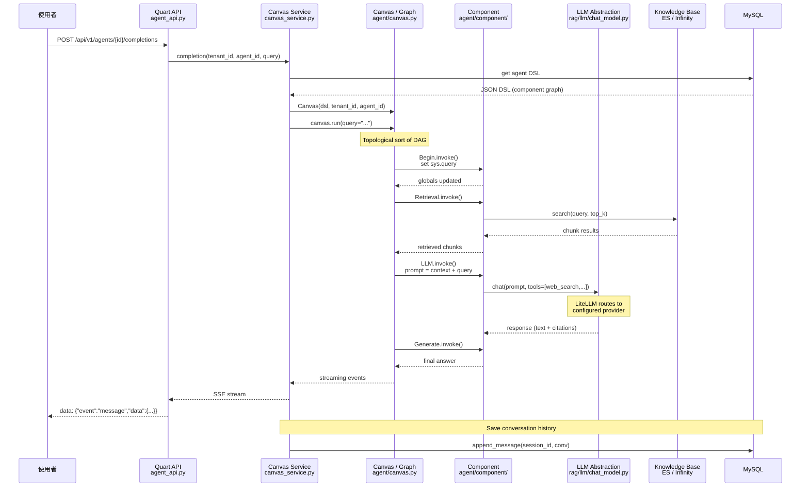

# RAGFlow · 程式碼追蹤

## 追蹤的場景

**任務**: 使用者在 RAGFlow 的 Agent 畫布（已部署的版本）中發送一條查詢：「2025 年 RAG 領域有哪些重要的開源進展？」

**預期的 Agent 行為**:
1. 接收查詢 → 從 DSL 畫布載入工作流
2. Begin 節點啟動，將使用者輸入注入全局變數
3. Retrieval 節點從知識庫檢索相關文件
4. LLM 節點根據檢索結果生成回答（可能使用 function calling 調用 web search）
5. Generate 節點輸出最終結果
6. 結果寫入 conversation 歷史

## 整體流程圖



## 逐步追蹤

### Step 1: 任務進入 API

入口點: [`api/apps/restful_apis/agent_api.py`](https://github.com/infiniflow/ragflow/blob/e6dd3975/api/apps/restful_apis/agent_api.py)

使用者發送 POST 請求到 `/api/v1/agents/{agent_id}/completions`。Quart 路由將請求 dispatch 到 `agent_api.py` 中的某個 handler。這個 handler 會呼叫 `canvas_service.completion()`——這是整個 agent 執行的入口。

handler 進行以下前置處理（參考 `agent_api.py` 中的 `_require_canvas_access_sync` 和 `_require_canvas_access_async` 裝飾器）：
- 驗證使用者對該 agent（canvas）的存取權限
- 從 request body 中解析 `query`、`files`、`inputs` 等參數

### Step 2: DSL 載入與 Canvas 初始化

入口點: [`api/db/services/canvas_service.py:313-340`](https://github.com/infiniflow/ragflow/blob/e6dd3975/api/db/services/canvas_service.py#L313-L340)

`completion()` 函數做了兩件事：

1. **載入 DSL**：從 MySQL 讀取該 agent（canvas）的 DSL JSON。DSL 是描述 DAG 的 JSON，包含 `components`（元件定義）、`path`（執行順序）、`history`（對話歷史）、`globals`（全域變數）。
2. **建立 Canvas 物件**：`Canvas(conv.dsl, tenant_id, agent_id, canvas_id=agent_id)` — 繼承自 `Graph`，擁有 graph traversal 與 component orchestration 的能力。

如果沒有 `session_id`（新對話），會用 `UserCanvasService.get_agent_dsl_with_release()` 取得最新發布版本的 DSL；如果已有 `session_id`，則從 conversation 中載入之前保存的 DSL（包含對話歷史）。

**值得注意的設計**: DSL 是**可持久化的狀態**，不僅僅是初始配置。每輪對話結束後，DSL 會被更新（`conv.dsl = str(canvas)`）並寫回 MySQL，包含當前的對話歷史和執行狀態。這讓中斷的對話可以透過載入 DSL 來恢復。

### Step 3: Canvas.run() — DAG 執行引擎

入口點: [`agent/canvas.py:375-475`](https://github.com/infiniflow/ragflow/blob/e6dd3975/agent/canvas.py#L375-L475)

`Canvas.run()` 是一個 async generator。它不一次執行整個 DAG，而是逐步執行並透過 `yield` 回傳 SSE 事件給前端（實現即時串流）。

關鍵邏輯:

1. **設定系統變數**：`self.globals["sys.query"]`、`self.globals["sys.date"]`、`self.globals["sys.files"]` 等
2. **重設路徑**：從 `self.path` 開始（初始為 `["begin"]`），標記需要執行的 component 為非 reset
3. **路徑擴展**：如果路徑最後不是 `End` 或 `UserFillUp`，附加 `"begin"` 到路徑末尾
4. **取消檢查**：每次執行前檢查 `self.is_canceled()`，支援任務取消

真正的執行邏輯在 `_run_batch()` 內部（第 437 行）：

```
while i < t:
    cpn = self.get_component_obj(self.path[i])
    if cpn.component_name.lower() in ["begin", "userfillup"]:
        # 直接執行，no input checking
    else:
        # 檢查所有 upstream inputs 是否都 ready
        # 如果缺少 input，pop 該 node（跳到下一個路徑）
```

這意味著 Canvas 使用類似 **dataflow 執行模型**：每個 component 在其所有 input 可用時才執行。如果某個 upstream component 沒產生 output，下游會被跳過。

`_run_batch` 使用 `asyncio.Semaphore` 控制並行度（預設 5），並透過 `loop.run_in_executor` 讓同步的 component 不阻塞事件循環。

### Step 4: Begin 元件 — 輸入注入

入口點: [`agent/component/begin.py`](https://github.com/infiniflow/ragflow/blob/e6dd3975/agent/component/begin.py)

`Begin` 元件是 DAG 的起點。它的 `invoke()` 方法將使用者查詢寫入全域變數 `sys.query`。這些全域變數可以在後續元件中透過 `{{sys.query}}` 或變數引用語法存取。

Begin 還處理檔案上傳：如果請求帶有檔案，它會調用 `Canvas.get_files_async()` 處理檔案，解析後的結果存入 `sys.files`。

### Step 5: Retrieval 元件 — 知識庫查詢

入口點: 元件的 DSL 中定義（由 agent/component 中的對應類別實作）

Retrieval 元件從 DAG 的 `globals["sys.query"]` 讀取查詢，調用後端搜尋服務。搜尋路徑有兩種：

- **Python 路徑**（透過 `api/db/services/search_service.py` 或 `rag/utils/`）：直接查詢 Elasticsearch 或 Infinity
- **Go 路徑**（需要 REST API call）：透過 Gin server 的 `/api/v1/search` 端點

檢索結果（chunks）以 `{"chunks": [...], "doc_aggs": [...]}` 的形式回傳到畫布的 retrieval 狀態中，後續可以透過 `{{retrieval_0@chunks}}` 變數引用。

**錯誤路徑**: 如果知識庫沒有相關內容，Retrieval 元件仍會正常回傳（空的 chunks list）。LLM 會收到「沒有相關內容」的訊號，並根據 prompt 中的 `empty_response` 配置決定如何處理。

### Step 6: LLM 元件 — 模型呼叫

入口點: [`agent/component/llm.py`](https://github.com/infiniflow/ragflow/blob/e6dd3975/agent/component/llm.py)

LLM 元件是整個 pipeline 中最複雜的元件。它：

1. **組裝 prompt**：從 `rag/prompts/` 載入 system prompt 模板 + 檢索結果 + 對話歷史
2. **判斷模式**：支持純文字生成（Generate）和 function calling（Agent with Tools）兩種模式
3. **呼叫 LLM**：透過 `rag/llm/chat_model.py` 中的 `ChatModel.chat()` 或 `ChatModel.chat_stream()` 方法

在 `chat_model.py` 中（第 60+ 行），LLM 呼叫經歷層層封裝：

```
LLMBundle.chat()
  → ChatModel.chat()
    → LiteLLM completion()
      → provider API (OpenAI / Anthropic / DeepSeek / ...)
```

`ChatModel` 實現了多種 LLMErrorCode（rate limit、auth、timeout、content filter 等）的錯誤處理。對於可重試的錯誤（rate limit、timeout），內部有重試邏輯。

Agent with Tools 模式（`agent/component/agent_with_tools.py`）增加了 ReAct loop：LLM 可以選擇呼叫工具（如 web search、code executor），每次 tool call 的結果會餵回 LLM 進行下一輪思考，直到達到 `max_rounds`（預設 5 輪）。

**序列化點**: 在 LLM 呼叫處，會將整個 prompt（包括檢索結果）序列化傳送給 provider。這是整條 pipeline 中**資料量最大**的序列化操作，也是主要的 latency 瓶頸。

### Step 7: Generate 元件 — 最終輸出

Generate 元件接收 LLM 的回應，進行後處理：
- 添加 citation anchors（引用標記）
- 格式化輸出（支援 markdown / 純文字）
- 確保引用與檢索結果的 consistency

### Step 8: 結果串流與持久化

入口點: [`api/db/services/canvas_service.py:360-375`](https://github.com/infiniflow/ragflow/blob/e6dd3975/api/db/services/canvas_service.py#L360-L375)

`Canvas.run()` 的每一個 `yield` 產生一個 SSE 事件，透過 `completion()` async generator 轉發給前端。串流格式：

```json
data: {"event": "message", "message_id": "...", "data": {"content": "..."}}
data: {"event": "message_end", ...}
```

當串流結束後：

1. 完整的 assistant response 追加到 `conv.message`
2. reference（檢索來源）存到 `conv.reference`
3. errors 存到 `conv.errors`
4. 更新後的 DSL（包含新對話內容）存到 `conv.dsl`
5. 通過 `API4ConversationService.append_message()` 寫入 MySQL

**持久化的層級**: 對話歷史同時維持在兩個地方——
- **MySQL**（API4Conversation 表）做長期儲存
- **DSL 內部的 `history` 列表**（作為 session context）

這表示同一個 session 的後續請求會從 MySQL 載入歷史，然後注入 DSL 的 history 中，讓 LLM 保有上下文。

## 想學更多時，在哪裡下中斷點

- Agent 入口: [`api/apps/restful_apis/agent_api.py`](https://github.com/infiniflow/ragflow/blob/e6dd3975/api/apps/restful_apis/agent_api.py) — 所有 agent 請求的 HTTP 切入點
- DSL 載入: [`api/db/services/canvas_service.py:313`](https://github.com/infiniflow/ragflow/blob/e6dd3975/api/db/services/canvas_service.py#L313) — Canvas 初始化，看 DSL 長什麼樣
- DAG 執行還未: [`agent/canvas.py:437`](https://github.com/infiniflow/ragflow/blob/e6dd3975/agent/canvas.py#L437) — `_run_batch`，觀察執行順序與並行控制
- LLM 呼叫前一刻: [`agent/component/llm.py`](https://github.com/infiniflow/ragflow/blob/e6dd3975/agent/component/llm.py) — 看最終送到 LLM 的完整 prompt
- LiteLLM 路由: [`rag/llm/chat_model.py:60+`](https://github.com/infiniflow/ragflow/blob/e6dd3975/rag/llm/chat_model.py#L60) — 看 LLM provider 與模型的選擇邏輯

## 沒追蹤到但值得留意的分支

- **文件上傳 + 解析流程** — 從使用者上傳文件到 chunking、embedding、indexing 的完整 pipeline，涉及 `deepdoc/`、`rag/flow/`、與 `api/db/services/document_service.py` 的協作
- **Agent with Tools 的多輪呼叫** — 上述追蹤簡化到單一 tool call，但 RAGFlow 的 Agent 元件支援多輪 function calling，有 `max_rounds`（預設 5）和終止條件判斷
- **MCP tool 整合** — Agent 可以透過 MCP protocol 呼叫外部 tool server，繞過內建的 tool registry
- **Sandbox 程式碼執行** — 使用者可以在 prompt 中要求 agent 執行程式碼，這在 `agent/sandbox/` 中用 gVisor 隔離執行
- **Loop / Iteration 迴圈控制** — DSL 支援 loop 元件，可以對一組 chunks 逐個執行子流程
