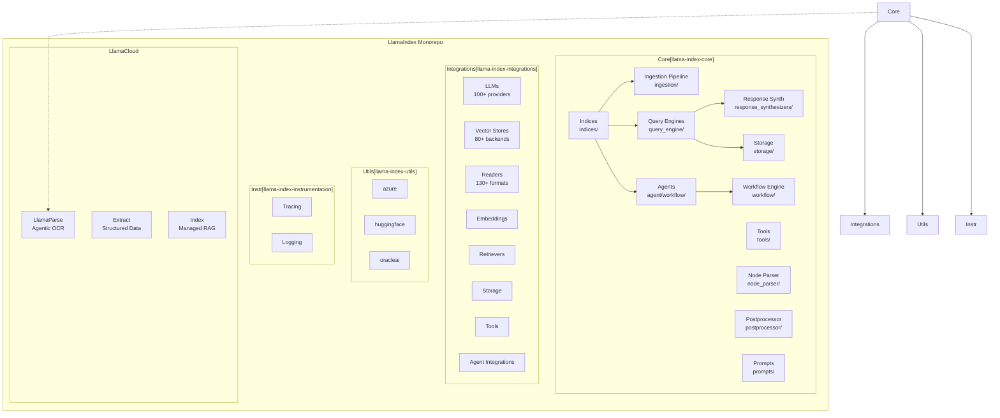
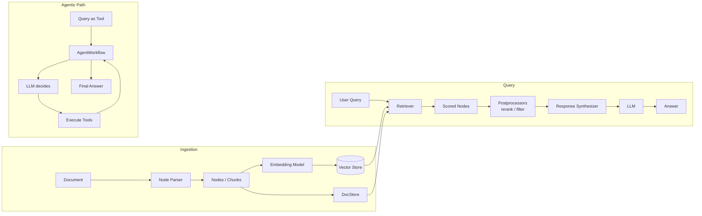

# LlamaIndex · 架構

## 頂層模組圖

LlamaIndex 的程式碼組織分為三個層次：核心抽象層、整合層、工具層。



**圖意說明**: 這張圖展示 LlamaIndex 的三層架構。核心層 (`llama-index-core`) 包含所有抽象與 pipeline 邏輯；整合層 (`llama-index-integrations`) 是 300+ 獨立套件的集合，每個套件實作核心層定義的介面；工具層提供跨套件共用的 utilities 與 instrumentation。LlamaCloud（LlamaParse 等）是商業產品，透過 API 與開源框架互動。關鍵的依賴箭頭：Indices 依賴 Ingestion Pipeline 做資料預處理，Query Engine 依賴 Response Synthesizer 做最終答案合成，Agent 系統建立在 Workflow 引擎之上。

## 資料流：文件到答案的完整路徑

LlamaIndex 的典型 RAG pipeline 是一條層層轉換的資料管線：



**圖意說明**: 這是 LlamaIndex 的核心工作流程。上半是 ingestion（資料進），下半是 query（查詢出）。Ingestion 階段的關鍵設計是將 Document 切分為 Node（chunk），對每個 Node 產生 embedding 存入 vector store，同時將原始 Node 存入 docstore。Query 階段的典型路徑是 retrieve → rerank → synthesize，但也可以將 QueryEngine 封裝為 agent 的 tool，讓 LLM 自主決定何時檢索（agentic path）。

## 核心設計決策與取捨

### 設計決策 1: 核心/整合分離的套件架構

LlamaIndex 選擇將所有外部相依放在獨立套件中，`llama-index-core` 只有純抽象與 `pydantic`、`fsspec` 等少數核心相依。

`llama-index-core/pyproject.toml` (lines 83+) 的相依聲明極簡，對比 `llama-index-llms-openai` 這類獨立套件各自宣告自己的相依。

- **為什麼這樣做**: 避免依賴衝突。使用者只需要安裝實際用到的整合套件(例如只用 OpenAI + Pinecone 就只需裝兩個 integration)，而不是整個生態系。
- **代價**: 套件數量爆炸（100+ LLM、80+ vector stores），CI 矩陣複雜，發布流程需要腳本協調。`scripts/publish_packages.sh` 就是專門處理大量套件的一次性發布。
- **跟 LangChain 比較**: LangChain 也走類似路線（`langchain-community`、`langchain-openai` 等），但 LangChain 的生態分裂更嚴重，部分元件的維護品質參差不齊。LlamaIndex 用 monorepo 集中管理所有整合套件的 CI/CD，品質相對一致。

### 設計決策 2: Workflow 引擎作為 Agent 基礎

LlamaIndex 沒有採用常見的 ReAct loop（硬編碼的 think-act-observe 迴圈），而是引入了一個完整的事件驅動 workflow 引擎（依賴 `llama-index-workflows` 外部套件），然後在 workflow 之上建置 `FunctionAgent` 和 `ReActAgent`。

```python
# agent/workflow/function_agent.py:87
class BaseWorkflowAgent(Workflow, BaseModel, PromptMixin, metaclass=BaseWorkflowAgentMeta):
```

這個多重繼承的設計 ([`llama-index-core/.../agent/workflow/base_agent.py:87`](https://github.com/run-llama/llama_index/blob/f027669/llama-index-core/llama_index/core/agent/workflow/base_agent.py#L87)) 讓每個 agent 本身就是一個 workflow——agent 的每個步驟都是一個 `@step`，透過事件（`AgentInput`、`AgentOutput`、`ToolCallResult`）傳遞狀態。

- **為什麼這樣做**: Event-driven workflow 比硬編碼 loop 更靈活。你可以插入自訂 `@step` 來做 logging、validation、human-in-the-loop 檢查，而不需要改寫 agent 的核心邏輯。Workflow 的 `Context` 還提供了 `write_event_to_stream` 機制讓 streaming 成為一等公民。
- **代價**: 學習曲線更高。使用者需要理解 event-driven 模型、`Context` 的 `.store`（dict-based key-value store）、以及事件 type dispatch 機制。對於簡單的 QA 場景，這個抽象層太重。
- **推測的 trade-off**: [UNVERIFIED] LlamaIndex 顯然正在把 agent 和 workflow 視為未來的核心差異化能力，不惜讓簡單場景的開發體驗變複雜。

### 設計決策 3: Index 作為 stateful 物件 vs. stateless pipeline

每個 `BaseIndex` ([`indices/base.py:25`](https://github.com/run-llama/llama_index/blob/f027669/llama-index-core/llama_index/core/indices/base.py#L25)) 初始化時就會建構 `IndexStruct` 並寫入 `StorageContext`（包含 docstore、index_store、vector_store）。這讓 Index 是一個 stateful 物件——你建立它、持久化它、然後在另一個 session 載入它繼續查詢。

```python
# indices/base.py:76-84
with self._callback_manager.as_trace("index_construction"):
    if index_struct is None:
        index_struct = self.build_index_from_nodes(nodes + objects)
    self._index_struct = index_struct
    self._storage_context.index_store.add_index_struct(self._index_struct)
```

- **為什麼這樣做**: 符合「一次建立、多次查詢」的 RAG 使用模式。使用者不需要自己管理 embedding cache 或 docstore，Index 幫你處理好。
- **代價**: Stateful 物件在 serverless 或短期任務中不友好。你必須每次都序列化/反序列化 `StorageContext`，或者使用 cloud-hosted vector store。
- **替代方案對照**: LangChain 的 VectorStore 是 stateless 的——你只傳 embedding function，每次都重新計算或從外部服務查詢。LlamaIndex 的方式對桌機/筆記型環境更直覺，但對生產部署需要更多的序列化注意。

## 跨模組通訊

| 機制 | 用途 | 位置 |
|---|---|---|
| Event-based (Workflow) | Agent 內部步驟、streaming 事件 | `agent/workflow/workflow_events.py:24` |
| CallbackManager | 跨模組 instrumentation、tracing | `callbacks/base.py` |
| Context.store (dict) | Workflow step 間共享狀態 | `workflow/context.py` |
| StorageContext | Index/docstore/vectorstore 的統一介面 | `storage/storage_context.py:52` |

## 狀態儲存

| 類別 | 預設實作 | 可替換為 |
|---|---|---|
| DocStore | `SimpleDocumentStore` (JSON file) | `MongoDBDocumentStore`、`RedisDocumentStore` |
| IndexStore | `SimpleIndexStore` (JSON file) | KV store (Redis) |
| VectorStore | `SimpleVectorStore` (in-memory JSON) | Pinecone、Qdrant、Chroma、Weaviate... |
| GraphStore | `SimpleGraphStore` (JSON file) | Neo4j、FalkorDB |

## 對外 Contract

- **Python SDK**: `from llama_index.core import ...`（核心）、`from llama_index.{category}.{name} import ...`（整合）
- **CLI**: 有限（`llama-index-core/command_line/`），主要用於 LlamaCloud 相關操作
- **Config**: Pydantic BaseModel 為主，支援 `Settings` 全域物件（`settings.py`）

## 失敗模式與降級策略

- **Retry**: Workflow 層支援 `RetryPolicy`（`workflow/retry_policy.py`），可對特定 step 設定重試
- **Fallback LLM**: 內建 `resolve_llm`（`llms/utils.py`），但無自動 fallback chain 機制
- **Tool 失敗**: Agent 將錯誤訊息回傳給 LLM 讓它調整（standard ReAct pattern）
