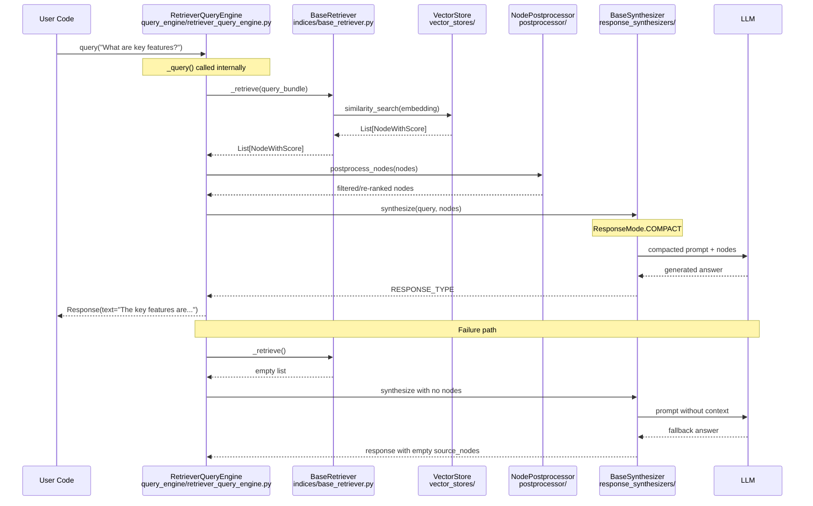

# LlamaIndex · 程式碼追蹤

## 追蹤的場景

**任務**: 使用者呼叫 `index.as_query_engine().query("What are the key features of this framework?")` 的完整 RAG 路徑——從收到查詢、檢索相關節點、到合成答案。

**預期的系統行為**:
1. 建立 QueryEngine（如果尚未建立）
2. 接收使用者查詢，包裝為 `QueryBundle`
3. 呼叫 Retriever 從 Vector Store 取得 top-k 相關節點
4. 執行 Node Postprocessors（如 reranking、過濾）
5. Response Synthesizer 將節點送入 LLM 合成答案
6. 回傳最終 `RESPONSE_TYPE` 物件

## 流程圖



**圖意說明**: 這是 LlamaIndex 最核心的 RAG 查詢路徑。`RetrieverQueryEngine` 是預設的 query engine，它將查詢委託給 retriever 取得相關節點，經過 postprocessor 處理，最後由 response synthesizer 將節點內容與使用者問題一起餵給 LLM。下半的 failure path 顯示當檢索不到相關節點時，系統不會崩潰，而是讓 LLM 在沒有 context 的情況下嘗試回答——這是一個重要的降級設計。

## 逐步追蹤

### Step 1: Query Engine 初始化與接收查詢

入口點: [`query_engine/retriever_query_engine.py:25`](https://github.com/run-llama/llama_index/blob/f027669/llama-index-core/llama_index/core/query_engine/retriever_query_engine.py#L25)

```python
class RetrieverQueryEngine(BaseQueryEngine):
    def __init__(self, retriever, response_synthesizer=None, node_postprocessors=None):
        self._retriever = retriever
        self._response_synthesizer = response_synthesizer or get_response_synthesizer(...)
        self._node_postprocessors = node_postprocessors or []
```

`BaseQueryEngine` ([`base/base_query_engine.py`](https://github.com/run-llama/llama_index/blob/f027669/llama-index-core/llama_index/core/base/base_query_engine.py)) 定義了 `query()` 方法，它會進行 callback tracing、轉換 query 為 `QueryBundle`，然後呼叫子類別實作的 `_query()`。

### Step 2: 檢索（Retrieval）

[`query_engine/retriever_query_engine.py:121`](https://github.com/run-llama/llama_index/blob/f027669/llama-index-core/llama_index/core/query_engine/retriever_query_engine.py#L121)

```python
async def _aretrieve(self, query_bundle: QueryBundle) -> List[NodeWithScore]:
    nodes = await self._retriever.aretrieve(query_bundle)
    # Apply node postprocessors
    for postprocessor in self._node_postprocessors:
        nodes = postprocessor.postprocess_nodes(nodes, query_bundle)
    return nodes
```

這段簡單的委託隱藏了重要的多型：`self._retriever` 可以是任何實作 `BaseRetriever` 的物件——`VectorIndexRetriever`（預設）、`KeywordTableRetriever`、`RouterRetriever`（多路檢索）、或 `AutoMergingRetriever`。

Vector 檢索的路徑是: `VectorIndexRetriever` → 從 `_index_struct` 取得 embedding → 呼叫 `vector_store.query(...)` → 返回 `NodeWithScore[]`。

### Step 3: Postprocessing（後處理）

[`indices/postprocessor.py`](https://github.com/run-llama/llama_index/blob/f027669/llama-index-core/llama_index/core/indices/postprocessor.py)

Postprocessor 實作 `BaseNodePostprocessor`，可以對檢索結果進行 rerank、過濾、或轉換。常見的 postprocessor 包括:
- `SimilarityPostprocessor` — 過濾低於相似度門檻的節點
- `KeywordNodePostprocessor` — 根據關鍵字過濾
- `SentenceTransformerRerank` — 用 cross-encoder rerank（這在整合套件中）
- `CohereRerank` — Cohere 的 rerank API

**這一步是最容易出問題的環節**: 如果所有檢索結果都被 postprocessor 過濾掉，`nodes` 會變成空列表，導致後續合成時沒有 context。這是為什麼後面的 Response Synthesizer 需要處理空 context 的情況。

### Step 4: Response Synthesis（回應合成）

[`response_synthesizers/base.py`](https://github.com/run-llama/llama_index/blob/f027669/llama-index-core/llama_index/core/response_synthesizers/base.py)

核心方法 `_get_llm_response()` 根據 `ResponseMode` 決定如何組裝 prompt:

```
ResponseMode.COMPACT (預設)
  1. 將所有節點內容塞入一個 prompt（如果太長，逐個移除節點直到符合 context window）
  2. 單次 LLM call → 答案

ResponseMode.REFINE
  1. 對第一個節點產出初始答案
  2. 逐個用後續節點 refine 答案
  3. 多次 LLM call

ResponseMode.TREE_SUMMARIZE
  1. 將節點分組，每組產出摘要
  2. 遞迴摘要直到單一答案
  3. 適合大量節點
```

LlamaIndex 有 6 種 ResponseMode: [`response_synthesizers/type.py`](https://github.com/run-llama/llama_index/blob/f027669/llama-index-core/llama_index/core/response_synthesizers/type.py)

**序列化/反序列化**: 整個路徑經過 `QueryBundle` → `NodeWithScore` → prompt text → LLM response → `RESPONSE_TYPE`。每個轉換點都是一次序列化（或至少是型別轉換），其中 `NodeWithScore` 的 `Node` 物件包含完整的 text、metadata、relationships。

### Step 5: 結果回傳

最終回傳的是 `RESPONSE_TYPE`（實際上是 `Response` 物件），包含：
- `response` / `response_str` — 答案文字
- `source_nodes` — 參考來源的 `NodeWithScore[]`
- `metadata` — 額外資訊

## 同步 vs 非同步

LlamaIndex 完整支援 async/await：

| 方法 | 同步 | 非同步 |
|---|---|---|
| Query Engine | `query()` | `aquery()` |
| Retriever | `retrieve()` | `aretrieve()` |
| Synthesizer | `synthesize()` | `asynthesize()` |

這使得在 async web framework（FastAPI、Quart）中使用時不需要 `asyncio.run()` 包裝。

核心實作路徑: `query()` → `_query()` → `_retrieve()` (sync, calls vector store) → `synthesize()` → LLM call

阻塞點: LLM call 和 vector store 查詢。所有其他步驟（postprocessor、prompt 組裝）都是 CPU-only。

## 想學更多時，在哪裡下中斷點

- Query Engine 入口: `query_engine/retriever_query_engine.py:25`
- Retriever 呼叫前一刻: `indices/base_retriever.py` 的 `_retrieve()` 抽象方法
- Postprocessor 執行的確切位置: `query_engine/retriever_query_engine.py:135`
- LLM call 前一刻的完整 prompt: `response_synthesizers/compact_and_refine.py` 的 `_get_llm_response()`

## 沒追蹤到但值得留意的分支

- **Sub-Question Query Engine** (`query_engine/sub_question_query_engine.py`) — 將複雜問題分解為多個子問題，每個子問題獨立 query，最後綜合答案。這條路徑經過 `question_gen` → multiple retrievers → `response_synthesizer`。
- **Router Query Engine** (`query_engine/router_query_engine.py`) — 根據查詢意圖選擇不同的 query engine。
- **Agentic Path** — 將 QueryEngine 包裝為 `QueryEngineTool`，讓 LLM agent 決定何時以及如何查詢。這條路徑經過完整的 `AgentWorkflow` → `FunctionAgent` → tool dispatch → QueryEngine。
